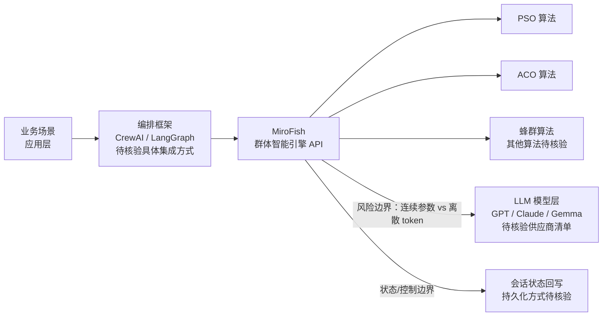

# MiroFish — 通用群体智能引擎

## 一句话定位

将群体智能算法（粒子群、蚁群、蜂群等）封装为可调用的通用引擎，为多 Agent 协作提供算法层支撑。

## 它解决的问题

多 Agent 系统的协作缺乏理论基础支撑。当前主流 Agent 框架（LangChain、CrewAI 等）提供的协作模式主要是"角色分配+消息传递"，缺乏优化理论。群体智能作为多 Agent 协作的数学基础，长期停留在学术层面。

MiroFish 尝试把群体智能从论文变成可调用的 API。

## 为什么值得关注

1. **概念前瞻**：群体智能是多 Agent 从"串行协作"到"涌现智能"的关键理论
2. **25K+ stars**：开发者对此方向有强烈兴趣
3. **月度 trending 前列**：持续热度，非昙花一现
4. **定位"通用引擎"**：如果 API 设计得当，可能成为多 Agent 框架的基础依赖

## 热度来源判断

- 概念驱动："群体智能"自带话题性
- 多 Agent 热潮的溢出效应：开发者寻找 Agent 协作的"下一层"
- Star 质量存疑：需要进一步验证 star 的真实性和活跃度

## 关键技术亮点亮点

- 多种群体智能算法统一封装（PSO、ACO、蜂群等）
- 预测 + 优化 + 协作一体化设计
- 声称支持多种应用场景（预测、调度、优化等）

## 架构师速览

| 决策问题 | 研究判断 | 证据边界 |
|---|---|---|
| 系统边界 | MiroFish 定位于"算法层"——位于编排层（CrewAI/LangGraph 等）与模型层之间，提供群体智能算法封装；并非完整 Agent 应用框架 | 边界由档案"与同类项目的关系"和分层图推断；具体入口协议、SDK 形态、依赖模型供应商清单未在档案中给出 |
| 主路径 | 业务请求 → 编排框架调用 MiroFish API → 群体智能算法（PSO/ACO/蜂群等）在多 Agent 协作中产出优化结果 → 回写会话状态 | 算法名称来自档案；调用方式、状态回写通道、是否真有"预测+优化+协作一体化"实现待核验 |
| 关键权衡 | 群体智能算法适用于连续空间参数优化，与 LLM 离散 token 输出之间存在适配鸿沟；抽象层过高会落入"通用陷阱" | 风险点由档案"风险/局限"明示；具体如何桥接连续-离散空间在档案中未描述 |
| 最小 PoC | 取一个具体多 Agent 协作场景，与传统优化基线（如随机搜索/贪心）对比收敛速度与解质量；同步验证 API 稳定性、文档完整度与 license | 档案明确"暂不建议企业 PoC"，"无 benchmark 数据"；算法种类、应用场景的工程化成熟度均待核验 |

## 架构启发

群体智能如果成功工程化，可能成为多 Agent 框架的"算法层"：

## 架构图（MMD）

> 证据边界：此图只采用本档案已有可核验描述；“待核验”节点不应视为项目实现事实。

## 定位判断

**学习型 → 平台候选的过渡阶段**。目前缺乏足够的工程验证，但概念方向正确。如果 API 设计得当且有 benchmark 数据支撑，可能升级为平台候选。

## 风险/局限/泡沫点

1. **"通用"的陷阱**：抽象层过高可能什么都做不好
2. **Benchmark 缺失**：缺乏与传统优化方法的对比数据
3. **群体智能在 LLM Agent 中的适用性存疑**：群体智能优化的是连续空间参数，LLM 输出是离散的 token 序列，两者之间的适配不直观
4. **泡沫风险中等**：概念吸睛但落地案例不足

## 与同类项目的关系

- **vs agency-agents**：agency-agents 是 Agent 模板集合（应用层），MiroFish 是算法引擎（底层）。理论上 MiroFish 可以为 agency-agents 提供优化能力。
- **vs CrewAI / LangGraph**：MiroFish 是这些编排框架的潜在依赖，而非竞争者。

## 是否值得持续跟踪

**⚠️ 观望**。概念方向正确但工程验证不足。需要等待 benchmark 数据和真实使用案例。

## 是否值得企业 PoC

**暂不建议**。除非企业有明确的多 Agent 优化需求且有研究团队可以评估。

## 后续观察点

1. 是否发布 benchmark 数据——与经典优化方法的对比
2. 是否被主流 Agent 框架集成
3. 社区活跃度和 issue/PR 质量
4. 实际使用案例的涌现
