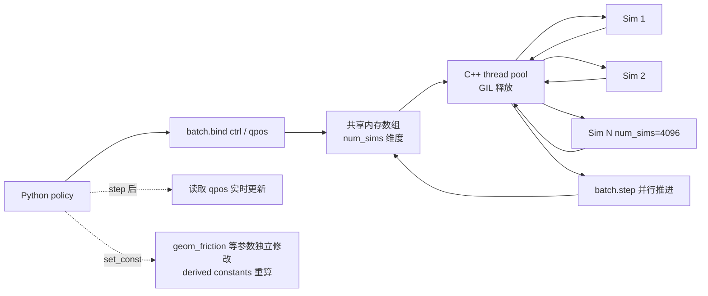

# kevinzakka/mjbatch

## 一句话定位
MuJoCo CPU 并行仿真 Python 库——C++ thread pool + GIL 释放，一行 `Batch(model, num_sims=4096)` 即可并行跑数千个 MuJoCo 仿真，适用于 RL / MPC / SysID / hardware co-design。

## 它解决的问题
MuJoCo 是 robotics / RL 圈的事实标准仿真器，但其 Python 包装的并行能力受限：要么串行 step（慢），要么用 multiprocessing（IPC 开销大）。mjbatch 通过 C++ thread pool 在 Python 层面提供"4096 个并行 sim"的一等公民 API：(1) GIL 释放使 Python 主线程不阻塞；(2) 实时数组访问 qpos / ctrl 等仿真状态；(3) 每个 sim 可独立设常量参数并触发 derived constants 重算。

## 为什么值得关注（2026-09-11）
- **Stars:** 215（截至 2026-09-11），1 天即达 215⭐，处于"首发即高增长"阶段
- **Forks:** 13 / 1 天 = 13 forks/日，**6.0% fork/star 偏低**，反映 star 以"关注 / 收藏"为主，二次开发未铺开
- **License:** Apache-2.0——可直接商用
- **语言:** Python（含 C++ 扩展）
- **活跃度:** created 2026-09-10，pushed_at 2026-09-10，1 天内完成发布
- **规模:** 17MB（含 MuJoCo 模型文件 + 示例）

## 热度来源判断
mjbatch 的热度是 **"MuJoCo 刚需 × Python 侧并行缺口 × RL 训练吞吐"** 的组合。MuJoCo 在四足 / 双足 / manipulation / RL benchmark（HumanoidBench、Meta-World）中是首选仿真器，但 Python 包装的并行能力让大规模 sim2real 训练变慢。mjbatch 直接把"4096 并行 sim"做成一等公民 API，对 RL 训练 / MPC rollout / SysID sweep 是直接的生产力提升。**Go1 RL 在 5 年 M1 笔记本 < 1 min 学会行走**的 README 声明需要 benchmark 复现。热度**真实且具生产可用潜力**——但需观察是否被 vLLM / SGLang 等主流 RL 框架集成。

## 关键技术亮点
1. **C++ thread pool + GIL 释放**——Python 主线程不阻塞，可并发调度数千 sim
2. **`Batch(model, num_sims=4096)` 一行启动**——threads 默认 = 逻辑 CPU 数
3. **实时数组访问 qpos / ctrl**——`batch.bind("qpos")` 返回共享数组，policy 直接写入
4. **`set_const` 触发 derived constants 重算**——每个 sim 可独立修改参数（如 geom_friction）并重算 derived 物理量
5. **RL / MPC / SysID / hardware co-design examples**——cartpole swing-up、MPC、Go1 RL 全部自带可运行示例
6. **Apache-2.0**——商业可用，无法律障碍

## 架构师速览

| 决策问题 | 研究判断 | 证据边界 |
|---|---|---|
| 系统边界 | MuJoCo Python 包装 + C++ thread pool；用户定义 num_sims 后所有 step 并行；实时数组与 batch 共享内存 | 仅基于 README 明示的 Batch API、bind 接口、set_const 行为；具体 thread pool 调度策略（静态 / 动态）、NUMA 感知、SIMD 优化未在档案中给出 |
| 主路径 | policy 输出 ctrl → 写入 batch.bind("ctrl") 共享数组 → batch.step() 并行推进 → qpos 实时更新 → policy 读取 | 主路径为 README 示例代码语义；具体 step 内部是否使用 SIMD、是否走 SIMD intrinsics 待核验 |
| 关键权衡 | 单机 CPU 并行 vs GPU 仿真（如 Isaac Gym / MJX）vs 跨机器分布式 vs 易用性 vs 维护成本 | 档案明示与 Isaac Gym/MJX 的 CPU 路径差异（未直接对比，但 README 强调 CPU 并行）；GPU 仿真性能对比未在档案中给出 |
| 最小 PoC | 跑 cartpole_swingup 示例，对比 mjbatch 与单线程 MuJoCo 的 wall-clock；调整 num_sims 看加速曲线 | PoC 范围由 README 示例推导；具体硬件（CPU 型号、核数、SMT）、SLO（steps/sec）需自行测量 |
| 风险 | MuJoCo 版本绑定、Python GIL 释放后多线程安全问题、跨平台（Windows / macOS / Linux）兼容性未在档案中明示 | 档案明示三项风险 |

## 架构启发
mjbatch 的核心启发是 **"Python 侧的并行吞吐缺口可以用 C++ thread pool + GIL 释放来补"**。MuJoCo 本身是 C 库，理论上支持多线程，但 Python 包装层（dm_control / mujoco-py）受 GIL 限制。mjbatch 直接在 C++ 层做线程调度，把 Python 接口降到"声明式"——`Batch(model, num_sims=4096)` 一行启动，policy 写共享数组即可。**更深层的启发是：仿真器的并行能力不应绑定到 GPU（如 Isaac Gym / MJX）——CPU 并行在 RL rollout / MPC inner loop / SysID sweep 场景下仍有不可替代的成本优势。** 这与 wshobson/agents 的"通用适配层"思路相似：mjbatch 在仿真器领域做"声明式并行 API"。

## 架构图（MMD）

> 证据边界：此图只采用本档案已有可核验描述；"待核验"节点不应视为项目实现事实。

## 定位判断
**工具型项目（MuJoCo Python 并行仿真库）。** mjbatch 不抢 MuJoCo 本身的生态，而是补 Python 侧的并行吞吐缺口。它的价值与"CPU 并行仿真"使用场景正相关——RL 训练、MPC inner loop、SysID sweep。**值得持续跟踪**工具型定位。

## 风险 / 局限 / 泡沫点
- **MuJoCo 版本绑定**——README 未明示依赖的 MuJoCo 版本，跨大版本升级可能 break
- **Python GIL 释放后多线程安全问题**——C++ 层的内存模型需要严格保证，第三方扩展需谨慎
- **跨平台兼容性未明示**——macOS / Windows / Linux 上的表现可能差异
- **17MB 仓库 size 偏大**——主要是 MuJoCo 模型文件 + 示例
- **"Go1 RL 在 5 年 M1 笔记本 < 1 min"**——README 自述未提供 benchmark 脚本路径，需要复现
- **个人项目属性**——单作者维护，企业级 SLA 未承诺
- **CPU 并行 vs GPU 仿真（Isaac Gym / MJX）性能对比未给出**——用户需自行评估

## 与同类项目的关系
- **vs dm_control / mujoco-py：** MuJoCo 官方 Python 包装；mjbatch 在其上加并行层
- **vs Isaac Gym / Isaac Lab：** GPU 并行仿真；mjbatch 是 CPU 并行
- **vs MJX：** MuJoCo 的 JAX 实现，GPU/TPU 并行；mjbatch 是 CPU 多线程
- **vs Brax：** Google 的 differentiable 物理仿真；mjbatch 不可微分但 CPU 易用
- **vs Genesis：** 近期出现的物理仿真新秀；mjbatch 是 MuJoCo 生态专属

## 是否值得持续跟踪
**值得跟踪（MuJoCo Python 并行仿真）。** mjbatch 解决了 MuJoCo 用户的明确痛点（Python 侧并行吞吐），且 Apache-2.0 友好。建议关注：(1) 是否被 Stable Baselines3 / RLlib / CleanRL 等主流 RL 框架集成；(2) 跨平台兼容性；(3) 是否扩展到更多场景（如 differentiable sim）。对 MuJoCo 用户，本仓库直接提升日常仿真吞吐；对 robotics 仿真观察者，它是"CPU 并行 vs GPU 并行"路线的代表样本。

## 后续观察点
- 是否被 Stable Baselines3 / RLlib / CleanRL 等主流 RL 框架集成
- 跨平台兼容性（macOS Apple Silicon / Windows / Linux x86）
- "Go1 RL < 1 min" benchmark 是否可复现
- 是否扩展到 differentiable sim / 多机分布式
- MuJoCo 新版本（4.x → 5.x）兼容性
- 是否有 CUDA 后端（虽然 README 强调 CPU）

---
*首次记录：2026-09-11*
> 数据来源: GitHub API (2026-09-11) | Stars: 215 | Forks: 13 | License: Apache-2.0 | 语言: Python | 创建: 2026-09-10
