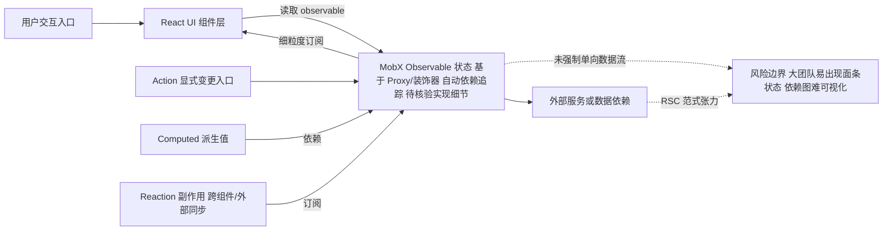

# mobxjs/mobx

## 一句话定位
基于透明响应式编程（Transparent Functional Reactive Programming）的前端状态管理库，通过可观察对象（Observable）自动追踪依赖并精确更新，是 Redux 之外的主流状态管理选择。

## 它解决的问题
React 应用的状态管理长期面临"简单与可扩展不可兼得"的困境。Redux 虽然可预测性强，但样板代码多、异步处理繁琐、性能上需要手动优化（shouldComponentUpdate）。MobX 通过**自动依赖追踪**解决这些问题：开发者只需标记可观察状态（`@observable`），框架自动建立"状态 → 依赖此状态的组件"的精确订阅关系，状态变化时只更新真正受影响的组件，无需手动 diff。

## 为什么值得关注
- **Stars:** 28,203（截至 2026-08-07），状态管理领域 Top 3
- **Forks:** 1,800，社区生态成熟
- **Watchers:** 331，活跃关注度高
- **License:** MIT
- **活跃度:** pushed_at 2026-08-02，持续维护
- **TypeScript 原生:** MobX 6+ 提供完善的类型推断

## 热度来源判断
MobX 的热度是**真实的技术选型偏好**沉淀。它在 2016-2019 年与 Redux 形成"双雄格局"，凭借"写更少代码做更多事"的理念吸引了大量开发者。虽然 2020 年后 Zustand、Jotai、Recoil 等轻量方案崛起分流，但 MobX 在**中大型复杂应用**（多实体关联、表单密集、实时数据）场景仍有不可替代性。当前 Star 增速稳定，属于成熟期工具。

## 关键技术亮点亮点
1. **Transparent Reactive Programming:** 通过 ES Proxy / 装饰器自动拦截属性访问，开发者无需手动声明依赖
2. **细粒度订阅:** 只有真正读取了某 observable 的组件才会在该值变化时 re-render，性能优于 Redux 的全树对比
3. **MobX 6 API:** 放弃装饰器依赖，改为 `makeObservable/makeAutoObservable`，更易配置
4. **MobX-State-Tree (MST):** 可选的"有 Schema"版本，提供快照、时间旅行、类型安全，类似 Immutable.js + Redux 的能力
5. **Derivation + Action + Reaction:** 清晰区分"派生值"（computed）、"变更"（action）、"副作用"（reaction），代码意图明确

## 架构师速览

| 决策问题 | 研究判断 | 证据边界 |
|---|---|---|
| 系统边界 | MobX 作为前端状态管理库，边界落在"React UI 层 ↔ Observable 领域状态 ↔ 外部服务/数据依赖"之间，运行时基于 ES Proxy 与 makeObservable/makeAutoObservable 做拦截与追踪 | 档案未给出源码级模块划分，未标注运行时最低版本 |
| 主路径 | 用户交互 → React UI 组件读取 observable → MobX 自动建立细粒度订阅 → 仅相关组件 re-render → action 修改状态触发 reaction/computed 派生 | 档案未描述具体订阅协议与调度实现细节 |
| 关键权衡 | "零样板开发效率 vs 缺乏强制单向数据流"；细粒度响应式性能 vs 依赖图难以可视化调试；功能完备性 vs 轻量替代（Zustand/Jotai/Valtio）蚕食新项目首选地位 | 权衡判断来自档案定性表述，未提供基准性能数据 |
| 最小 PoC | 用一个含对象图关联与 computed 派生的真实页面（如表单+列表过滤）验证 observable 边界、action 一致性、组件重渲染范围，再评估 RSC 兼容与团队约定成本 | 档案未提供官方 PoC 示例或基准，需以源码与官方文档核验 |

## 架构启发
MobX 的核心启发是 **"让框架理解数据依赖，而非让开发者手动 wire"**。这与 Vue 的响应式系统异曲同工。在 Redux 世界，开发者必须显式写 `mapStateToProps` 和 `useSelector`；MobX 则通过 Proxy 自动建立追踪。这种"零样板"思路影响了后续所有轻量状态库（Zustand、Valtio、Jotai）的设计——它们都在试图"比 Redux 更简单，比 MobX 更轻量"。

## 架构图（MMD）

> 证据边界：此图只采用本档案已有可核验描述；“待核验”节点不应视为项目实现事实。

## 定位判断
**成熟工具型项目。** MobX 是状态管理领域的经典选择，适合中大型 React 应用。它不是"创新新星"，而是"经过验证的成熟工具"。技术路线已基本定型，未来增量主要在生态适配（React 18/19、RSC 兼容）。

## 风险/局限/泡沫点
- **学习曲线:** 响应式概念（autorun、reaction、derivation）对 Redux 用户不直观
- **过度自由:** 不强制单向数据流，大型团队若无约定容易写出"面条式"状态逻辑
- **调试复杂:** 自动依赖追踪虽好，但出了 bug 后依赖图难以可视化
- **轻量替代崛起:** Zustand（6K+ lines vs MobX 复杂）正在成为新项目首选
- **RSC 兼容:** 响应式状态与服务端组件范式存在张力

## 与同类项目的关系
- **vs Redux/Redux Toolkit:** Redux 强调可预测性和时间旅行，MobX 强调开发效率；RTK 缩小了样板差距但理念仍不同
- **vs Zustand:** Zustand 更轻量、API 更简洁，是新项目首选；MobX 在复杂响应场景更强
- **vs Valtio:** Valtio 用 Proxy 实现响应式（与 MobX 类似），但极简，MobX 功能更全
- **vs Jotai:** Jotai 是原子化状态（atom-based），适合细粒度状态；MobX 适合对象图
- **vs React Context:** Context 适合低频全局状态，高频更新场景 MobX 性能优势明显

## 是否值得持续跟踪
**中等优先级跟踪。** MobX 已是成熟稳定的选择，技术突破性降低。建议关注其与 React Server Components 的适配，以及 MST（MobX-State-Tree）是否在类型安全方向有新进展。

## 后续观察点
- Star 增速是否被 Zustand/Jotai 持续蚕食
- 是否推出更轻量的核心包以应对轻量库竞争
- MobX-State-Tree 的采用率变化
- 与 React 19 Compiler 的兼容性

---
> 数据来源: GitHub API (2026-08-07) | Stars: 28,203 | Forks: 1,800 | License: MIT
