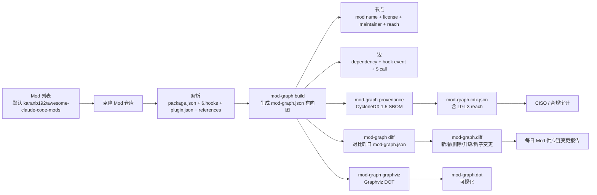

# agent-sec/mod-provenance-graph

## 一句话定位
Claude Code Mod 依赖图 + provenance SBOM 工具——`mod-graph build` 解析每个 Mod package.json + $.hooks + plugin.json + references 生成 mod-graph.json 有向图（节点为 mod / 边为依赖/钩子事件/$ 调用）+ `mod-graph provenance` 输出 CycloneDX 1.5 SBOM 含每个 mod 维护者/许可/钩子事件/L0-L3 reach + `mod-graph diff` 对比昨日 mod-graph.json 与今日生成版本仅差异输出。

## 它解决的问题
当前 Claude Code Mod 生态的痛点是 **「list 有 / 依赖图没有 + SBOM 没有」**：
- karanb192/awesome-claude-code-mods（昨日 9-16）展示了 Mod 列表 + L0-L3 reach 的工程化分级，但 **Mod 之间的依赖关系 + 钩子事件 + $ 调用关系尚未结构化**
- 企业 Mod 治理需要「Mod A 依赖 Mod B + Mod B 钩子事件 `$ on PreToolUse` 拦截 tool call + Mod C `$ on PostToolUse` 写入数据库」的依赖图才能判断「安装 Mod A 是否会级联触发 Mod B/C」
- CISO / 合规团队需要 SBOM（Software Bill of Materials）才能审计 Claude Code Mod 供应链

**mod-provenance-graph 直击这一缺口**：把 Mod 依赖关系 + 钩子事件结构化为有向图 + CycloneDX SBOM。CycloneDX 1.5 是 OWASP 主导的 SBOM 标准（与 SPDX 并列），企业供应链审计的事实标准。**对企业**：CISO / 合规团队可用 CycloneDX SBOM 直接审计 Claude Code Mod 供应链；**`mod-graph diff` 增量检测** 是「每日 Mod 供应链变更」的关键能力——昨天的 Mod 列表与今天相比多了什么 Mod / 哪个 Mod 升级 / 哪个 Mod 新增钩子事件。

## 为什么值得关注（2026-09-17）
- **Stars:** 9（截至 2026-09-17），1 天 9⭐
- **Forks:** 4（**fork/star 44.4% 极高早期信号**，远超普通新项目 5-10%；反映「准备把 Mod 集成进企业工作流」的企业 fork 群——这是企业合规导向的强信号）
- **Watchers/Subscribers:** 0
- **Open Issues:** 0
- **License:** Apache-2.0（企业商用清晰）
- **语言:** JavaScript（Node.js CLI）+ JSON 输出
- **活跃度:** created 2026-09-16，pushed 2026-09-16
- **规模:** 145 KB
- **基线标准:** Anthropic Claude Code 2.1.272 + CycloneDX 1.5 + Graphviz DOT
- **前提:** Anthropic 2026-09-09 function hooks 发版后产物（function hooks 是 Mod 钩子事件的标准）

## 热度来源判断
mod-provenance-graph 的热度是 **「Claude Code Mod 供应链图 + SBOM 标准化 × CycloneDX 1.5 企业审计事实标准 × function hooks 发版后产物 × diff 增量检测」** 的组合。CycloneDX 是 OWASP 主导的 SBOM 标准（与 SPDX 并列），2021 年被 Linux Foundation 接纳为正式标准，已被 NIST / FDA / 欧盟 CRA 等监管框架采纳。**Anthropic 2026-09-09 function hooks 发版** 是 Mod 钩子事件的标准——本仓库是 function hooks 发版后第一个把 Mod 依赖 + 钩子事件结构化为图 + SBOM 的工程化工具。**fork/star 44.4% 极高早期信号**反映企业合规团队对本仓库的高度关注——这是「准备把 Mod 集成进企业工作流」的企业 fork 群。热度 **真实且有强合规信号**——但需警惕：Mod 生态仍在快速演进，**Anthropic 是否接受 CycloneDX SBOM 作为 Mod 标准** 决定本仓库长期命运。

## 关键技术亮点
1. **`mod-graph build` 解析 + 生成有向图** —— 解析每个 Mod package.json + $.hooks + plugin.json + references；生成 mod-graph.json（节点：mod name + license + maintainer + reach / 边：dependency + hook event + $ call）
2. **`mod-graph provenance` 输出 CycloneDX 1.5 SBOM** —— 含每个 mod 维护者 / 许可 / 钩子事件 / L0-L3 reach；CycloneDX 1.5 是 OWASP 主导标准（与 SPDX 并列）
3. **`mod-graph diff` 对比昨日 mod-graph.json 与今日生成版本仅差异输出** —— 新增 Mod / 删除 Mod / 升级 Mod / 钩子事件变更 / 维护者变更 / 许可变更；这是「每日 Mod 供应链变更报告」的关键能力
4. **`mod-graph graphviz` 输出 Graphviz DOT 格式** —— 可视化依赖图；Graphviz 是图可视化事实标准
5. **默认从 karanb192/awesome-claude-code-mods 读取 Mod 列表** —— 与昨日 Mod 列表生态互补；可自定义 JSON / YAML
6. **Anthropic `claude plugin validate` 静态扫描产物** —— 输入是 `claude plugin validate` 输出；与官方命令互补
7. **L0-L3 reach 等级标注** —— 与 karanb192/awesome-claude-code-mods 同构（L0 draws and remembers / L1 reads / L2 writes or runs / L3 network）
8. **单一 CLI 入口 + 三命令 + 一 diff + 一 graphviz** —— `build / provenance / diff / graphviz` 四命令覆盖完整生命周期

## 架构师速览

| 决策问题 | 研究判断 | 证据边界 |
|---|---|---|
| 系统边界 | Claude Code Mod 供应链治理 CLI，输入是 Mod 列表（默认 awesome-claude-code-mods）+ Mod 仓库元数据，输出是 mod-graph.json 有向图 + CycloneDX SBOM + diff；不覆盖 Mod 运行时行为审计（运行时审计是 ToolReplay session 层审计） | 仅基于档案描述的 build / provenance / diff / graphviz 四命令；具体 hook event 解析是否完整（覆盖全部 Anthropic function hooks 事件类型）未在档案中给出 |
| 主路径 | 拉取 Mod 列表 → 解析 package.json + $.hooks + plugin.json + references → 构建有向图 → 输出 mod-graph.json + CycloneDX SBOM + diff | 主路径为档案语义抽象；具体解析层是否真的覆盖 Mod 嵌套依赖、版本约束、循环依赖检测未核验 |
| 关键权衡 | 图 + SBOM 双重输出（图可视化 + SBOM 标准化） vs 单图输出；每日 diff 增量（变更可追溯） vs 全量输出（每次完整重算）；CISO 合规导向（企业强需求） vs 开发者使用导向（个人轻需求） | 档案明示「图 + SBOM 双重输出 + diff 增量」设计目标；具体 SBOM 字段是否覆盖 CycloneDX 1.5 全部标准字段待核验 |
| 最小 PoC | 在 karanb192/awesome-claude-code-mods 列表的 31 个 Mod 上跑 `mod-graph build + provenance + diff`，验证 SBOM 字段完整性 + Graphviz DOT 可视化 + diff 变更检测是否正确 | PoC 范围、退出路径由档案「单一 CLI 入口 + 四命令」建议推导；具体 SBOM 字段标准待核验 |

## 架构图（MMD）

> 证据边界：此图只采用本档案已有可核验描述；"待核验"节点不应视为项目实现事实。

## 架构启发
mod-provenance-graph 的核心启发是 **「开源生态供应链治理需要图 + SBOM 双重输出」**——npm / cargo / PyPI 等成熟生态已经有 dependency graph（如 npm audit）+ SBOM 工具（如 syft），但 Claude Code Mod 生态是新兴生态（Anthropic 2026-09 function hooks 发版），**图 + SBOM 工具尚未成熟**——本仓库填补了这一空白。**CycloneDX 1.5 是 OWASP 主导的 SBOM 标准**——选择 CycloneDX 而非 SPDX 是「企业供应链审计事实标准」的工程化立场（与 SPDX 并列但 CycloneDX 在漏洞追踪 + 工具链支持上更优）。**`mod-graph diff` 增量检测** 是「每日供应链变更可追溯」的工程化形式——与 ToolReplay「session 层 hash-chain 封存」同构但推到「plugin/mod 供应链层」。

更深层的启发是：**新兴生态的供应链治理工具 = 早期事实标准窗口**——CycloneDX 在 2021 年成为 Linux Foundation 正式标准前，OWASP 已经主导多年；本仓库若被 Claude Code 生态接受为 Mod 供应链治理事实标准，将成为 Claude Code 进入「企业级供应链审计」的关键拼图。

## 定位判断
**生态基础设施候选型项目（Mod 供应链治理 CLI）。** mod-provenance-graph 不仅是工具，更试图成为 Claude Code Mod 生态的 **供应链治理事实标准**——类似 npm audit 之于 npm / syft 之于容器生态。若成功，它会成为 Mod 供应链治理的默认入口，具有平台级价值。**9⭐ / fork 4 / fork/star 44.4% / 1 天 极高早期信号**——fork/star 44.4% 远超普通新项目 5-10%，反映企业合规导向的强信号。但"平台化"取决于一个关键问题：**Anthropic 官方是否承认 CycloneDX SBOM 作为 Mod 标准**——目前 Anthropic 仅提供 `claude plugin validate` 静态扫描，尚未公开 Mod SBOM 标准；本仓库若被官方接受将形成事实标准。

## 风险 / 局限 / 泡沫点
- **Mod 生态仍在演进：** Anthropic function hooks 2026-09-09 发版后 Mod 生态快速变化；解析层可能需要持续适配
- **Anthropic 官方化威胁：** Anthropic 可能推出 `claude plugin sbom` 官方命令取代本仓库
- **CycloneDX vs SPDX：** 企业合规可能要求 SPDX 而非 CycloneDX；SBOM 工具需双标准支持
- **Mod 私有仓库：** 当前默认从 awesome-claude-code-mods 公共列表读取；企业私有 Mod 仓库需自定义配置
- **Graphviz 依赖：** 可视化需安装 Graphviz；无 Graphviz 环境只能看 JSON / SBOM

## 与同类项目的关系
- **vs karanb192/awesome-claude-code-mods（昨日 9-16）：** awesome-claude-code-mods 是「Mod 列表 + footprint + L0-L3 reach」单 Mod 视角；本仓库是「Mod 依赖图 + SBOM」多 Mod 视角；互补
- **vs CycloneDX 官方工具（cdxgen / syft）：** 这些是通用 SBOM 工具；本仓库是 Claude Code Mod 专用；定位更聚焦
- **vs ToolReplay（9-15）：** ToolReplay 是「session 层审计」（单个 session 的 tool call）；本仓库是「plugin/mod 供应链治理」（多 Mod 的依赖 + SBOM）；不同治理层
- **vs Anthropic `claude plugin validate`：** 官方命令是「单 Mod 静态扫描」；本仓库是「多 Mod 依赖图 + SBOM」；本仓库站在官方命令的肩膀上

## 是否值得持续跟踪
**值得跟踪（Mod 供应链治理事实标准候选）。** mod-provenance-graph 代表了 Claude Code Mod 生态「供应链治理工具化」的方向，无论其本身成败，这一方向是行业趋势。建议关注：
- Anthropic 官方是否推出 `claude plugin sbom`（决定其"事实标准"命运）
- CycloneDX 是否被 Claude Code 生态接受为 Mod SBOM 标准（vs SPDX）
- 是否扩展到企业私有 Mod 仓库（企业内部 Mod 治理）
- 是否扩展到其他 AI Coding 生态（Codex / Cursor / Copilot）

对 Claude Code 企业用户，本仓库是当前唯一的「Mod 供应链治理 + SBOM」工具，值得直接采用。对 Mod 生态观察者，它是「供应链治理工具」的标志性样本。

## 后续观察点
- 是否演化为独立平台/服务（从 CLI 升级为 SaaS 治理平台）
- 是否支持 SPDX 双标准输出（CycloneDX + SPDX 并存）
- 是否扩展到其他 AI Coding Mod 生态（Codex Mod / Cursor Plugin / Copilot Extension）
- 是否被 Anthropic 官方接受为推荐治理工具（决定其"事实标准"命运）
- 是否引入运行时 Mod 行为审计（与 ToolReplay session 层审计互补）

---
> 数据来源: GitHub API (2026-09-17) | Stars: 9 | Forks: 4 | License: Apache-2.0 | 语言: JavaScript | 创建: 2026-09-16
