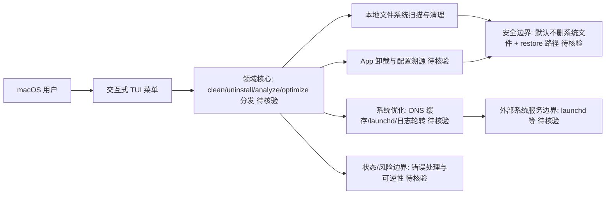

# Mole

## 一句话定位
macOS 一体化清理 + 卸载 + 分析 + 优化 CLI 工具——纯 shell 实现，号称"daisydisk + appcleaner + sensei + istat"四合一的开源替代，提供交互 TUI。

## 它解决的问题
macOS 用户常年被"磁盘占用越来越大"困扰，但：
- DaisyDisk/Sensei 等工具多为订阅制
- AppCleaner 不分析系统缓存、Docker、brew
- 手动清理每个目录工作量大

Mole 一条命令进入交互式菜单，支持 clean（应用残留、缓存、构建产物）、uninstall（彻底卸载 app 及配置）、analyze（按大小排序目录）、optimize（DNS 缓存、launchd、日志轮转）。

## 为什么值得关注（2026-08-16）
被 daily/2026-08-16.md 选为今日 macOS 系统工具重点。tw93（Mole 作者）的 README + 哲学化页脚在中文开发者社区是高质量样板；64,387 stars 在不到一年达成，是 2025 年下半年的现象级工具项目。

## 热度来源判断
热度来源是 **"macOS 装机刚需 × 纯 shell 美学 × 作者 kizuna 效应"**。tw93 在国内开发者社区是知名审美 / 工具大佬，README 与排版有"工具界苹果风"的模板化影响。但需注意：64k stars 在不到一年内达成，混入了作者个人品牌效应。建议区分项目本身 vs 作者光环。

## 关键技术亮点
1. **纯 Shell + 标准 macOS 命令:** 无依赖、零二进制安装
2. **交互 TUI:** 菜单式导航，可视化展示磁盘占用
3. **多模块覆盖:** clean / uninstall / analyze / optimize 四大功能
4. **安全默认:** 默认不删系统文件，所有清理操作可逆（提供 restore 路径）
5. **中英双语 README:** 中文社区友好的工具站

## 架构师速览

| 决策问题 | 研究判断 | 证据边界 |
|---|---|---|
| 系统边界 | 面向 macOS 单机的 CLI/TUI 工具，边界限于本机用户态文件系统与 launchd/DNS 等系统服务，不涉及服务端或跨平台抽象 | 档案仅声明 macOS-only、Shell 实现、标签含 macos；无 Linux/Windows/服务端部署事实 |
| 主路径 | 交互菜单分流到 clean/uninstall/analyze/optimize 四大本地模块，全部由 shell 脚本直接调用系统命令完成，无中间服务 | 档案明确"纯 shell + 标准 macOS 命令、零二进制安装"；具体子命令实现细节未在档案中给出 |
| 关键权衡 | "零依赖 shell + 交互 TUI"换取跨机器零安装成本，代价是 GPL-3.0 copyleft 风险、单作者维护脆弱性、误删用户配置可能 | 权衡基于档案明确字段：语言 Shell、License GPL-3.0、"单一大版本演进"、清理风险段落；性能/协议细节未证实 |
| 最小 PoC | 在一台真实 macOS 机器跑 analyze 一次、再跑一次 uninstall 走完完整路径，验证可逆性（restore）与默认安全行为，再纳入装机清单 | 档案指出"提供 restore 路径""默认不删系统文件"；具体 restore 命令、覆盖范围未在档案中给出，待核验 |

## 架构启发
"用 shell 模拟 GUI 体验"是 mole 的最大启发——TUI 把复杂决策抽象成菜单，让高级工具对普通用户也安全可用。这一模式值得借鉴到任何系统工具：减少学习曲线不等于降低功能。

## 架构图（MMD）

> 证据边界：此图只采用本档案已有可核验描述；“待核验”节点不应视为项目实现事实。

## 定位判断
**工具型 / macOS 系统清理标杆（中文社区）。** 在 DaisyDisk / AppCleaner 商业版之外，mole 是开源长尾替代之一。GPL-3.0 与"零依赖 shell" 立场清晰，但企业自用 fork 需注意 copyleft。

## 风险 / 局限 / 泡沫点
- **作者光环依赖:** 项目热度部分源于 tw93 个人品牌，需关注是否可持续
- **macOS-only:** 不跨 Linux/Windows，Windows 用户需找其他项目
- **GPL-3.0 严格 copyleft:** 自托管 fork 用于 SaaS 会被传染
- **少有人维护风险:** 单一大版本演进，作者忙时会延后
- **清理风险:** 误删用户配置的可能性始终存在，需谨慎默认行为

## 与同类项目的关系
- **vs DaisyDisk:** DaisyDisk 是付费 GUI；mole 是开源 CLI
- **vs AppCleaner:** AppCleaner 仅卸 app；mole 覆盖更广
- **vs mac-cleanup-pymupdf:** 简单清理脚本；mole 是完整 TUI
- **vs sensei / iStat Menus:** 商业监控；mole 偏向清理 + 优化

## 是否值得持续跟踪
**对 macOS 用户强烈推荐使用。** 跟踪价值中等（成熟期工具）。其稳定运行值得依赖，建议纳入新 mac 装机必装清单。

## 后续观察点
- 是否新增 AI 辅助模块（自动建议"清理 vs 保留"边界）
- 是否扩展到 Linux/WSL
- 作者是否开启更多版本语言（社区 PR 多语化）
- 与 Mac App Store 商业版的边界演化

---
> 数据来源: GitHub API (2026-08-21) | Stars: 64,387 | Forks: 2,256 | License: GPL-3.0 | 语言: Shell | 创建: 2025-09-23
