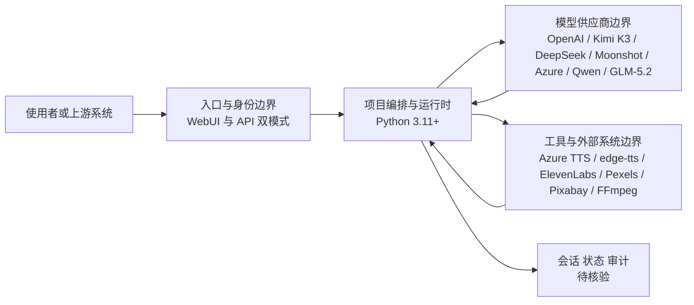

# harry0703/MoneyPrinterTurbo

## 一句话定位
一站式 AI 短视频生成工具——只需提供视频主题或关键词，即可自动生成视频脚本、匹配素材、生成字幕和背景音乐，并合成高清短视频，支持 WebUI 和 API 双模式。

## 它解决的问题
短视频内容创作（TikTok、YouTube Shorts、Instagram Reels）是巨大的市场需求，但制作一条高质量短视频需要脚本撰写、素材搜集、配音、字幕、剪辑等多个环节，对个人创作者和小团队来说门槛高、耗时长。MoneyPrinterTurbo 将整个流程自动化：输入主题或关键词，AI 自动生成文案脚本，从素材库匹配视频画面，用 TTS 生成配音，自动添加字幕和背景音乐，最终合成高清短视频。

## 为什么值得关注（2026-05-26）
- 102,008 stars，15,364 forks——创建于 2024-03-11，2 年多达到 10 万+ stars，是 AI 视频生成领域的绝对头部项目
- MIT 许可证，Python 3.11+，支持 Windows/macOS/Linux 全平台
- 提供 WebUI（可视化操作界面）和 API（程序化调用）双模式
- 已接入 Kimi K3（月之暗面）模型，支持 GLM-5.2、DeepSeek、Qwen 等国产大模型
- 646 个 subscribers（订阅者），社区高度活跃，持续更新（最近 push: 2026-08-07）

## 热度来源判断
**真实需求 + 短视频经济 + 中文社区红利**。MoneyPrinterTurbo 的 10 万 stars 由三重因素驱动：(1) 短视频经济的爆发——全球短视频创作者数量庞大，自动化工具需求强烈；(2) 端到端自动化的吸引力——从主题到成片的全流程自动化是内容创作者的梦想；(3) 中文社区红利——项目同时面向中英文用户（双 README），在中文开发者社区传播极广。10 万 stars 使其进入 GitHub 全站 Top 级别。需要注意的是，fork 数（15K）极高说明大量用户实际部署使用，不仅仅是"star 收藏"。

## 关键技术亮点亮点
1. **端到端自动化工作流**：输入主题/关键词 → AI 生成文案脚本 → 关键词提取与素材匹配 → TTS 配音生成 → 自动字幕 → 背景音乐匹配 → FFmpeg 合成高清短视频。整个流程无需人工干预，且每一步都可配置（LLM 提供商、TTS 引擎、素材来源等）。
2. **多模型/多服务集成**：LLM 层支持 OpenAI、Kimi K3、DeepSeek、Moonshot、Azure、Moonshot、Qwen 等；TTS 层支持 Azure TTS、edge-tts（免费）、ElevenLabs 等；素材层支持 Pexels、Pixabay 等免费素材库。这种"乐高式"的模块集成让用户可以根据需求和预算自由组合。
3. **WebUI + API 双模式**：WebUI 提供可视化操作界面（脚本参数配置、视频预览、任务管理），API 提供程序化调用接口（可集成到其他系统、批量生成）。两种模式覆盖了个人创作者和平台化运营两种场景。
4. **FFmpeg 深度集成**：使用 FFmpeg 进行视频合成，支持高清输出、字幕叠加、音频混合、转场效果等。FFmpeg 是视频处理的工业标准，保证了输出的专业级质量。

## 架构师速览

| 决策问题 | 研究判断 | 证据边界 |
|---|---|---|
| 系统边界 | 入口层（WebUI / API 双模式）→ 编排与运行时（Python 3.11+）→ 模型供应商（OpenAI、Kimi K3、DeepSeek、Moonshot、Azure、Qwen、GLM-5.2）→ 工具与数据源（Azure TTS、edge-tts、ElevenLabs、Pexels、Pixabay、FFmpeg）→ 会话/状态/审计边界（项目侧未给出明确实现细节） | 模型清单与工具清单来自档案；编排层内部组件、状态存储与审计落点待核验。 |
| 主路径 | 主题/关键词 → LLM 生成文案 → 关键词提取 → 素材库匹配画面 → TTS 生成配音 → 自动字幕 → FFmpeg 合成高清短视频；WebUI 与 API 共享同一编排路径 | 步骤顺序与 FFmpeg 合成在档案中明确；各步骤的可配置项、错误处理与重试机制待核验。 |
| 关键权衡 | 编排优先 vs. 自研视频生成：迭代快、成本低、模块可替换，但画面原创性与相关性受限于免费素材库（Pexels/Pixabay）；同时存在 TTS/素材版权与平台同质化风险 | 素材库限制与版权风险由档案明说；具体的素材匹配精度、平台限流阈值、视频生成模型集成进度待核验。 |
| 最小 PoC | 单渠道（WebUI 或 API 二选一）+ 单 LLM（如 DeepSeek）+ edge-tts + Pexels + FFmpeg，产出 1 条端到端短视频；验收项：版权溯源、成本/条、SLO（生成耗时）、可审计日志、退出路径 | 最低依赖组合可由档案组件拼出；具体部署形态、依赖版本、硬件要求与日志/成本基线待核验。 |

## 架构启发
MoneyPrinterTurbo 的设计哲学是"编排而非自研"——它不自己训练视频生成模型，而是编排现有的 AI 服务（LLM、TTS、素材库）和工具（FFmpeg）来完成端到端工作流。这种策略的优势是迭代快、成本低、灵活度高——每当有新的更好的 LLM 或 TTS 出现，只需更新配置即可。劣势是输出质量受限于各环节工具的能力——特别是素材匹配环节，由于依赖免费素材库（Pexels/Pixabay），画面与文案的相关性可能不够精确。这也是它与 ViMax（调用视频生成模型而非素材库）的本质区别。

## 架构图（MMD）

> 证据边界：此图只采用本档案已有可核验描述；“待核验”节点不应视为项目实现事实。

## 定位判断
MoneyPrinterTurbo 定位为**AI 短视频自动化的工程标杆**。在 AI 视频生成生态中，它不与底层视频生成模型（Sora、Kling）竞争，而是在应用层提供"主题→成片"的自动化工具。10 万 stars 使其成为 AI 内容生产赛道的绝对头部项目。与学术性更强的 ViMax 相比，MoneyPrinterTurbo 更偏工程实用主义——快速、可用、可部署。

## 风险 / 局限 / 泡沫点
1. **素材匹配的精度天花板**：依赖免费素材库（Pexels/Pixabay）进行画面匹配，素材覆盖范围有限且与文案的相关性不够精确。"AI 生成视频"实际上是"AI 拼接素材"，与真正的视频生成（如 Sora）有本质区别。对于要求原创画面的场景，MoneyPrinterTurbo 不适用。
2. **版权和原创性风险**：使用免费素材库的画面、TTS 生成的配音、AI 生成的文案，组合后的成品在版权和原创性上存在灰色地带。用于商业发布（特别是 YouTube 变现）可能面临版权问题或平台的内容质量惩罚。
3. **内容同质化**：大量用户使用同一工具生成短视频，可能导致内容高度同质化，平台算法可能降低这类内容的推荐权重。
4. **对免费服务/模型的依赖**：edge-tts（免费 TTS）和免费素材库可能随时变更服务条款或限制，影响项目的持续可用性。

## 与同类项目的关系
- **HKUDS/ViMax**：11K stars，Agentic 视频生成。ViMax 调用视频生成模型（Google Omni、Seedance）生成原创画面，MoneyPrinterTurbo 使用素材库拼接。前者更"原创"但更慢更贵，后者更快更便宜但画面非原创。
- **OpenAI Sora / Google Veo**：底层视频生成模型。MoneyPrinterTurbo 是这些模型的上层应用——未来可能集成这些模型作为素材来源，但目前主要依赖免费素材库。
- **Fliki / InVideo**：商业 AI 视频生成 SaaS。功能类似但收费。MoneyPrinterTurbo 是其开源替代。

## 是否值得持续跟踪
**值得持续跟踪，作为 AI 内容生产赛道的标杆**。10 万 stars 的项目在 GitHub 上极为罕见，MoneyPrinterTurbo 的持续增长反映了 AI 视频自动化赛道的巨大需求。虽然技术上不是"生成式视频"，但其编排层的工程实践和用户基数使其成为该赛道的必看项目。建议关注其是否会集成真正的视频生成模型。

## 后续观察点
1. **是否集成视频生成模型**：是否会接入 Sora API、Kling、Seedance 等视频生成模型，从"素材拼接"升级为"AI 生成画面"，这将是质的飞跃
2. **平台内容政策的影响**：YouTube/TikTok 等平台是否会对 AI 自动生成的短视频进行限制或降权，影响 MoneyPrinterTurbo 的实际使用价值
3. **商业化和企业版**：是否有团队围绕 MoneyPrinterTurbo 构建商业 SaaS（批量生成、API 服务的付费版），以及这些商业化尝试的成功度

---
*首次记录：2026-05-26*
