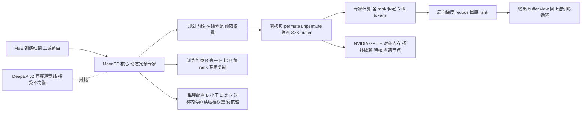

# MoonshotAI/MoonEP

## 一句话定位
专家并行（Expert Parallelism）通信库，通过动态冗余专家实现每个 rank 的完美负载均衡（恒定 S×K tokens），零拷贝 + 静态形状，通信延迟低于 DeepEP v2 且对路由不均衡免疫。

## 它解决的问题
大规模 MoE 训练中，专家并行（EP）的核心瓶颈是**负载不均衡**：不同专家收到的 token 数差异巨大，最热 rank 决定整体延迟，且动态 token 形状导致 GPU 内存碎片甚至 OOM。现有方案（如 DeepEP）是"接受不均衡、让最热 rank 拖慢全局"。MoonEP 把问题转为"主动消除不均衡"。

## 为什么值得关注（2026-07-30）
- **完美均衡**：无论路由多倾斜，每个 rank 恒定接收 `S × K` tokens。
- **对标 DeepEP v2**：官方 benchmark 显示通信时间在所有不均衡水平下更低，且端到端训练在高不均衡下不 OOM。
- **静态形状消除内存碎片**：固定的 `S × K` buffer，静态已知形状消除逐层 MoE 主机同步。
- **随 Kimi K3（896 专家）发布同期出现**：直接关系 3T 级 MoE 训练可行性。

## 热度来源判断
**真实技术需求主导。** EP 通信是 MoE 训练的硬骨头，DeepEP（DeepSeek 开源）已建立该赛道认知。MoonEP 作为"完美均衡"新方案切入，对训练大规模 MoE 的团队有直接实用价值。热度（4 天 858⭐）对纯基础设施库而言健康。风险：benchmark 为项目方自报，需独立复现。

## 关键技术亮点亮点
1. **动态冗余专家（dynamic redundant experts）**：在线从当前 router 输出规划冗余专家、预取权重，使每 rank 计算量恒定；梯度在反向传播时 reduce 回原 rank。
2. **零拷贝 + 静态形状**：融合 permute/unpermute，token 直接写到远程 rank 的专家分组位置，返回 buffer view 给计算层，消除 comm-buffer→user-buffer 拷贝。固定 `S × K` buffer，静态形状。
3. **近最优 GPU 规划内核**：在线规划冗余专家的开销可忽略（near-optimal planning kernel）。
4. **训练/推理分离配置**：训练必须 `B = E/R`（每 rank 复制 ≤ E/R 个专家）；推理允许 `B < E/R`（推荐 B=3–4），溢出时通过对称内存映射直读远程权重。

## 架构师速览

| 决策问题 | 研究判断 | 证据边界 |
|---|---|---|
| 系统边界 | 边界位于"MoE 训练框架（上游路由/Token 分配）— MoonEP 的 EP 通信核心（动态冗余专家 + 静态 S×K buffer）— NVIDIA GPU 宿主运行时（依赖对称内存/NVLink）"三段之间；外部侧必须满足 B=E/R 的专家分组约束 | 边界由 README 关于训练/推理分离配置与对称内存要求直接得出；"振武 PPU 在审"为待核验事项 |
| 主路径 | 上游训练循环 → MoonEP 规划内核（在线冗余专家分配）→ 零拷贝 permute/unpermute → 静态 S×K 远程 buffer → 专家计算 → 反向梯度 reduce 回原 rank | 主路径完全基于 README 的"动态冗余专家 + 零拷贝 + 静态形状 + 梯度 reduce 回原 rank"四步描述 |
| 关键权衡 | 以"冗余专家的额外正向计算 + 静态 buffer 内存占用"换取"恒定 S×K 负载（消除最热 rank 瓶颈）+ 零碎片 + 免主机同步"；硬件被锁定在 NVIDIA | 权衡三要素均来自 README；推理 B=3–4 的推荐值仅适用于推理场景，训练不可用 |
| 最小 PoC | 在 H20/H100 单节点、≥8 rank 上复现官方 benchmark：固定路由不均衡率（1×~4×），对照 DeepEP v2 测量 EP 通信耗时与峰值显存；并验证 B=E/R 约束下 OOM 边界 | PoC 复现目标直接对应 README 的"H20 EP=8 自报 benchmark"与"高不均衡下不 OOM"声明，属项目方自报，需独立复现 |

## 架构启发
MoonEP 的核心启发是**把"不均衡"从不可避免变为可工程消除**。冗余专家用少量额外计算换全局恒定负载 + 静态内存，这是一个清晰的工程权衡——以可预测的计算开销换取消除最热 rank 瓶颈与内存碎片。静态形状还顺带解决主机同步开销。这种"主动均衡"思想对任何大规模 MoE 训练系统都有借鉴价值，不限于 K3。

## 架构图（MMD）

> 证据边界：此图只采用本档案已有可核验描述；“待核验”节点不应视为项目实现事实。

## 定位判断
在 MoE 训练基础设施赛道中，MoonEP 是 DeepEP 的**直接竞争与补充方案**。DeepEP 由 DeepSeek 开源、已有社区基础；MoonEP 由 Moonshot 开源、主打"完美均衡"差异化。两者可能共存：不同 MoE 配置（专家数/路由策略）下各有优势。

## 风险 / 局限 / 泡沫点
1. **benchmark 为项目方自报**（H20 EP=8）：与 DeepEP v2 的对比需独立复现，尤其在不同硬件/配置下。
2. **仅支持 NVIDIA GPU**（振武 PPU 在审）：硬件覆盖有限，AMD/其他加速器用户无法使用。
3. **冗余专家的额外计算开销**：完美均衡并非免费，需在小规模真实配置中量化"冗余开销 vs 均衡收益"的平衡点。
4. **强依赖对称内存（symmetric memory）**：对 NVLink/拓扑有要求，跨节点扩展性待验证。

## 与同类项目的关系
- **vs DeepEP / DeepEP v2**（DeepSeek）：同赛道直接竞品。DeepEP 接受不均衡、延迟由最热 rank 决定；MoonEP 主动消除不均衡。官方 benchmark 称 MoonEP 在高不均衡下更优。
- **vs Megatron-LM 的 EP**：Megatron 提供更通用的分布式训练框架，MoonEP 聚焦 EP 通信这一子问题，可作为 Megatron 的组件集成。

## 是否值得持续跟踪
**是。** EP 通信是大 MoE 训练的核心瓶颈，"完美均衡"是有价值的工程方向。跟踪重点：独立 benchmark 复现、与 DeepEP 在真实训练中的实测对比、硬件扩展性。

## 后续观察点
1. 第三方在非 H20 硬件（如 H100/A100）上复现与 DeepEP v2 的对比。
2. 是否被主流训练框架（Megatron/DeepSpeed）集成为可选 EP 后端。
3. 跨节点（多机）扩展下对称内存方案的实际性能。

---
*首次记录：2026-07-30 · 数据来源：GitHub API + 仓库官方 README*
