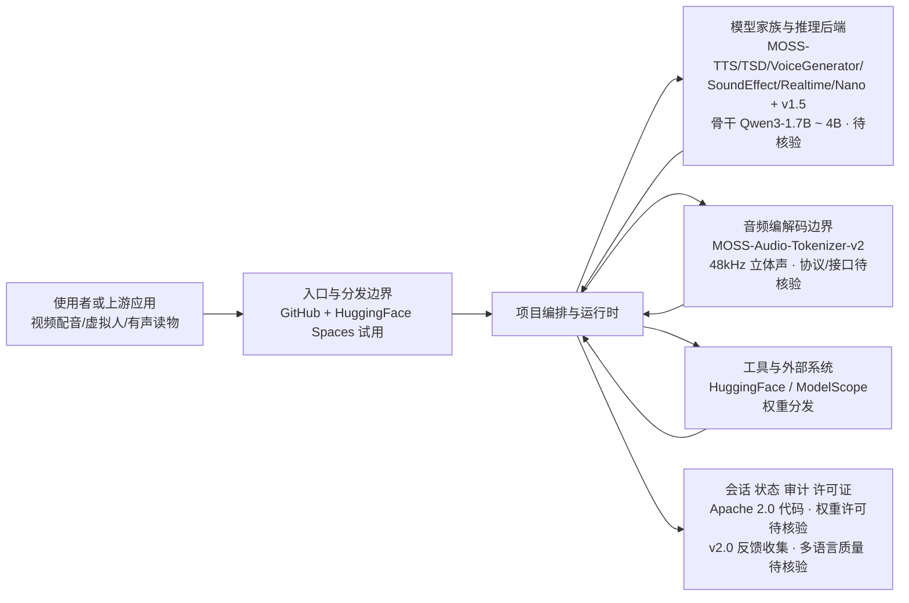

# OpenMOSS/MOSS-TTS

## 一句话定位
MOSI.AI 和 OpenMOSS 团队推出的开源语音与音效生成模型家族，覆盖稳定长语音合成、多说话人对话、语音/角色设计、环境音效和实时流式 TTS，原生支持 48kHz 立体声。

## 它解决的问题
开源 TTS 领域此前缺乏一个"全能型"方案——现有的项目要么只能做短语音（如 VITS），要么不支持声音克隆，要么音质不够高，要么无法流式输出。MOSS-TTS Family 通过一系列模型覆盖了全场景：高质量长语音、多说话人对话、声音设计、环境音效、实时流式合成，且原生支持 48kHz 立体声输出。这为开源社区提供了一个可以与商业 TTS（如 ElevenLabs、Azure TTS）竞争的完整方案。

## 为什么值得关注（2026-05-25）
- 3,962 stars，351 forks——创建于 2026-02-07，半年内增长到近 4K stars
- Apache 2.0 许可证，Python 实现，有完整的技术报告（arXiv: 2603.18090）
- 模型已在 HuggingFace 和 ModelScope 发布，可在线试用（HuggingFace Spaces）
- 支持多种推理后端：llama.cpp（PyTorch-free）、SGLang-Omni（3x 加速）、vLLM-Omni（全系列支持）
- MOSS-TTS-Nano 约 100M 参数，4 核 CPU 即可流式运行

## 热度来源判断
**学术声誉 + 开源 TTS 市场需求**。MOSS-TTS 的热度来自：(1) OpenMOSS 团队的学术声誉——复旦 OpenMOSS 实验室此前推出的 MOSS 对话模型在中文开源 AI 社区有高知名度；(2) 开源 TTS 的真实需求——随着 AI 应用（视频配音、虚拟人、有声读物）爆发，高质量开源 TTS 是刚需；(3) 多后端推理支持降低了部署门槛——从 llama.cpp（CPU 推理）到 vLLM（GPU 高性能推理），覆盖了不同场景。4K stars 虽不及头部项目，但在 TTS 细分领域已属领先。

## 关键技术亮点亮点
1. **模型家族覆盖全场景**：MOSS-TTS（基础长语音）、MOSS-TTSD（多说话人对话）、MOSS-VoiceGenerator（语音/角色设计）、MOSS-SoundEffect（环境音效，DiT backbone + Flow Matching）、MOSS-TTS-Realtime（实时流式）、MOSS-TTS-Nano（~100M 参数轻量版）。v1.5 版本引入了语言标签、更稳定的克隆、显式停顿控制（`[pause X.Ys]`）。
2. **48kHz 立体声原生支持**：配合 MOSS-Audio-Tokenizer-v2，原生支持 48kHz 立体声输入输出——远超多数开源 TTS 的 16kHz/22kHz 单声道。这对音频质量至关重要的场景（播客、有声读物）意义重大。
3. **多后端推理支持**：(a) llama.cpp + ONNX Runtime 实现 PyTorch-free 推理，8B 模型可在 8GB GPU 上运行；(b) SGLang-Omni 提供约 3x 吞吐加速；(c) vLLM-Omni 支持全系列模型。GGUF 量化权重已发布。
4. **MOSS-TTS-Local-Transformer-v1.5**：4B 参数检查点，从 Qwen3-1.7B 扩展到 Qwen3-4B 骨干，继承 v1.5 全部特性，获得 SGLang-Omni Day-0 支持。

## 架构师速览

| 决策问题 | 研究判断 | 证据边界 |
|---|---|---|
| 系统边界 | MOSS-TTS 是覆盖长语音、多说话人对话、声音设计、环境音效、流式 TTS 与轻量版共 7+ 变体的开源 TTS 模型家族，通过 MOSS-Audio-Tokenizer-v2 提供 48kHz 立体声能力，对外发布于 HuggingFace/ModelScope 与 HuggingFace Spaces 在线试用。 | 仅基于档案“关键技术亮点”与发布渠道描述；具体各模型 checkpoint 命名、license 细则在 README 中未列出，须逐权重核验。 |
| 主路径 | 文本输入 → MOSS-Audio-Tokenizer-v2 编码 → Qwen3（1.7B 或 4B）骨干 TTS 模型推理 → 多后端（llama.cpp/ONNX、SGLang-Omni、vLLM-Omni）部署 → 48kHz 立体声输出。Nano(~100M) 走 4 核 CPU 流式子路径。 | 后端加速比（SGLang “约 3x”）、CPU 4 核流式、8GB GPU 跑 8B 等说法源自档案引用的公开资料，未在 README 给出复现脚本或基准。 |
| 关键权衡 | “多场景模型家族 vs 维护成本”以及“48kHz 立体声/大骨干 vs 部署门槛”：全场景覆盖与音质上限换来了 7+ 变体的持续维护负担，且除 Nano 外需 Qwen3 级 GPU 资源；中文优势明显，英文/多语言生产可用性未证实。 | 权衡判断只来自档案“风险/局限”与“同类项目”两节；具体多语言质量基准、模型权重单独许可条款未给出原文。 |
| 最小 PoC | 优先在 HuggingFace Spaces 试用 v1.5 验证中文长语音与 `[pause X.Ys]`、语言标签基本能力，再以 MOSS-TTS-Nano + llama.cpp/ONNX 在 4 核 CPU 环境跑流式 PoC；GGUF 量化权重已发布可作低门槛入口。 | 试用入口来自档案；Nano 4 核 CPU 流式、GGUF 量化等说法均需在 README 与对应推理后端文档中再核验，acceptance 项须自定 SLO 与许可证复核。 |

## 架构启发
MOSS-TTS 的设计哲学是"模型家族覆盖全场景"而非"一个模型做所有事"。这种设计让每个模型可以针对特定场景优化（如 Nano 追求轻量、Realtime 追求低延迟、SoundEffect 追求音效保真），而不是在一个模型中做 trade-off。另一个值得学习的是多后端推理策略——通过 llama.cpp/vLLM/SGLang 适配不同的部署环境，最大化模型的可及性。基于 LLM 骨干（Qwen3）的 TTS 架构也代表了"TTS as LLM"的趋势——用语言模型的框架统一语音生成。

## 架构图（MMD）

> 证据边界：此图只采用本档案已有可核验描述；“待核验”节点不应视为项目实现事实。

## 定位判断
MOSS-TTS 定位为**开源 TTS 的全能型方案**。在开源 TTS 生态中，它与 ChatTTS、CosyVoice（阿里）、GPT-SoVITS 等竞争。差异化在于全场景覆盖（从基础 TTS 到音效生成）和 48kHz 立体声支持。OpenMOSS 的学术背景使其在中文学术社区有较强影响力。3.9K stars 说明还在增长期，尚未达到 ChatTTS（30K+）或 CosyVoice 的热度水平。

## 风险 / 局限 / 泡沫点
1. **模型家族的维护复杂度**：7+ 个模型变体意味着维护成本高。如果团队精力不足，部分模型可能停止更新。学术实验室项目尤其面临"论文发表后维护放缓"的风险。
2. **中文为主的多语言能力**：虽然支持多语言合成，但 OpenMOSS 团队的优势在中文。英文和其他语言的质量可能不如 ElevenLabs 等英文为主的商业方案。
3. **模型参数量较大**：除 Nano（~100M）外，主模型基于 Qwen3-1.7B 到 4B，部署门槛比轻量 TTS（如 Piper TTS）高得多。虽然 llama.cpp 支持降低了门槛，但仍需一定的技术能力。
4. **许可证风险**：虽然代码是 Apache 2.0，但模型权重可能有额外的使用限制（特别是商业使用）。需仔细检查每个模型的许可条款。

## 与同类项目的关系
- **CosyVoice (阿里)**：阿里的开源 TTS，同样基于 LLM 骨干，支持声音克隆和多语言。与 MOSS-TTS 定位相似，是中国开源 TTS 的主要竞争者。
- **ChatTTS**：对话式 TTS，在中文社区有 30K+ stars。更专注于对话场景，而 MOSS-TTS 覆盖更广。
- **GPT-SoVITS**：社区驱动的声音克隆 TTS，约 40K+ stars。用户群体更大但学术性不如 MOSS-TTS。
- **ElevenLabs**：商业 TTS 标杆。开源方案在音质和稳定性上仍在追赶。

## 是否值得持续跟踪
**值得跟踪，特别是 TTS/语音技术方向**。MOSS-TTS 代表了中国学术开源 TTS 的前沿水平。其模型家族策略和多后端推理支持是值得学习的工程实践。建议关注 v2.0 版本发布和模型能力的跃升。

## 后续观察点
1. **MOSS-TTS 2.0 的发布**：README 已宣布 2.0 即将到来，正在收集反馈——大版本更新是否带来质的飞跃
2. **多语言能力的提升**：v1.5 已支持语言标签，但英文/多语言合成质量是否达到生产可用水平
3. **社区采纳度**：是否有视频制作、有声读物、虚拟人等应用场景的项目选择 MOSS-TTS 作为底层引擎

---
*首次记录：2026-05-25*
