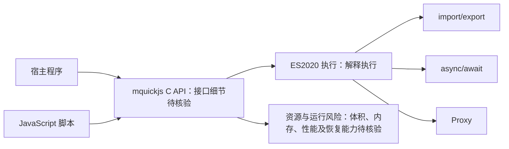

# bellard/mquickjs

## 一句话定位
Fabrice Bellard 推出的精简版 QuickJS JavaScript 引擎，专为极低资源占用的嵌入式场景优化。

## 它解决的问题
在物联网设备、边缘计算节点、智能卡片等资源极度受限的硬件上，标准 V8/SpiderMonkey 等 JS 引擎因内存占用过大（数十 MB 起）完全无法运行。开发者需要一种能以 KB 级内存执行 JavaScript 的运行时。mquickjs 正是面向这类场景：在极小二进制体积和极低内存条件下，提供完整的 ES2020 兼容 JavaScript 执行能力。

## 为什么值得关注
- **Stars:** 6,100 stars，在 C 语言项目中属于垂直细分领域的高关注度
- **作者权威性:** Fabrice Bellard 是传奇程序员，创造了 QEMU、FFmpeg、QuickJS、TCC 等多个里程碑级项目
- **技术稀缺性:** 嵌入式 JS 引擎领域几乎没有竞争对手，mquickjs 是该赛道唯一的顶级实现
- **生态战略意义:** 随着边缘 AI 和 IoT 智能化加速，轻量级 JS 运行时的战略价值持续上升

## 热度来源判断
热度主要来自 Bellard 的个人品牌效应——他在系统编程社区拥有极高声誉，每次发布新项目都会引发广泛关注。但与纯炒作不同，mquickjs 填补了一个真实的技术空白：嵌入式设备对脚本化的需求正在增长（智能家电、车机系统、工业控制器等需要灵活的配置逻辑）。6,100 stars 对一个嵌入式 C 引擎来说是合理偏高的水平，说明社区认可是实打实的。

## 关键技术亮点亮点
1. **极小二进制体积:** 编译后可控制在约 200-300KB（含完整 ES2020 支持），远低于 V8 的 20MB+ 级别
2. **低内存占用:** 堆内存可低至数百 KB 级别运行，适配 ARM Cortex-M 等微控制器
3. **完整的 ES2020 模块支持:** 支持 import/export、async/await、Proxy 等 modern JS 特性，不牺牲语言完整性
4. **C API 简洁:** 提供清晰的嵌入式集成接口，几行代码即可在宿主程序中嵌入 JS 执行引擎
5. **基于成熟 QuickJS:** 继承了 QuickJS 多年的稳定性积累和标准合规性测试

## 架构师速览

| 决策问题 | 研究判断 | 证据边界 |
|---|---|---|
| 系统边界 | mquickjs 的核心是面向资源受限设备的精简 JavaScript 引擎，通过 C API 嵌入宿主程序并执行 ES2020 JavaScript；外部边界包括宿主、待执行脚本及具体集成方式。 | 档案未提供 C API 接口定义、宿主集成示例或设备侧外设模型；数十 MB 起、KB 级执行等比较性数据未给出测试方法。 |
| 主路径 | 宿主程序加载脚本 → mquickjs 解释执行 → 返回执行结果；模块、async/await 与 Proxy 属于被明确支持的语言能力路径。 | 档案未说明模块加载实现、异步调度、错误返回格式、对象跨边界规则及 API 生命周期。 |
| 关键权衡 | mquickjs 以解释执行取代 JIT，以引用计数和循环回收换取较低资源占用与可移植性；该取向适合资源受限场景，但不应据此推断计算密集型任务性能。 | “无 JIT、解释执行、引用计数+循环回收、无多线程”未附源码依据；V8 体积、mquickjs 体积和内存数字也缺少构建配置、编译选项及测量基准。 |
| 最小 PoC | 选择一项真实嵌入式配置逻辑，分别核验编译后体积、运行期内存、目标脚本执行、宿主 C API 集成及错误恢复；性能、工具链、RTOS 集成、WASM 与 NEON 均列为后续核验项。 | 档案未提供可复现构建命令、目标平台、测试脚本、测量工具或验收阈值；不得将 Stars、作者声誉或定位描述视为生产适用性证据。 |

## 架构启发
mquickjs 的核心设计哲学是「极致做减法」——它没有 JIT 编译器（解释执行），没有垃圾回收器的复杂分代设计（使用引用计数+循环回收），也没有多线程支持。这种「功能最小化换取可移植性最大化」的权衡，是嵌入式系统设计的经典范式。对比 V8 的「功能最大化换取性能最大化」，两者代表了截然不同的架构取向。

## 架构图（MMD）

> 证据边界：此图只采用本档案已有可核验描述；“待核验”节点不应视为项目实现事实。

## 定位判断
属于嵌入式 JavaScript 运行时生态的核心基础设施。在更广阔的运行时生态中，mquickjs 是「超轻量」赛道的标杆，与 Node.js（服务端）、Deno（现代化）、Bun（高性能）形成互补而非竞争关系。

## 风险 / 局限 / 泡沫点
1. **维护节奏不确定:** Bellard 的项目更新频率不固定，mquickjs 的 issue 响应和 bugfix 周期可能较长
2. **无 JIT 导致性能瓶颈:** 纯解释执行模式下，计算密集型 JS 代码性能远低于 V8，不适合高性能场景
3. **生态工具链匮乏:** 没有 npm 包管理集成，调试工具和性能分析工具极度有限
4. **文档相对稀少:** 主要依赖源码和少量示例，新手上手成本较高

## 与同类项目的关系
- **QuickJS（原始版）:** mquickjs 的前身，功能更完整但体积更大；mquickjs 是其精简分支
- **Espruino:** 另一个嵌入式 JS 引擎，但使用自定义的 ES 子集而非完整标准，生态偏向微控制器教育市场
- **Microvium:** 极致轻量的 JS 引擎（目标 <30KB），但牺牲了更多语言特性，兼容性不如 mquickjs

## 是否值得持续跟踪
**值得跟踪。** 作为嵌入式 JS 赛道的标杆项目，且由顶级系统程序员维护，其技术演进方向具有风向标意义。尤其需要关注其在边缘 AI 推理编排、智能硬件脚本化等新兴场景的落地情况。

## 后续观察点
- 关注 mquickjs 是否被主流嵌入式 RTOS（如 Zephyr、FreeRTOS）集成为标准组件
- 观察是否有针对 mquickjs 的 WASM 编译流程，以实现跨平台嵌入式部署
- 跟踪 Bellard 是否为 mquickjs 添加 ARM SIMD/NEON 指令优化以提升解释执行性能

---
> 数据来源: GitHub API (gh cli) | 更新: 2026-08-07 | Stars: 6,100 | Language: C | Forks: 235
