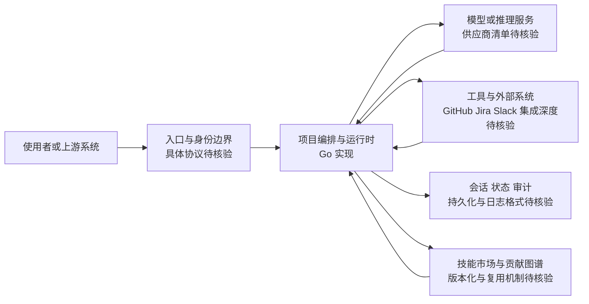

# multica-ai

## 一句话定位

开源托管式 Agent 平台，将编码 Agent 转化为真正的团队成员——支持任务分配、进度追踪、技能复用。

## 它解决的问题

当前的 AI Agent 是个人工具，缺乏团队层面的管理和协作能力。企业在采用 AI Agent 时面临几个核心问题：

1. **Agent 孤岛**：每个开发者单独使用 Agent，经验和技能无法共享
2. **贡献不可追溯**：Agent 完成的任务缺乏记录和审计
3. **缺乏生命周期管理**：Agent 的创建、配置、维护没有统一管理

面向的用户是需要将 AI Agent 集成到团队工作流中的企业和开发团队。

## 为什么值得关注（2026-04-11）

首次将 Agent 定位为"团队成员"而非"工具"。6,000+ stars 显示开发者对 Agent 协作管理的强烈需求。代表了从"个人助手"到"团队成员"的 Agent 角色升级方向。

## 热度来源判断

- **角色定义创新**：Agent 不再是工具，而是有名字、技能、贡献记录的团队成员
- **团队化需求**：企业正在寻找将 AI Agent 纳入团队工作流的方案
- **开源托管**：提供自托管选项，满足企业数据安全需求
- **任务可追溯**：Agent 的每个贡献都可以被发现和审计

## 关键技术亮点亮点

1. **Agent 生命周期管理**：从创建到配置到退役的完整管理流程
2. **技能复用和积累**：Agent 学到的技能可以被其他 Agent 复用，形成知识积累
3. **贡献可发现、可追溯**：Agent 完成的每个任务都有记录，可审计可回溯
4. **任务分配和进度追踪**：支持将任务分配给特定 Agent，追踪执行进度
5. **人类-Agent 混合团队**：支持人类和 Agent 在同一团队中协作

## 架构师速览

| 决策问题 | 研究判断 | 证据边界 |
|---|---|---|
| 系统边界 | 项目自定位为开源托管式 Agent 平台，聚焦编码 Agent 的团队级生命周期与协作管理；档案未给出具体入口协议、模型供应商适配清单或外部系统对接方式 | 仅基于定位描述、Go 语言与标签（Multi-Agent / 托管式平台 / 团队协作 / Agent 管理）做边界判断；具体接入渠道、SDK、存储与部署形态在档案中缺失 |
| 主路径 | Agent 作为具名成员被分配任务，经由平台层的编排/运行时执行，调用模型与工具，并把会话、贡献与审计写回平台 | 档案仅抽象描述“任务分配 → 进度追踪 → 技能复用 → 贡献可追溯”的管理流；运行时协议、状态机、持久化方案需源码核验 |
| 关键权衡 | “团队成员”级身份、技能市场与贡献图谱带来的管理复杂度、可审计性与不可预测行为治理成本，叠加开源托管带来的部署/合规负担 | 档案明确列出 Agent 行为不可预测性、大团队未验证、与 GitHub/Jira/Slack 集成深度待验等局限；不引用 star 增速或评分作为生产可用性证据 |
| 最小 PoC | 以单一接入渠道（如仅一个编码 Agent 入口）、最小工具权限、可审计日志与可回滚的部署形态验证生命周期、技能复用与贡献追溯三项能力，再扩展混合团队与多渠道 | 档案未披露官方推荐部署方式、SLO 与退出路径；PoC 中安全、成本、SLO、退出策略须作为独立验收项而非由档案预设 |

## 架构启发

multica-ai 的核心架构决策是 **Agent-as-Team-Member**：

- **身份系统**：每个 Agent 有独立身份，而非匿名工具调用
- **技能市场**：Agent 技能可以被版本化、共享和复用
- **贡献图谱**：记录 Agent 的所有贡献，形成可追溯的工作历史
- **从工具到协作者**：架构上从"调用 API"升级为"管理团队成员"

Trade-off：增加了管理复杂度，适合中大型团队，小团队可能觉得过重。

## 架构图（MMD）

> 证据边界：此图只采用本档案已有可核验描述；“待核验”节点不应视为项目实现事实。

## 定位判断

**平台候选**。multica-ai 是 Agent 管理平台，核心价值在于提供 Agent 的团队级管理和协作能力。如果成功，可能演化为 Agent 团队协作的标准平台。

## 风险 / 局限 / 泡沫点

- **新项目，生态待验证**：刚上线不久，实际效果和稳定性需要验证
- **Agent 行为不可预测性**：将 Agent 作为团队成员管理，Agent 的不确定行为可能带来风险
- **大规模团队场景**：尚未验证在大型团队中的可行性
- **与现有工具集成**：需要与 GitHub、Jira、Slack 等工具深度集成才能发挥价值

## 与同类项目的关系

- **agent-orchestra**：类似的多 Agent 协作方案，但 multica 更偏平台化运营
- **oh-my-claudecode**：Claude Code 生态的团队化编排，与 multica 的定位有重叠
- **auto-deep-researcher-24x7**：单 Agent 自动化，multica 提供的是多 Agent 管理层

## 是否值得持续跟踪

**持续跟踪。** Agent 团队化协作是新赛道，multica-ai 的"团队成员"定位有差异化价值，但需要等待更多实际案例验证。

## 后续观察点

1. **企业团队试用反馈**：是否有中大型团队实际采用
2. **与开发工具集成深度**：GitHub、Jira 等工具的集成质量
3. **Agent 协作效率数据**：人类-Agent 混合团队的实际效率提升
4. **社区贡献和插件生态**：是否形成插件市场

---

*首次记录：2026-04-11*
