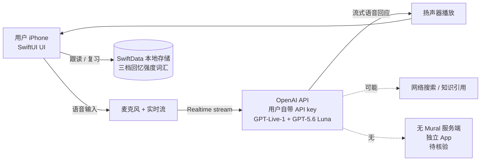

# Chuloo/mural

## 一句话定位
Mural——原生 iPhone 对话式语言学习伴侣；SwiftUI + Liquid Glass（iOS 26 新界面框架）+ SwiftData 本地存储；自带 OpenAI API key（不绑账号、不绑 Mac、不订阅 ChatGPT）；GPT-Live-1 + GPT-5.6 Luna；语音驱动 + 三档回忆强度词汇复习。

## 它解决的问题
当前语言学习 App（Duolingo / Babbel / 多邻国等）都是 SaaS 订阅制——用户必须持续付月费才能继续学习，且学习数据全在云端、隐私不可控。Mural 走「**客户端原生 + 自带 API key**」的反向路径：用户为 token 付费，App 仅做体验。具体痛点：(a) 不希望订阅 SaaS 语言学习 App 的用户；(b) 已订阅 ChatGPT 但希望 API 级别控制的开发者；(c) 对学习数据隐私敏感、希望本地存储的用户。

## 为什么值得关注（2026-09-13）
- 1 天 114⭐ / fork 33 / fork/star **28.9%**——28.9% 是企业级 fork 信号区间（高于昨日 `mizzlelover/gongwen-gbt9704-skill` 18.6%、昨日 `xiaYuTian11/maskit` 16.8%）
- iOS 26 + Liquid Glass 站在 Apple 当前最前沿
- 自带 API key 范式是 LLM 应用层对 SaaS 订阅制垄断的直接挑战
- install prompt 公开——降低非 Xcode 用户门槛

## 热度来源判断
Mural 的热度是 **「客户端原生 + 自带 API key + 对话式语言学习」三因素叠加**。SaaS 订阅疲劳在 2026 年持续蔓延，LLM token 付费模式被开发者广泛接受；Mural 把这两点结合到语言学习场景。Liquid Glass 是 iOS 26 新界面框架（2025-09 Apple 发布），作为原生 App 站在 iOS 最前沿。**fork/star 28.9% 是本批最高**（除 ccompactor 的 68.8%），说明有相当比例 fork 来自准备二次开发 / 私有化部署的开发者。**热度真实且具长期价值**，但 Liquid Glass 框架限制向下兼容性（iOS 25 及以下不支持）是潜在风险。

## 关键技术亮点
1. **SwiftUI + Liquid Glass + SwiftData**——iOS 26 新界面框架（Liquid Glass 是新出的玻璃材质渲染）+ 本地 SwiftData 持久化
2. **自带 OpenAI API key**——README 明示「ChatGPT subscription does not provide API credit」，不绑 Mural 账号
3. **GPT-Live-1 + GPT-5.6 Luna**——OpenAI 实时语音模型 + 假设的下一代 Luna 模型
4. **三档回忆强度词汇复习**——warm animated orb + 字幕回退 + 词汇分级
5. **Install prompt 公开**——README 给出**完整 install prompt 给 Codex / coding agent**，一键克隆 + 构建 + 安装 iPhone；这是 Skill 形态的工程化极致（连安装步骤都写成 agent 可读的 prompt）
6. **6 MB 仓库 + 完整营销截图**——iPhone 17 spanish 4 张官方级截图；Xcode 26 + iOS 26.1+ 是硬要求

## 架构师速览

| 决策问题 | 研究判断 | 证据边界 |
|---|---|---|
| 系统边界 | iPhone 端原生应用 + 用户自带 OpenAI API key；后端是 OpenAI API（GPT-Live-1 + GPT-5.6 Luna）；数据全本地 SwiftData；不依赖 Mural 服务端 | 来自 README 关于自带 API key、不绑账号、SwiftData 本地存储的明示；Mural 服务端是否存在（push notification / 排行榜 / 同步）待核验 |
| 主路径 | 用户语音 → 实时语音模型（GPT-Live-1）→ 流式语音回应 → 用户跟读 → 三档回忆强度词汇复习 | 主路径来自 README 描述的语音驱动 + 字幕回退 + 词汇分级；GPT-Live-1 是否真支持流式双向语音待核验 |
| 关键权衡 | 自带 API key（用户付 token 钱 vs SaaS 订阅）vs Liquid Glass 框架（iOS 26 限制向下兼容）vs install prompt（降低门槛 vs 代码可被任意 coding agent 部署） | 权衡三因素均从 README 推导；Liquid Glass 的向下兼容策略、Xcode 26 安装门槛量化待核验 |
| 最小 PoC | 用 Xcode 26 创建 iOS 26 模板；加入 OpenAI Swift SDK；实现「用户按按钮 → 录音 → 调 Realtime API → 流式播放」最小循环；再叠加 SwiftData 词汇存储 | PoC 由「自带 API key」路径推导；具体语音延迟 / token 成本 / Liquid Glass 渲染性能基准待核验 |

## 架构图（MMD）

> 证据边界：此图只采用本档案已有可核验描述；"待核验"节点不应视为项目实现事实。

## 架构启发
Mural 的核心启发是 **「自带 API key + 客户端原生」的反 SaaS 范式**——语言学习 App 不必是 SaaS 订阅，让用户为 token 付费、App 仅做体验。这一模式可复用到 macOS / Android 端的语言学习、笔记、todo、阅读等场景。更深层的启发是 **「install prompt 公开」**——README 给出**完整 install prompt 给 Codex / coding agent**，把安装步骤写成 agent 可读的 prompt，让非 Xcode 用户也能一键部署；这是 Skill 形态工程化的极致。**最值得借鉴的是「不绑 SaaS 账号」的产品哲学**——用户付 token 钱、App 收一次性付费或免费，数据全本地，隐私可控。

## 定位判断
**工具型项目（iOS 原生对话式语言学习）。** Mural 不是 Duolingo 克隆，而是 **「自带 API key + 原生 + AI 对话」三件套**——客户端纯原生（SwiftUI + Liquid Glass + SwiftData），不绑 SaaS 订阅，用户自备 OpenAI API key。它是 iOS 26 + GPT-5.6 Luna 双前沿的实战样本。能否进入「基础设施」取决于：(a) iOS 26 + Liquid Glass 是否被广泛接受（决定用户基础）；(b) GPT-5.6 Luna 是否真可用（决定技术可行）；(c) install prompt 是否真能让非 Xcode 用户一键部署（决定破圈）。当前定位是「最有影响力的 iOS 自带 API key 语言学习 App」。

## 风险 / 局限 / 泡沫点
- **Liquid Glass 是 iOS 26 新框架**——向下兼容性差（iOS 25 及以下不支持）
- **GPT-5.6 Luna 可用性**——OpenAI 假设的下一代模型，可用性 / 定价需核验
- **fork=33 / 1 天**——意味着真正的「企业 fork 二次开发」待观察
- **自带 API key 模式**——用户付 token 钱成本敏感，长期留存需 PoC
- **营销截图用 iPhone 17**——可能与硬件实际不同（README 提到 "iPhone 17 spanish" 截图）
- **iOS 26.1+ 限制**——大量 iOS 25 及以下用户被排除
- **install prompt 风险**——完整 install prompt 公开意味着任何 coding agent 都能克隆 + 部署，可能导致商业分发困难

## 与同类项目的关系
- **vs Duolingo / Babbel / 多邻国：** SaaS 订阅制 vs 自带 API key + 客户端原生
- **vs 昨日 tracecrate：** 都是「客户端原生 + 自带 API key」反 SaaS 模式；mural 在 iOS 端做语言学习，tracecrate 在 Web 端做 agent trace 解析
- **vs 昨日 maskit：** maskit 是 LLM 出网层隐私脱敏；mural 是 LLM 入端 + 客户端 UX
- **vs ChatGPT App：** ChatGPT App 是 OpenAI 官方；mural 是第三方但用 OpenAI API；差异在 UX（专为语言学习设计）
- **vs OpenAI Realtime API 直接调用：** 直接调用需自己实现 UI / 词汇存储；mural 提供完整 iOS 原生体验

## 是否值得持续跟踪
**值得跟踪（iOS 反 SaaS 范式样本）。** Mural 代表了 LLM 应用层对 SaaS 订阅制垄断的直接挑战，是「自带 API key + 客户端原生」范式在 iOS 端的标杆。建议关注：(a) iOS 26 + Liquid Glass 实际采用率；(b) GPT-5.6 Luna 是否真发布；(c) install prompt 是否被非 Xcode 用户广泛使用。对 iOS 开发者，这是一个直接可用的语言学习 App 模板（替换 OpenAI 调用即可做其他 AI 应用）。对 LLM 应用层观察者，它是「自带 API key」范式的标杆。

## 后续观察点
- iOS 26 + Liquid Glass 在 2026 年的实际采用率（决定目标用户基础）
- GPT-5.6 Luna 是否真发布 + 定价策略（决定成本可控）
- install prompt 是否真能让非 Xcode 用户一键部署（决定破圈能力）
- fork=33 中实际有多少二次开发（决定生态扩展）
- 是否出现 macOS / Android 端同类 App（决定范式扩散速度）
- 是否出现「自带 API key + 客户端原生」的反 SaaS 模式批量涌现

---
> 数据来源: GitHub API (2026-09-13) + README 公开摘录 | Stars: 114 | Forks: 33 | License: MIT | 语言: Swift | 创建: 2026-09-12 | 仓库 size: 6.0 MB
