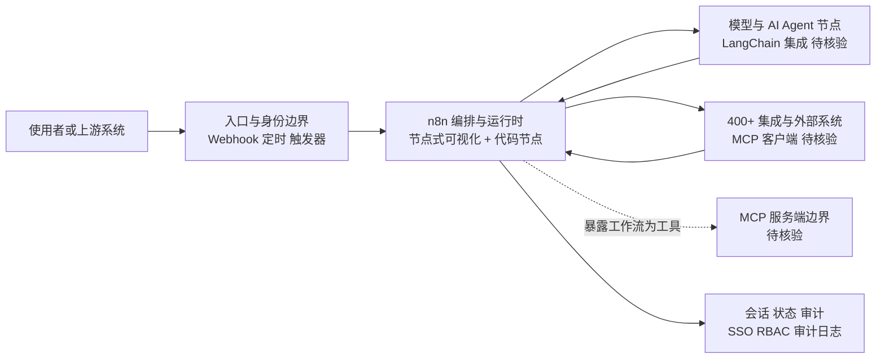

# n8n-io/n8n

## 一句话定位
开源公平代码（fair-code）工作流自动化平台，原生集成 AI 能力，支持可视化拖拽 + 自定义代码混合开发，自托管或云端部署，400+ 集成连接器。

## 它解决的问题
企业自动化需求碎片化且多变——CRM 同步、邮件通知、数据处理、AI 调用、API 编排等场景各异。Zapier/Make 等闭源 SaaS 虽然好用，但存在数据隐私、成本不可控、供应商锁定等问题。n8n 提供了可自托管的开源替代方案，让企业完全掌控自动化数据流。2025-2026 年间，n8n 原生集成了 AI Agent 节点和 MCP（Model Context Protocol）支持，使其从传统 iPaaS 进化为 AI Agent 编排平台。

## 为什么值得关注
- **Stars:** 199,661 stars，接近 20 万，是 GitHub 上 stars 最多的自动化平台
- **AI 原生转型:** 内置 LangChain 节点、AI Agent 节点、MCP 客户端/服务端支持
- **Fair-code 模式:** 源码开放但商业使用有限制，平衡了开源社区和企业商业化
- **400+ 集成:** 覆盖几乎所有主流 SaaS 和数据库，降低连接成本
- **自托管能力:** 企业级隐私和合规需求的首选方案

## 热度来源判断
热度来自传统自动化和 AI Agent 两股浪潮的交汇。传统 iPaaS 用户因成本和数据隐私迁移到 n8n；AI 开发者将 n8n 视为快速构建 AI 工作流的可视化工具。2025-2026 年 AI 节点的加入使其在 GitHub Trending 上反复出现。YouTube/Twitter 上的自动化教程生态也持续贡献流量。

## 关键技术亮点亮点
- 基于节点的可视化工作流编辑器，支持分支、循环、错误处理
- AI Agent 节点：内置 LangChain 集成，支持工具调用、记忆管理、RAG
- MCP 双向支持：既是 MCP 客户端（消费外部工具）也是 MCP 服务端（暴露工作流为工具）
- 自定义代码节点：支持 JavaScript/Python 内联编写
- 企业级特性：SSO、RBAC、审计日志、环境隔离
- Webhook 和定时触发，支持事件驱动架构

## 架构师速览

| 决策问题 | 研究判断 | 证据边界 |
|---|---|---|
| 系统边界 | n8n 作为入口渠道、外部系统/工具与模型推理之间的可视化编排层，承担集成、触发与会话状态管理职责 | 边界由分类(平台候选)、标签(ai, automation, low-code, workflow, self-hosted, mcp)与描述性事实推断；具体部署形态、持久化与多租户实现须源码核验 |
| 主路径 | 上游事件/Webhook/定时触发 → 节点式工作流运行时 → 分支调用模型、工具与代码节点 → 回写会话/状态/审计 | 路径反映 README 描述的"节点编排 + AI Agent + MCP + 自定义代码"职责；协议(REST/gRPC)与状态存储介质(数据库选型)未在档案中给出 |
| 关键权衡 | 400+ 集成的覆盖速度与许可证风险、可视化可维护性、AI Agent 成本/可靠性之间的平衡，且 Fair-code 限制与"面条式"工作流是已声明的局限 | 权衡直接来自档案"风险/局限"段；具体许可证细则、企业版差异化能力未经核验 |
| 最小 PoC | 单入口渠道 + 最小工具权限 + 可审计日志 三件套验证，纳入安全/成本/SLO/退出路径作为验收项 | 建议复刻档案"采用建议"句；具体触发器类型、工具清单与 SLO 阈值需结合业务定义 |

## 架构启发
n8n 的架构证明了"可视化编排 + 代码逃生舱"的混合模式在自动化领域的有效性。对架构师的启发是：**纯低代码会碰到表达力天花板，纯代码会碰到上手门槛，混合模式是最佳平衡点**。n8n 的 AI Agent 节点设计也值得关注——将 LLM 作为工作流中的"智能节点"而非全局控制器，是一种务实的 AI 集成策略。

## 架构图（MMD）

> 证据边界：此图只采用本档案已有可核验描述；“待核验”节点不应视为项目实现事实。

## 定位判断
**平台候选（强）。** n8n 已超越工具定位，成为自动化领域的平台级基础设施。其 400+ 集成、自托管能力、AI 原生支持构成了强大的网络效应。Fair-code 模式确保了商业可持续性。定位为"开源版 Zapier + AI Agent 编排平台"。

## 风险/局限/泡沫点
- Fair-code 许可证（非纯开源）可能限制部分企业采用和社区贡献热情
- 可视化工作流在复杂场景下可维护性下降（"面条式"连接难以调试）
- AI Agent 节点的可靠性和成本控制仍是行业性挑战
- 接近 20 万 stars 存在"收藏 ≠ 使用"的泡沫成分
- 竞争白热化：Make、Zapier、Temporal、Dify 都在抢同一市场

## 与同类项目的关系
- 与 **Make（原 Integromat）**、**Zapier** 是直接商业竞争对手
- 与 **Temporal** 在工作流引擎维度竞争——Temporal 面向开发者，n8n 面向更广泛用户
- 与 **Dify**、**Flowise** 在 AI Agent 编排维度竞争——n8n 更通用，Dify 更聚焦 LLM
- 与 **Airweave** 互补——n8n 编排工作流，Airweave 提供 RAG 数据层
- MCP 支持使其与 Claude Code、Cursor 等 AI 工具形成生态连接

## 是否值得持续跟踪
**强烈推荐持续跟踪。** n8n 是自动化 + AI 交叉领域最重要的开源项目之一，其 AI 节点和 MCP 支持的演进直接影响 AI Agent 工程化的实践标准。建议每月关注版本更新。

## 后续观察点
- AI Agent 节点的可靠性和可观测性改进
- MCP 生态集成深度（是否成为 MCP 标准的核心消费者）
- Fair-code 许可证是否影响企业采用（vs 纯开源的 Temporal/Dify）
- 商业化指标：云端版本收入、企业版客户数
- 社区贡献的节点质量和新节点增长速度

---
> 数据来源: GitHub API (n8n-io/n8n) | 星标: 199,661 | 语言: TypeScript | 许可证: NOASSERTION (fair-code)
