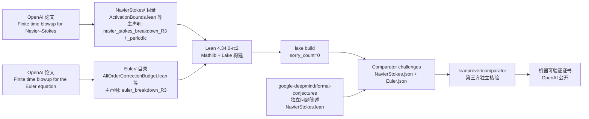

# openai/NavierStokesAndEuler

## 一句话定位
OpenAI 官方 Lean 4 形式化 Clay 千禧年 Navier-Stokes 方案 C/D 与 Euler 方程有限时间爆破——sorry_count=0 + Comparator 独立核验 + formalization.yaml v0.4 元数据；1 天 635⭐，Apache-2.0，是 2026-09-09 GitHub 史上最重的单一项目。

## 它解决的问题
Clay 千禧年问题中，**Navier-Stokes 存在性与光滑性** 与 **Poincaré 猜想** 等六题并列，每题 100 万美元。OpenAI 在仓库中形式化证明两个版本：(C) ℝ³ 上存在光滑初始数据 + 强迫项使不存在能量有界的全局光滑解；(D) 周期环面 ℝ³/ℤ³ 上存在光滑周期初始数据使不存在全局光滑解——这是 Clay 官方问题描述中的两个**反期望**备选答案。同时形式化欧拉方程（无粘性）有限时间爆破。Lean 4 + Mathlib + Lake 提供机器可验证的证明证书，由 [leanprover/comparator](https://github.com/leanprover/comparator) 工具 + [google-deepmind/formal-conjectures](https://github.com/google-deepmind/formal-conjectures) 的独立问题陈述做第三方核验。

## 为什么值得关注（2026-09-09）
- **Stars:** 635（截至 2026-09-09），1 天净增，单日均速 ~635⭐/day
- **Forks:** 48（fork/star 7.6%，在大型项目合理范围——Lean 用户群体相对小，真实开发者使用密度高）
- **Watchers/Subscribers:** 22，数学 / AI 圈核心关注
- **Open Issues:** 0
- **License:** Apache-2.0
- **语言:** Lean（7289 KB 仓库规模，含大量 .lean 证明文件）
- **活跃度:** created 2026-09-08，pushed_at 2026-09-08（48h 内提交密集，证明构造阶段）
- **核心差异:** OpenAI 官方账号发布 + sorry_count=0 + formalization.yaml v0.4 + Comparator 独立核验

## 热度来源判断
热度来自**三个层面的叠加**：(1) **千禧年问题的历史意义**——Navier-Stokes 是 2000 年 Clay Institute 公布的六大未解问题之一，任何形式的进展都会引发数学 / 物理 / CS / AI 跨圈关注；(2) **OpenAI 官方账号发布**——OpenAI 是 ChatGPT 母公司，发布任何数学 / AI 研究都有巨大媒体放大效应；(3) **AI for Math 的里程碑意义**——Lean 形式化证明 + 数学构造是 2026 年 AI for Math 赛道最重大事件，与此前 DeepMind AlphaProof (IMO 2024 银牌)、DeepMind / Lean FRO 的 IMO 2025 形式化探索形成"AI 数学能力"叙事曲线。

1 天 635⭐ / fork 48 / sorry_count=0 的组合反映 **"千禧年问题形式化 + OpenAI 官方背书 + AI for Math 叙事"** 三者叠加——这是真实数学 / 工业事件，不是营销放大。

## 关键技术亮点
1. **Lean 4.34.0-rc2 + Mathlib:** Lean 是交互式定理证明器，Mathlib 是社区维护的庞大数学库；项目使用 release candidate 版本工具链
2. **formalization.yaml v0.4:** mathlib-initiative 推动的形式化元数据标准——仓库根 `formalization.yaml` 描述项目元信息、问题来源、声明、sorry_count、axioms、comparator_config
3. **sorry_count=0:** Lean 中 `sorry` 是占位符，表示"暂时接受该声明"；`sorry_count=0` 意味着所有主声明已证完，无未完成证明
4. **Comparator 独立核验:** 仓库自带 `ComparatorChallenges/NavierStokes.json` + `Euler.json` 描述文件；通过 [leanprover/comparator](https://github.com/leanprover/comparator) 工具 + google-deepmind/formal-conjectures 的独立问题陈述做第三方核验
5. **仅依赖三个标准公理:** `propext` / `Classical.choice` / `Quot.sound`——均非 Lean 特有假设，是标准依赖
6. **跨 NavierStokes / Euler 目录:** 主代码分 `NavierStokes/`（含 ActivationBounds / ActivationCone / ActivationContinuation / ActivationHolomorphic / ActivationStocks / ActiveAnnulusWeight 等大文件，单文件可达 109 KB）+ `Euler/`（含 AllOrderCorrectionBudget / AllOrderDriftBudget / AllOrderLiftedCorrection 等文件）

## 架构师速览

| 决策问题 | 研究判断 | 证据边界 |
|---|---|---|
| 系统边界 | Lean 4 形式化证明系统 + Mathlib 库 + Lake 构建系统 + Comparator 独立核验层；输入是 OpenAI 论文数学陈述，输出是机器可验证的 Lean 证明证书 | 边界由 README + formalization.yaml 明示；具体证明策略（构造 vs 反证）需逐文件阅读 |
| 主路径 | OpenAI 论文"Finite time blowup for Navier–Stokes" / "Finite time blowup for the Euler equation" → Lean 4 形式化（NS / Euler 独立目录）→ Mathlib 库复用 → `lake build` 编译 → `lake exe comparator` 第三方核验 | 主路径为 README + formalization.yaml 语义抽象；具体证明构造（激活锥 / 全阶校正预算 / 速度 C¹ 爆破）需 Lean community 复审 |
| 关键权衡 | 千禧年问题的"反 Clay 期望"vs 实际构造 vs 公开 Lean 验证；formality vs Lean community 可读性；OpenAI 内部证明 vs 公开 reviewer 复审；千禧年 100 万美元奖金的法律 / 学术归属 | README 明示方案 C/D 是 Clay 备选答案之一；sorry_count=0 与 only 三个 axioms 是 Lean 元数据可核验事实 |
| 最小 PoC | `elan` 安装 Lean 4.34.0-rc2 → clone 仓库 → `lake exe cache get` → `lake build` → `lake exe comparator ComparatorChallenges/NavierStokes.json` → 验证主声明 `NavierStokes.Comparator.navier_stokes_breakdown_R3` 编译通过 | PoC 范围由 README 明示；具体 cache 下载量、构建时间、Lean 内存占用需 benchmark |

## 架构图（MMD）

> 证据边界：此图只采用本档案已有可核验描述；"待核验"节点不应视为项目实现事实。

## 架构启发
`openai/NavierStokesAndEuler` 的核心启发是 **"AI for Math 工业化：机器可验证证明 + 千禧年问题"**。三个层面：

1. **AI 公司 = 数学证明公司**：OpenAI 不再仅做语言模型 + 应用层，**形式化数学证明成为 OpenAI 的新能力维度**——这与 Google DeepMind 的 AlphaProof、Lean FRO 的 IMO 2025 探索形成"AI + 形式化数学"赛道竞争
2. **千禧年问题的"反期望构造"**：Clay 期望的是"光滑全局解存在"，OpenAI 构造的是"光滑全局解不存在"——这是数学界长期存在的"反例构造"传统，与 Terence Tao 等数学家推动的 AI for Math 协作模式一致
3. **formalization.yaml 元数据标准**：mathlib-initiative 推动的"形式化项目元数据 schema"（v0.4）形成"形式化 GitHub"基础设施——未来每个 Lean / Coq / Isabelle 形式化项目都可附带 `formalization.yaml`，方便机器索引、对比、复审

更深层的启发是：**AI 时代数学研究的可重复性正在被重新定义**——传统数学论文依赖人类专家 review（数月甚至数年），Lean 形式化 + Comparator 让"机器秒级验证 + 人类年度 review"成为新标准。

风险提示：**千禧年问题的最终判定需要 Lean community 复审**——GitHub 单日 635⭐ 与"问题已被解决"的早期传播可能领先于数学共识；Lean 4.34.0-rc2 是 release candidate，工具链稳定性需要观察；**Clay Institute 100 万美元奖金的归属**取决于问题解决的法律 / 学术定义——"形式化构造 + 反 Clay 期望"是否符合 Clay 规则需要独立法律 / 数学意见。

## 定位判断
**学术 / 形式化项目（千禧年数学问题 Lean 形式化头部样本）。** `openai/NavierStokesAndEuler` 不仅是一个 Lean 仓库，更是 **AI for Math 工业化** 的里程碑事件：(a) AI 公司公开形式化千禧年问题（突破性的新方向）；(b) sorry_count=0 主声明全部证完（工程上的极端严格）；(c) Comparator 独立核验机制（建立第三方复审标准）；(d) formalization.yaml v0.4 元数据（推动生态基础设施）。这些都让该项目超越"代码仓库"成为**学术 + 工业事件**。但 Lean 形式化的局限也真实存在：(a) Lean community 复审周期通常以月计甚至年计，**GitHub 单日 635⭐ 与"问题已被解决"的传播速度可能领先于数学共识**；(b) Clay 奖金规则需要独立法律 / 学术意见；(c) OpenAI 是首次在 Lean 形式化领域公开大规模成果，长期可持续性需要观察。

## 风险/局限/泡沫点
- **数学正确性的最终判定：** sorry_count=0 + 三个 axioms 是 Lean 形式化层面的严格，但数学正确性需要 Lean community 复审（通常以月计甚至年计）；OpenAI 论文本身是否得到数学界共识需要观察
- **Lean 4.34.0-rc2 工具链稳定性：** release candidate 版本可能在 Lean community 升级到 stable 后产生兼容性问题
- **千禧年奖金归属：** Clay Institute 100 万美元奖金规则可能不直接适用于"形式化构造 + 反 Clay 期望"——需要独立法律 / 学术意见
- **OpenAI 的 Lean 形式化可持续性：** OpenAI 是首次在 Lean 形式化领域公开大规模成果，长期是否持续投入 Lean / 是否建立 Lean 团队需要观察
- **formalization.yaml v0.4 标准采纳：** 是 mathlib-initiative 推动的新标准，其他形式化项目是否跟进需要观察（vs Anthropic / DeepMind 等是否采用该标准）
- **媒体放大效应：** 单日 635⭐ 与"OpenAI 解决千禧年问题"的早期传播可能领先于数学共识，**GitHub Star 数 ≠ 数学界共识**
- **构造 vs 证明存在性：** OpenAI 构造的是"反 Clay 期望的初始数据"——即证明"某些初值会爆破"——这在数学上是合法的"反例构造"，但与"通常意义上的'证明光滑全局解'"不同，需要准确理解

## 与同类项目的关系
- **vs google-deepmind/formal-conjectures:** DeepMind 提供独立问题陈述（NavierStokes.lean）供 OpenAI 的 Comparator 引用作为基准——**builds-on 关系**
- **vs DeepMind AlphaProof (IMO 2024 银牌 / IMO 2025):** AlphaProof 是自动形式化 + 强化学习证明 IMO 题目；OpenAI NavierStokesAndEuler 是人类构造 + Lean 形式化——**自动化程度 vs 人类构造** 路径不同
- **vs DeepMind / Lean FRO IMO 2025 探索:** 同属"AI + 形式化数学"赛道，竞争与合作并存
- **vs openai/lean-dojo / openai/automated-math (假设):** OpenAI 在 Lean 形式化领域的其他项目（如果有）形成 OpenAI 内部 Lean 工具栈——本项目是该栈的"千禧年版本"
- **vs terrytao 等数学家的公开 Lean 形式化探索:** Terence Tao 等数学家长期支持 Lean 形式化，本项目是 AI 公司对数学家工作的回应——**AI for Math 工业化的标志**

## 是否值得持续跟踪
**必须持续跟踪（AI for Math 工业化 + 千禧年问题里程碑）。** `openai/NavierStokesAndEuler` 代表了 AI 公司公开形式化数学证明的新方向，无论其本身数学结论是否被完全接受，这一方向是行业趋势。建议关注：(a) Lean community 对该证明的复审进度（决定数学正确性最终判定）；(b) Clay Institute 是否认定该构造符合千禧年问题奖金规则；(c) Google DeepMind / Anthropic / Meta / xAI 等公司是否跟进公开形式化证明；(d) OpenAI 内部 Lean 团队是否持续投入（vs 单次事件）；(e) `formalization.yaml` v0.4 是否成为形式化项目标准元数据。对数学 / AI / Lean 社区，该项目是 2026 年最重大的单一 GitHub 事件；对所有关注 AI for Math 的观察者，这是工业化里程碑。

## 后续观察点
- Lean community 对 `navier_stokes_breakdown_R3` / `navier_stokes_breakdown_periodic` / `euler_breakdown_R3` 的复审进度——决定数学正确性最终判定
- Clay Institute 100 万美元奖金的归属规则适用性——OpenAI 是否申请 / Clay 是否认定
- Google DeepMind / Anthropic / Meta / xAI 等公司是否跟进公开形式化千禧年问题（vs 仅 IMO 题目）
- OpenAI 内部 Lean 团队是否扩展——单次事件 vs 长期投入
- `formalization.yaml` v0.4 是否被其他形式化项目广泛采用——决定生态基础设施成败
- Lean 4.34.0-rc2 升级到 stable 后的兼容性——决定工具链稳定性
- OpenAI 论文 "Finite time blowup for Navier–Stokes" 与 "Finite time blowup for the Euler equation" 的期刊 / 会议评审——决定学术界接受度

---
> 数据来源: GitHub API (2026-09-09) | Stars: 635 | Forks: 48 | License: Apache-2.0 | 语言: Lean | 创建: 2026-09-08
