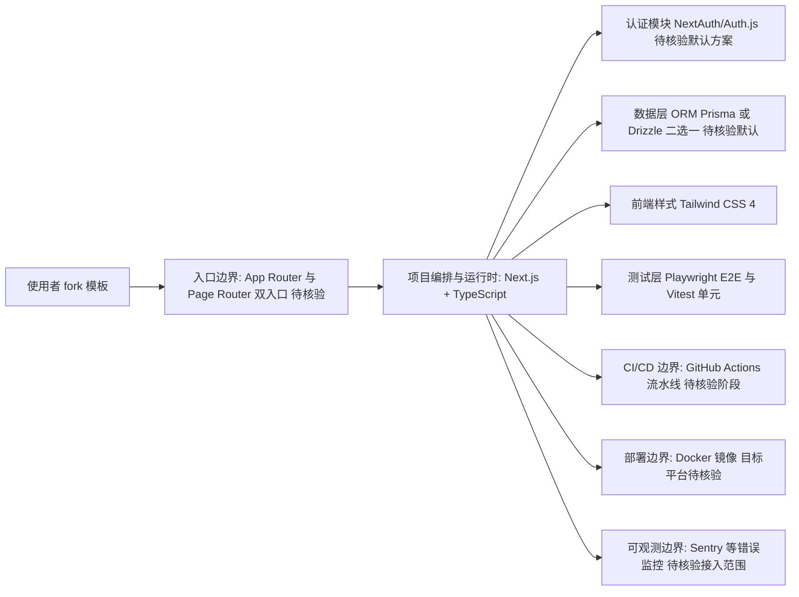

# ixartz/Next-js-Boilerplate

## 一句话定位
Next.js 全栈应用脚手架——同时支持 App Router 和 Page Router，集成 Tailwind CSS 4、TypeScript、认证、数据库、CI/CD 等，开发者体验优先。

## 它解决的问题
启动一个新的 Next.js 全栈项目时，需要配置大量基础设施：TypeScript、Tailwind、认证（NextAuth）、数据库（Prisma/Drizzle）、测试（Playwright/Vitest）、CI/CD、Docker、监控等。手动配置耗时且容易出错。Next-js-Boilerplate 提供了生产就绪的起始模板，开发者 fork 后即可专注业务逻辑。

## 为什么值得关注
- **Stars:** 13,035 stars，Next.js 脚手架赛道头部
- **Forks:** 2,404（大量项目基于此模板启动）
- **TypeScript 原生**
- **App Router + Page Router 双支持**：兼容迁移期项目
- **Tailwind CSS 4**：跟进最新版本
- **完整技术栈**：认证+DB+测试+CI+Docker+i18n+SEO
- **开发者体验优先**：设计理念明确

## 热度来源判断
- **Next.js 生态规模（极高）**：最流行的 React 全栈框架
- **脚手架刚需（高）**：每个新项目都需要起始模板
- **维护活跃（高）**：持续跟进 Next.js 最新版本
- **企业采用（中高）**：大量企业用此模板快速启动项目

## 关键技术亮点亮点
1. **App + Page Router 双支持**：平滑迁移过渡
2. **完整认证方案**：NextAuth/Auth.js 集成
3. **数据库 ORM**：Prisma 或 Drizzle 可选
4. **测试覆盖**：Playwright（E2E）+ Vitest（单元）
5. **CI/CD 就绪**：GitHub Actions 配置完整
6. **Docker 部署**：生产级容器化
7. **i18n + SEO**：国际化和搜索引擎优化预配置
8. **监控集成**：Sentry 等错误监控

## 架构师速览

| 决策问题 | 研究判断 | 证据边界 |
|---|---|---|
| 系统边界 | Next.js 全栈脚手架（TypeScript 原生），双路由（App Router + Page Router）、Tailwind CSS 4、认证、ORM、测试、CI/CD、Docker、i18n/SEO、监控均为模板内可选项 | 档案"关键技术亮点"逐条列出；具体文件结构、默认 ORM 选型（Prisma/Drizzle 二选一哪一项为默认）、Sentry 配置范围未在档案中证实 |
| 主路径 | fork 模板 → 按需裁剪不需要的模块（认证/DB/测试/Docker 等）→ 编写业务路由与页面 → 通过 GitHub Actions 构建 → Docker 镜像部署 | 主路径基于"脚手架"定位推导；CI 工作流具体阶段、Docker 镜像基线、部署目标（Vercel/Netlify/自托管）档案未指明 |
| 关键权衡 | 启动速度/功能完备性 vs. 依赖膨胀与定制化清理成本；App Router + Page Router 并存 vs. 长期维护双套约定的认知负担；ORM 二选一（Prisma vs Drizzle）等固化选型 vs. 业务适配性 | 权衡来自档案"风险/局限"章节；未涉及具体依赖数量、bundle 体积或构建耗时 |
| 最小 PoC | 单一页面（仅启用 App Router + TypeScript + Tailwind 4），关闭认证/DB/Docker，跑通 `next build` 与 Vitest 基础测试，验证 CI 通过 | PoC 范围仅引用档案明确列出的能力；性能基线、测试覆盖率门槛、Next.js 版本兼容性需以源码核验 |

## 架构启发
- **脚手架即基础设施**：好的脚手架能让团队节省数天配置时间
- **开发者体验是核心竞争力**：DX 优先的设计理念
- **全栈一体化**：前后端+DevOps+测试一体化模板

## 架构图（MMD）

> 证据边界：此图只采用本档案已有可核验描述；“待核验”节点不应视为项目实现事实。

## 定位判断
**成熟工具型项目**。Next.js 生态中最重要的脚手架之一。不是技术热点但实用价值高，被大量项目作为起点。

## 风险/局限/泡沫点
- **Next.js 版本跟进压力**：Next.js 频繁大版本更新，脚手架需同步
- **依赖膨胀**：集成太多功能可能导致初始项目过重
- **定制化成本**：不需要的功能需要手动移除
- **竞品多**：create-next-app、T3 Stack 等竞争
- **技术选型固化**：某些选型（如特定 ORM）不一定适合所有项目

## 与同类项目的关系
- **vs create-next-app**：官方工具极简，此模板功能完整
- **vs T3 Stack (create-t3-app)**：T3 Stack 是 tRPC+Prisma 栈，定位类似但技术选型不同
- **vs Next.js Enterprise Boilerplate**：企业版更重，此模板更通用
- **vs Vercel 官方示例**：官方示例偏 demo，此模板偏生产

## 是否值得持续跟踪
**推荐关注（Next.js 开发者）。** 如果使用 Next.js，这是最好的起始模板之一。关注其对 Next.js 新特性的跟进速度。

## 后续观察点
- Next.js 15+ 新特性的集成（Server Actions、Partial Prerendering）
- 是否增加 AI 应用相关模板（LLM 集成、RAG 等）
- Drizzle vs Prisma 的选型趋势
- 社区反馈和 issue 解决速度
- 是否推出 SaaS 版本（一键部署到 Vercel/Netlify）

---
> 数据来源: GitHub API (2026-08-01) | Stars: 13,035 | Forks: 2,404 | 语言: TypeScript
