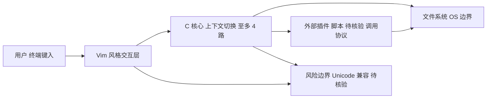

# jarun/nnn

## 一句话定位
极简但功能强大的终端文件管理器，以 C 语言实现，追求极致性能和零依赖部署。

## 它解决的问题
终端文件操作依赖 ls/cp/mv/rm 等离散命令，缺少交互式的文件浏览和管理体验。现有终端文件管理器（如 ranger）基于 Python，启动慢且有依赖。nnn 面向追求效率的终端重度用户，提供了一个 C 语言编写的极轻量文件管理器，启动近乎瞬间，功能覆盖文件浏览、批量重命名、磁盘分析等。

## 为什么值得关注
- **Stars:** 21,760 stars，在终端文件管理器中属于标杆项目
- **极致性能:** C 语言实现，启动时间 <1ms，内存占用极低
- **零依赖:** 编译后单二进制，不需要任何运行时依赖
- **功能丰富:** 虽然极简但覆盖了文件选择、批量操作、插件系统等实用功能
- **多平台:** 支持 Linux、macOS、BSD、Android（Termux）、Windows（WSL/Cygwin）

## 热度来源判断
热度来自终端工具控的真实需求——文件管理是基础操作，有一个高效的终端文件管理器能显著提升工作流。21K stars 经过近 10 年积累（创建于 2016 年），增长稳定。nnn 的特色在于「极简但不简陋」——在极小的体积内实现了丰富的功能，这种工程能力获得了社区尊重。

## 关键技术亮点亮点
1. **C 语言高性能核心:** 纯 C 实现，无动态语言运行时开销，启动和操作响应近乎瞬间
2. **强大的插件系统:** 通过 shell 脚本插件扩展功能，用户可以用任何脚本语言编写自定义文件操作
3. **上下文（Context）管理:** 支持最多 4 个独立的工作目录上下文，可快速切换不同位置的文件浏览
4. **批量文件操作:** 内置批量选择、重命名、文件类型分析等高级操作
5. **Vim 风格快捷键:** 键盘操作完全 vim 化，降低学习成本

## 架构师速览

| 决策问题 | 研究判断 | 证据边界 |
|---|---|---|
| 系统边界 | nnn 边界为单 C 二进制 + 外部 shell 插件调用，无运行时依赖；外部边界是 OS 文件系统与用户配置的插件脚本 | 档案仅说明 C 实现、零依赖、插件系统，具体系统调用与插件协议未在档案中给出 |
| 主路径 | 用户键入 → vim 风格交互层 → C 核心状态/上下文（最多 4 路） → 触发外部插件脚本 → 文件系统操作回写状态 | 档案未披露上下文切换与插件调用的具体协议，待核验 |
| 关键权衡 | 极小核心 + 外挂插件换得启动 <1ms 与零依赖，但代价是插件碎片化、UI 朴素、Unicode 兼容性弱 | 性能数字与权衡仅来自档案陈述，未做基准复测 |
| 最小 PoC | 在 Linux 终端跑通单二进制启动、目录浏览、批量选择、调用一个外部插件重命名，并验证非 ASCII 文件名降级行为 | 档案未给出插件接口规范与 Unicode 兼容范围，需源码核验 |

## 架构启发
nnn 的设计哲学是「核心最小化，插件最大化」——文件管理器核心只做最基础的浏览和选择，所有高级功能通过外部脚本插件实现。这种设计让核心保持极小体积和零 bug，同时通过插件系统获得了几乎无限的扩展性。这与 Emacs 的「可编程编辑器」理念异曲同工。

## 架构图（MMD）

> 证据边界：此图只采用本档案已有可核验描述；“待核验”节点不应视为项目实现事实。

## 定位判断
属于终端文件管理器生态的「极致性能」代表。与 ranger（Python，功能丰富但慢）、lf（Go，中间路线）、yazi（Rust，现代新秀）形成梯度竞争。nnn 在「纯性能」维度上无对手。

## 风险 / 局限 / 泡沫点
1. **插件碎片化:** 丰富的插件系统也意味着功能分散，新用户需要花时间了解和安装各种插件
2. **UI 极简到粗糙:** 相比 yazi 等现代 TUI 工具，nnn 的视觉设计非常朴素
3. **非 Unicode 文件名兼容:** 在某些环境下可能遇到特殊字符文件名的显示问题
4. **竞争加剧:** yazi（Rust）等新工具在保持性能的同时提供了更现代的 UI，可能分流用户

## 与同类项目的关系
- **ranger:** Python 终端文件管理器，功能更全但性能差一个数量级
- **lf:** Go 实现的终端文件管理器，性能和功能的中间路线
- **yazi:** Rust 实现的现代终端文件管理器，在性能和 UI 之间取得了更好平衡
- **midnight commander (mc):** 老牌双面板终端文件管理器，UI 更丰富但更重

## 是否值得持续跟踪
**低优先级跟踪。** nnn 已是成熟的终端工具，后续演进主要是小功能优化。对于终端工具生态观察者仍有参考价值，但不太可能出现突破性变化。

## 后续观察点
- 关注 nnn 是否受到 yazi 等 Rust 新秀的明显分流
- 观察终端文件管理器这一品类的整体演进趋势
- 跟踪 nnn 的插件生态是否有新的高价值贡献

---
> 数据来源: GitHub API (gh cli) | 更新: 2026-08-07 | Stars: 21,760 | Language: C | License: BSD-2-Clause | Forks: 814
