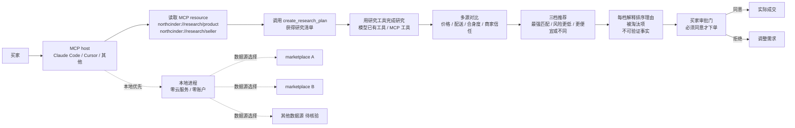

# cinderline/northcinder

## 一句话定位
Local-first 的 MCP server，专门做"购物比价 + 人工审批"——对比多个数据源、解释排序理由、购买前必须经买家同意；拒绝"marketplace 自家 agent 只搜索自家目录"的引导式推荐，主张"agent 应为买家服务，不为商家服务"。

## 它解决的问题
当下"AI 购物 agent"几乎都被 marketplace 自己的 agent 垄断——Amazon Rufus / Walmart Sparky / Shopify Sidekick 等自家 agent，搜索结果天然偏向自家目录与品牌。这导致：① 用户以为得到"客观比价"，实则被商业利益引导；② 隐私泄露——agent 把购物意图同步给商家；③ 难以跨平台对比。NorthCinder 用三招分别解决：① 本地优先 MCP server——`npx northcinder init` 一键启动，credential 不外传；② 多源对比 + 解释排序——展示"最强匹配 / 风险更低 / 更便宜或不同"三档选择 + 被淘汰项 + 不可验证事实；③ 购买前人工审批——`create_research_plan` 引导 LLM 在研究阶段引用 northcinder://research/product 与 northcinder://research/seller 资源，确保推荐基于证据。

## 为什么值得关注（2026-08-23）
- **6 天 1,205⭐**（GitHub API 可核验）：增速明显，处于 MCP server / agentic commerce 赛道头部
- **MIT / TypeScript / 本地优先：** 零云依赖，企业级隐私友好
- **明确的产品哲学：** README 开篇即声明"Big marketplaces are building the easiest version of this: an agent that searches one catalog and steers the buyer toward that platform's checkout. That may be convenient, but it is not independent advice." —— 这种立场让它在"agent 信任危机"背景下获得差异化
- **human-in-the-loop 设计：** 购买前必须买家同意，符合消费者保护原则

## 热度来源判断
**"agentic commerce × MCP × 隐私优先"三重驱动。** MCP 协议 2025-2026 年快速扩散，越来越多 AI 应用接入 MCP server，NorthCinder 是消费场景的早期样本；agent trust crisis（"AI 是不是在骗我买贵的"）持续发酵，本地优先 + 多源对比 + 人工审批的三件套恰好回应焦虑。**1.2k⭐的增速真实但需关注边界**——支持的数据源覆盖度、研究指南的实际可用性、result ranking 的稳定性均待独立测试。

## 关键技术亮点
1. **本地优先 MCP server：** `npx northcinder init` 一键启动，credential 不外传，本地 MCP + 搜索引擎同进程
2. **多源对比：** 不限制数据源，由用户选择可信来源；对比项含价格、配送、合身度、商家信任
3. **三档推荐：** "最强匹配 / 风险更低 / 更便宜或不同"，每档解释排序理由 + 被淘汰项 + 不可验证事实
4. **研究阶段引导：** 提供 `northcinder://research/product` 与 `northcinder://research/seller` 两个 MCP resource，让 LLM 在研究阶段就引用研究指南，避免"研究不充分就推荐"
5. **人工审批门：** 购买前必须买家同意，agent 不直接成交
6. **零账户、零云服务：** "The repository owner does not operate a NorthCinder service. There is no NorthCinder account or cloud service." —— 立场清晰

## 架构师速览

| 决策问题 | 研究判断 | 证据边界 |
|---|---|---|
| 系统边界 | NorthCinder 是本地 MCP server，承担"购物研究 + 多源对比 + 排序解释 + 人工审批门"；不替代 LLM，仅作为 LLM 的工具/资源层 | README 与 topics 明确描述；具体数据源接入方式、research guide 实际覆盖度、ranking 稳定性均待代码核验 |
| 主路径 | 用户购物意图 → MCP host（如 Claude Code / Cursor） → 读取 northcinder://research/{product,seller} → 调用 create_research_plan → 用 research 工具完成研究 → 展示三档推荐 + 解释 + 不可验证事实 → 购买前人工审批 | 主路径为 README 描述；具体 MCP resource 内容、create_research_plan 接口契约、各 MCP host 兼容性均待实测 |
| 关键权衡 | "本地优先隐私"vs"跨设备同步缺失"；"多源对比"vs"数据源接入成本与覆盖度限制"；"人工审批门"vs"即时购物场景下的摩擦" | 均为推断；具体数据源接入、跨设备策略、ranking 算法均待官方文档核验 |
| 最小 PoC | `npx northcinder init` 启动，在 Claude Code / Cursor 中要求"对比价格 < $130 的黑色羊毛跑鞋，4 个 marketplace"，观察三档推荐是否真能给出 + 解释排序 + 列出被淘汰项；尝试直接让 agent 完成购买验证人工审批门是否生效 | PoC 范围与退出路径由"本地优先、可观察、可审批"原则推导；具体命令、版本兼容、SLO 指标待核验 |

## 架构启发
NorthCinder 的核心启发是 **"agentic commerce 必须把治理做进协议层"**——传统电商平台 agent 把"推荐 → 成交"做成闭环，用户无处插手；NorthCinder 把"研究 → 推荐 → 审批"拆成三步，每一步都开放给用户审查，类似金融行业的"先披露后成交"。这暴露了 agentic commerce 的核心矛盾：**平台天然想让 agent 引导自家商品，而买家需要 agent 真正独立**。NorthCinder 通过本地优先 + 多源 + 人工审批三件套，把"独立性"做实，但代价是覆盖度受限——若某个 marketplace 不在数据源列表中，再独立的 agent 也没法对比它。另一启发：**MCP server 是 agent 治理的天然载体**——MCP 的 resource / tool 接口天然适合做"研究指南"+"审批门"，比 SDK 各自实现更标准化。

## 架构图（MMD）

> 证据边界：此图只采用本档案已有可核验描述；"待核验"节点不应视为项目实现事实。

## 定位判断
**工具型项目（MCP server × agentic commerce × 隐私优先的早期标本）。** 1.2k⭐的增速说明市场对"独立购物 agent"有真实需求。短期看，它是单点购物 MCP server；中期看，若"多源对比 + 人工审批"模式被其他场景（机票、酒店、保险、合同）借鉴，可能形成"agentic commerce 治理基线"。对企业：金融、医疗、法律等强隐私行业的采购/合同/审计 agent 可参考其"研究 + 推荐 + 审批"模板。

## 风险 / 局限 / 泡沫点
- **数据源覆盖度有限：** README 未明确列出支持哪些 marketplace；若只覆盖 5-10 个主流平台，对长尾商品无能为力
- **研究指南的覆盖面：** `northcinder://research/product` 与 `northcinder://research/seller` 的实际覆盖度（哪些商品类目、哪些 seller 维度）需独立测试
- **result ranking 的稳定性：** 不同 LLM host 对同一研究结果可能给出不同排序，"客观"与"主观"的边界需透明
- **本地优先的代价：** 跨设备同步缺失，企业级部署需要额外自建同步层
- **个人项目属性：** cinderline 个人维护，长期可持续性需观察
- **agentic commerce 的合规边界：** 即便本地优先，agent 仍需在某些司法管辖区披露（"本推荐由 AI 生成"），未来监管可能加严

## 与同类项目的关系
- **vs Amazon Rufus / Walmart Sparky / Shopify Sidekick：** 闭源、自家目录引导；NorthCinder 开源、本地、多源
- **vs LangChain / AutoGen：** 那些是 SDK；NorthCinder 是单点 MCP server
- **vs Snyk / Veracode（应用安全）：** 那些面向 SAST；NorthCinder 面向 agent 推荐治理——可类比但场景不同
- **vs Perplexity Shopping / Google Shopping：** 那些是中心化 SaaS；NorthCinder 是本地优先
- **vs ChatGPT Browse with Bing：** 那是通用浏览；NorthCinder 是购物垂直场景

## 是否值得持续跟踪
**值得持续跟踪（MCP server × agentic commerce × 隐私优先的早期标本）。** 1.2k⭐的增速说明赛道真实且强烈。建议关注：① 数据源覆盖度的扩张；② 是否被 MCP host（Claude Code / Cursor / VS Code）官方推荐；③ 跨设备同步策略与企业级部署方案。对企业：金融、医疗、法律等强隐私行业的采购/合同/审计 agent 可参考其治理模板；对开发者：这是"agent 治理做进协议层"的早期信号。

## 后续观察点
- 数据源接入数量与质量（哪些 marketplace、是否有官方合作）
- research guide 的覆盖面（商品类目、seller 维度、跨文化支持）
- MCP host 官方推荐情况（Claude Code / Cursor / VS Code 是否将其列入官方 MCP server 列表）
- 跨设备同步策略与企业版演进
- 监管动态（agentic commerce 的"AI 推荐披露"是否成为合规要求）

---
> 数据来源: GitHub API (2026-08-23) | Stars: 1,205 | License: MIT | 语言: TypeScript | 创建: 2026-08-17 | 推送到 main: 2026-08-22
