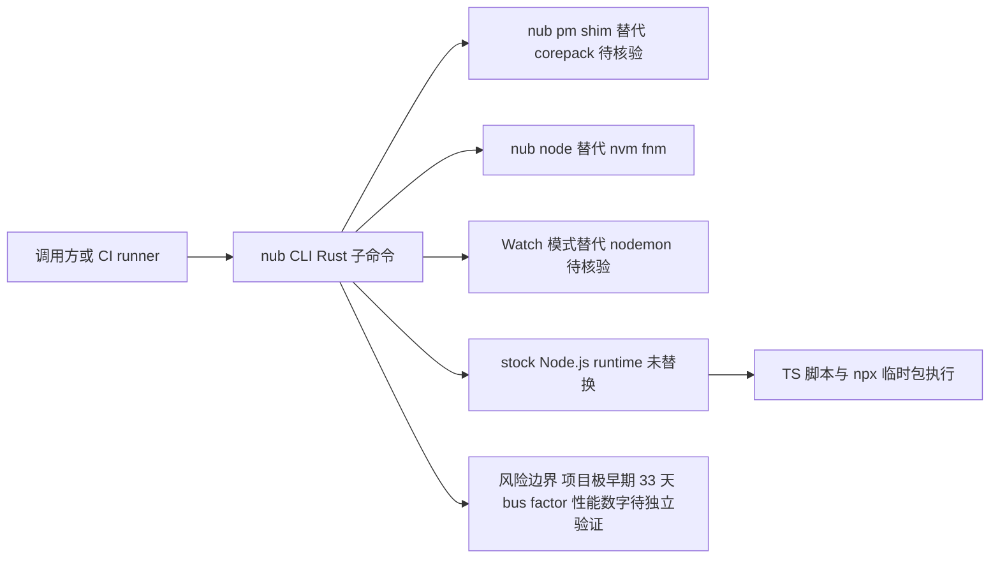

# Nub

## 一句话定位
用 Rust 编写的 Node.js 全能工具箱，在保持 stock Node.js runtime 不变的前提下，提供 Bun 式开发体验——24× 更快的脚本运行、19× 更快的 npx、2.5× 更快的包安装。

## 它解决的问题
Node.js 开发者工具链碎片化严重：运行 TS 需要 tsx/ts-node，运行脚本需要 npm/pnpm，执行临时包需要 npx，管理 Node 版本需要 nvm/fnm，管理包管理器需要 corepack。每个工具都有自己的安装、配置和学习成本。Bun 用一个二进制解决了这些问题，但代价是替换了整个 runtime——企业需要重新验证兼容性，风险高。Nub 的策略是：只替换工具链，不替换 runtime。

## 为什么值得关注
- **不替换 runtime**：保持 stock Node.js 不变，企业 adoption 零风险
- **33 天 2.6K⭐**：2026-06-03 创建，Rust 编写
- **性能数据亮眼**：24× faster run、19× faster npx、2.5× faster install
- **一站式替代**：node + tsx + npx + nodemon + nvm + corepack 一个工具搞定
- **多平台支持**：macOS/Linux/Windows/Homebrew/Nix/mise/npm 全覆盖
- **GitHub Actions 兼容**：`nubjs/setup-nub` 直接替代 `actions/setup-node`

## 热度来源判断
- Node.js 生态 Rust 化趋势（Deno/Bun/Nub 都在用底层语言重写）
- 开发者对工具链速度的永恒追求
- colinhacks（Zod 作者）的影响力
- 对 Bun 策略的差异化（不替换 runtime）

## 关键技术亮点亮点
1. **Rust 核心**：所有子命令用 Rust 实现，启动开销极低
2. **透明 runtime 层**：TS 文件直接通过 Node.js 运行，不做 runtime hack
3. **Corepack shim**：`nub pm shim` 自动配置 pnpm/yarn 等包管理器
4. **内置版本管理**：`nub node install 26` 替代 nvm，无需额外工具
5. **Watch 模式**：原生文件监听，替代 nodemon

## 架构师速览

| 决策问题 | 研究判断 | 证据边界 |
|---|---|---|
| 系统边界 | Nub 是 Rust 编写的 Node.js 工具链统一体，替代 tsx/npx/nodemon/nvm/corepack，但 stock Node.js runtime 不被替换；边界停在工具链层 | 仅基于档案"Rust + 替换 node/tsx/npx/nodemon/nvm/corepack，不替换 runtime"叙述；未含 IPC/CLI 协议与内部模块细节 |
| 主路径 | 调用方或 CI → `nub` CLI（Rust 子命令）→ 复用 stock Node.js runtime 执行（TS 直跑经 Node）→ 资源/包/版本管理由内置能力处理 | 档案只明示"TS 文件直接通过 Node.js 运行"与"Rust 核心极低启动开销"；调度、watch、shim 实现细节待核验 |
| 关键权衡 | 不替换 runtime 换取零兼容性风险，代价是放弃 Bun 式端到端运行时加速，性能上限受 Node 约束；24×/19×/2.5× 数字按档案标注为"特定场景"待独立验证 | 档案已自陈"项目极早期、生产稳定性未经验证、性能数据基于特定场景"，证据止于 benchmark 原文未在档案中给出 |
| 最小 PoC | 在 CI 与本地分别跑三组对照：① `nub run` vs `tsx`/`node` 跑 TS 脚本 ② `nub`（npx 子命令）vs `npx` 执行临时包 ③ `nub node install`/`nub pm shim` 替代 nvm/corepack；以启动耗时、稳态耗时、错误信息完整性、Node 上游变更冲击为验收项 | 安装/分发表与 CI 接入方式档案已列（Homebrew/Nix/mise/npm、`nubjs/setup-nub`）；具体基准方法学与样本待核验 |

## 架构启发
JavaScript 工具链的 Rust/Zig 化已成定局。Nub 的独特之处是找到了一个甜蜜点：用 Rust 加速工具链，但保留 Node.js runtime 的兼容性。这是企业最安全的加速路径。

## 架构图（MMD）

> 证据边界：此图只采用本档案已有可核验描述；“待核验”节点不应视为项目实现事实。

## 定位判断
**工具型** — 优秀的开发者体验工具，企业 adoption 门槛极低。不是新 runtime，不是包管理器替代品，是 Node.js 开发者工具链的统一加速层。

## 风险/局限/泡沫点
- **项目极早期**（33 天）：生产稳定性未经验证
- **维护团队小**：bus factor 风险
- **与 Node.js 生态耦合**：Node.js 上游变更可能影响兼容性
- **竞争激烈**：Bun 生态在扩展，pnpm 在加速，nx 等 monorepo 工具也在演进
- **性能数据需独立验证**：24× 等数字可能基于特定场景

## 与同类项目的关系
| 项目 | 定位 | 关系 |
|------|------|------|
| Bun | Zig runtime + 工具链 | 竞争：Bun 替换 runtime，Nub 不替换 |
| pnpm | 包管理器 | Nub 内部调用 pnpm，是加速层而非替代 |
| tsx | TS 运行器 | Nub 替代 tsx |
| nvm/fnm | Node 版本管理 | Nub 内置版本管理替代它们 |

## 是否值得持续跟踪
**是** — JS 工具链 Rust 化趋势的重要数据点，关注生产环境稳定性反馈。

## 后续观察点
- 生产环境稳定性反馈（24× 等性能数据的独立验证）
- Bun 生态扩展对 Nub 差异化空间的影响
- 企业级 adoption 案例
- 是否出现 plugin 系统向平台化演进
