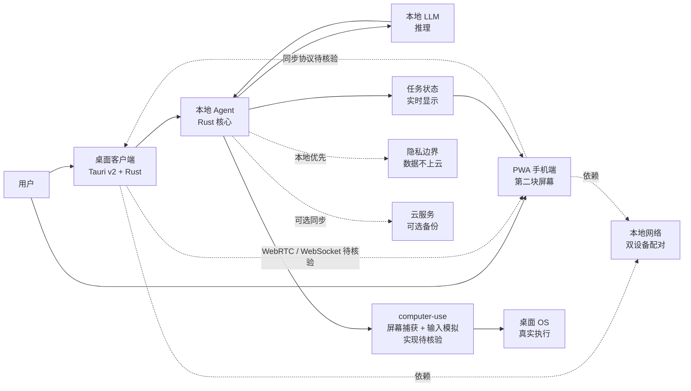

# mrpulor-gh/nuphus

## 一句话定位
**Nuphus —— 本地优先的 AI Agent**，Rust + Tauri v2 + React + PWA；"真实桌面执行力 + 手机第二块屏幕"，**desktop + mobile 双设备实时同步**。

## 它解决的问题
当前主流 AI agent（OpenAI Operator / Claude Computer Use / 8-25 OpenBot）多为云端优先，**存在三个痛点**：(1) **隐私风险**——屏幕捕获 / 文件访问数据上传云端；(2) **网络依赖**——离线不可用；(3) **单设备约束**——只能在电脑上操作，无法跨设备协同。**nuphus 把 agent runtime 拉到本地优先 + 双设备协同**：用 Tauri v2 做桌面客户端（性能 + 跨平台 + 小体积），用 PWA 做手机端"第二块屏幕"，双设备通过本地网络实时同步。

## 为什么值得关注（2026-08-26）
- **4 天 32⭐ / 8 forks**：fork 数相对 stars 较高（25%），暗示开发者社区实际试用
- **Rust + Tauri v2 + React + PWA**：2026 年本地优先应用的主流技术栈组合
- **Apache-2.0**：商用友好许可（vs AGPL）
- **真实桌面执行力**：与 OpenAI Operator / Claude Computer Use 同方向但本地优先
- **手机作为第二块屏幕**：8-25 OpenBot / herdrm 是桌面优先；nuphus 是 mobile-second-screen 优先
- **10.8MB size**：Tauri 应用 + PWA 资源的中等体量，暗示是完整产品而非 demo

## 热度来源判断
热度来自 **"本地优先 agent 隐私刚需 × Tauri 生态成熟 × 双设备协同 UX"** 的组合：(1) 隐私合规是 2026 下半年的硬刚需（金融 / 政府 / 医疗）；(2) Tauri v2 是 Rust 生态跨平台桌面应用的成熟栈（性能 + 小体积）；(3) 双设备协同（手机作为第二屏）是少有人做的 UX 创新。**主要风险：** Apache-2.0 商用友好但需配套 CLA；computer-use 体验若不如 OpenAI Operator / Claude Computer Use 则可能被替代；双设备同步的工程稳定性需长期观察。

## 关键技术亮点
1. **Rust + Tauri v2**：性能 + 跨平台 + 小体积三件齐
2. **React 前端**：与 JavaScript 生态无缝集成
3. **PWA 手机端**：手机作为"第二块屏幕"无需原生应用
4. **本地优先架构**：屏幕捕获 / 文件访问数据不离开本地
5. **Desktop + mobile 双设备实时同步**：跨设备 UX 创新
6. **Apache-2.0 许可**：商用友好
7. **10.8MB 中等体量**：完整产品形态

## 架构师速览

| 决策问题 | 研究判断 | 证据边界 |
|---|---|---|
| 系统边界 | Rust + Tauri v2 桌面应用 + React + PWA 手机端；本地优先 + 双设备实时同步；真实桌面执行力 | 边界由 README + topic 描述确认；具体 computer-use 实现路径、双设备同步协议需源码核验 |
| 主路径 | 本地 LLM 推理 → 屏幕捕获 + 输入模拟 → 桌面 Agent 执行 → PWA 手机端"第二屏"显示状态/控制 → 本地网络实时同步 | 主路径为档案语义抽象；具体 computer-use 实现（屏幕捕获 + OCR？browser automation？）、同步协议（WebRTC / WebSocket / local network）需源码核验 |
| 关键权衡 | 本地优先 vs 云端性能；Tauri v2 vs Electron（小体积 vs 生态）；双设备同步 vs 单机稳定性；Rust 后端 vs TypeScript 全栈 | 取舍由 README "本地优先 / 真实桌面执行 / 手机第二块屏幕" 描述确认；具体 computer-use 体验、与 OpenAI Operator / Claude Computer Use 的差异未公开 |
| 最小 PoC | 安装 nuphus 桌面端 → 启动本地 LLM → 在电脑上让 agent 执行一个任务（打开浏览器搜索） → 用 PWA 手机端查看状态 → 验证双设备同步 | PoC 流程由 README "桌面 + mobile 双设备实时同步" 描述推导；具体安装命令、本地 LLM 配置、双设备配对流程未公开 |
| 证据边界 | README + topic + GitHub API；具体 computer-use 实现、同步协议、本地 LLM 支持范围、与 Operator / Computer Use 的对比均需源码核验 | 已核验事实来自 GitHub API 与 topic；其他来自语义推断 |

## 架构图（MMD）

> 证据边界：此图只采用本档案已有可核验描述；"待核验"节点不应视为项目实现事实。

## 架构启发
nuphus 的核心启发是 **"本地优先 agent 是 2026 下半年的硬刚需"** ——OpenAI Operator / Claude Computer Use 都是云端优先，**对金融 / 政府 / 医疗等注重隐私的行业是合规阻碍**；nuphus 把数据完全留在本地 + Rust + Tauri v2 的性能 + 小体积，是严肃的本地优先 agent 样本。更深层的启发：**"手机作为第二块屏幕" 是 desktop agent 的少有人做的 UX 创新** ——8-25 OpenBot / herdrm 等多 agent runtime 都是桌面优先，nuphus 走 mobile-second-screen 路径，意味着 "agent 不止在一台设备上"。再深一层：**"Tauri v2 + React + PWA" 三栈组合是 2026 年本地优先应用的主流栈** ——Apache-2.0 商用友好 + fork 数相对 stars 较高（25%）显示开发者社区实际试用，12 月内可能被 Anthropic / OpenAI 官方 local-first 方案吸收。

## 定位判断
**local-first cross-device agent 工具型项目。** nuphus 是 **"本地优先 agent"路线的 Rust 生态样本**——与 8-25 OpenBot（云端优先 + browser / files）形成对照：**nuphus 是本地优先 + 真实桌面 + mobile-second-screen**。**核心差异化是 "本地优先 + 双设备协同"**：与所有云端 agent 对比，nuphus 把数据完全留在本地；与单设备 desktop agent 对比，nuphus 把手机变成"第二块屏幕"。**主要风险：** Apache-2.0 商用友好但需配套 CLA；computer-use 体验若不如 OpenAI Operator / Claude Computer Use 则可能被替代；双设备同步的工程稳定性需长期观察。

## 风险 / 局限 / 泡沫点
- **computer-use 体验未知**：与 OpenAI Operator / Claude Computer Use 对比的实际体验需评估
- **双设备同步工程稳定性**：WebRTC / WebSocket / local network 的稳定性需长期观察
- **本地 LLM 性能**：本地优先意味着推理能力受限于本地硬件
- **Tauri v2 + React + PWA 三栈整合复杂度**：32⭐ / 8 forks 体现早期吸引力，但长期维护成本高
- **手机端 PWA 限制**：相比原生应用，PWA 功能受限（推送 / 后台运行）
- **与官方 Computer Use 竞争**：OpenAI / Anthropic 可能在 6-12 月内推出官方 local-first 解决方案

## 与同类项目的关系
- **vs OpenAI Operator / Claude Computer Use**：商业云端 agent；nuphus 是本地优先 + 双设备
- **vs 8-25 OpenBot**：OpenBot 是云端优先 + browser / files；nuphus 是本地优先 + 桌面执行 + mobile-second-screen
- **vs 8-25 herdrm / penguin-harness / happyclaw**：都是 multi-agent runtime；nuphus 是 local-first + 双设备
- **vs Tauri 应用生态**：Tauri v2 是 Rust 桌面应用主流；nuphus 是 Tauri + Agent 的垂直产品
- **vs React + PWA 移动方案**：纯前端移动方案；nuphus 是 PWA 作为"第二屏"协同桌面

## 是否值得持续跟踪
**值得跟踪（local-first cross-device agent 方向）。** nuphus 是 **"本地优先 agent"路线的 Rust 生态严肃样本**——4 天 32⭐ + 8 forks（25% fork/star 比）显示开发者社区实际试用。**建议关注：** (a) computer-use 实际体验与 Operator / Computer Use 的对比；(b) 双设备同步的工程稳定性；(c) 是否会被 Anthropic / OpenAI 官方 local-first 方案吸收。**对注重隐私的开发者：** 可直接试用。**对关注 agent 基础设施的开发者：** 12 月内持续观察。

## 后续观察点
- computer-use 实际体验（与 Operator / Computer Use 对比）
- 双设备同步协议与稳定性
- 本地 LLM 支持范围（Ollama / llama.cpp / LM Studio？）
- Tauri v2 + React + PWA 三栈整合的工程挑战
- 商业模式（开源 + SaaS？纯开源？商业版？）
- 是否被 Anthropic / OpenAI 官方吸收或收购

---
> 数据来源: GitHub API (2026-08-26) | Stars: 32 | Forks: 8 | License: Apache-2.0 | 语言: Rust | 创建: 2026-08-21 | Pushed: 2026-08-24 | Homepage: https://github.com/mrpulor-gh/nuphus