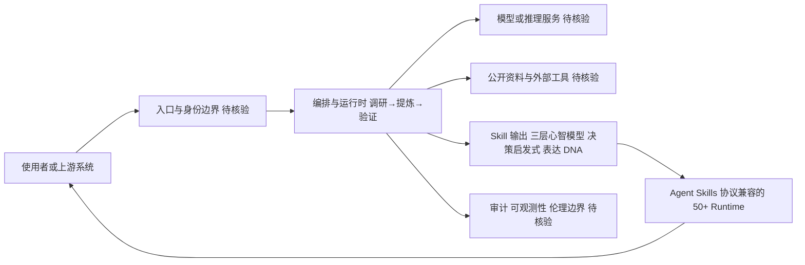

# 女娲.skill (nuwa-skill) — 人格蒸馏引擎

## 一句话定位
Agent Skill 工具，输入一个名字（乔布斯、马斯克、芒格、费曼…），自动完成调研→提炼→验证全流程，将任何人的思维方式（心智模型、决策启发式、表达 DNA）蒸馏为可运行的 AI Skill，让名人"给你打工"。

## 它解决的问题
1. **AI 交互缺乏个性化深度**：通用 AI 的建议泛泛而谈，缺乏特定领域专家的认知框架和决策视角
2. **专家思维难以数字化迁移**：领域专家的经验和判断模式存在于他们的公开内容（访谈、著作、演讲）中，但未被结构化提取
3. **Prompt 模拟名人的效果粗糙**：手动写"你是一个像乔布斯一样思考的 AI"效果差——没有提取真正的认知模型，只是表面模仿语气

女娲的核心主张：**不是角色扮演，不是复读名人语录，而是用名人的认知框架帮你分析问题。** 蒸馏乔布斯后问他"OpenAI 和 Anthropic 谁的方向对"，他不会说"Think Different"，而会用"聚焦即说不"和"端到端控制"的心智模型做分析。

## 为什么值得关注（2026-08-11）
- **Stars:** 30,286（从 4 月的 20K 增长到 30.3K），Forks 4,194，社区高度参与
- **开创赛道**："人格蒸馏"（Persona Distillation）品类的定义者
- **多 Runtime 兼容**：基于开放 Agent Skills 协议（agentskills.io），支持 Claude Code、Codex、Cursor、OpenClaw、Hermes Agent、CodeBuddy、Gemini CLI、OpenCode 等 50+ 兼容 runtime
- **一行安装**：`npx skills add alchaincyf/nuwa-skill`，跨 runtime 自动识别
- **生态效应**：大量以人物命名的衍生 Skill 仓库涌现（段永平.skill、Naval.skill 等）
- **持续活跃**：pushed_at 2026-07-27，updated_at 2026-08-11

## 热度来源判断
女娲的热度来自 **"概念新颖性 × 社交传播力 × Agent Skill 生态红利"** 三重叠加。把任何人蒸馏为可交互的 AI Skill 是极具传播性的概念——每个人心里都有想"请教"的人物。社交平台上"我和乔布斯聊了 30 分钟"类内容天然有传播力。4,194 forks 反映大量用户在尝试蒸馏自己感兴趣的人物。但热度中**概念驱动成分较高**——实际蒸馏出的"人格"在严肃任务中的价值仍需验证。30K stars 中有多少是"试一次就放下了"的尝鲜用户，有多少是持续使用，尚不明确。

## 关键技术亮点
1. **自动化全流程**：输入名字 → 自动调研（公开资料搜集）→ 提炼（心智模型/决策启发式/表达 DNA 提取）→ 验证（效果测试）→ 输出可运行 Skill
2. **三层心智模型提取**：
   - **心智模型**：这个人如何理解世界（如马斯克的"第一性原理"）
   - **决策启发式**：这个人如何做决策（如芒格的"逆向思考"）
   - **表达 DNA**：这个人的语言风格和表达模式
3. **Skill 可组合**：可叠加多个 Skill 实现复合认知模式（如同时加载乔布斯的"聚焦"和马斯克的"第一性原理"）
4. **跨 Runtime 标准**：基于 Agent Skills 协议（agentskills.io），`skills.sh` 兼容，55+ runtime 通用安装器支持
5. **多语言**：中/英/日/韩/西五语言 README

## 架构师速览

| 决策问题 | 研究判断 | 证据边界 |
|---|---|---|
| 系统边界 | 作为"人格蒸馏"品类定义者，处于 Agent Skills 生态内的生成层；与入口（使用者/上游系统）、Agent Skills 协议兼容的 50+ Runtime、模型/推理服务、工具与外部系统之间构成编排边界。 | 基于分类、Python 语言与"跨 runtime"标签抽象；具体上游协议、模型供应商、数据源均未在档案中点名。 |
| 主路径 | 输入人名 → 编排/运行时执行"调研→提炼→验证"三段式流水线 → 调用模型与外部资料工具 → 输出可被 50+ Runtime 加载的 Skill（心智模型/决策启发式/表达 DNA 三层结构）。 | 流水线阶段与三层心智模型来自档案叙述；其内部调度顺序、缓存与重试策略未在档案中说明。 |
| 关键权衡 | 概念传播速度（30K stars、4200+ forks、衍生仓库涌现）与严肃任务可验证性之间的张力：架构上把"人格"做成可组合 Skill 提升了生态扩张力，但缺乏客观 ground truth 的验证机制，伦理边界也未在档案中给出答案。 | Stars/Forks 与衍生生态数量来自档案；蒸馏质量评估、伦理合规框架在档案中被列为风险/观察点而非已实现特性。 |
| 最小 PoC | 在单一受控 Runtime（如 Claude Code）下、以最小工具权限与可审计日志，挑选一名公开人物做端到端蒸馏，验收项聚焦于：(1) 三层结构是否可被外部解析、(2) 跨 Runtime 安装一次成功率、(3) 成本与 SLO 上限、(4) 退出/卸载路径。 | "一行安装 `npx skills add alchaincyf/nuwa-skill`"与跨 Runtime 列表来自档案；具体 PoC 工具链、计费模型、安全模型均需源码核验。 |

## 架构启发
- **"人格即 Skill"的范式**：女娲把"人格"从 prompt 模板升级为结构化的 Skill——有心智模型层、决策启发式层、表达 DNA 层，而非简单的"你扮演 XX"提示词
- **认知框架的可迁移性**：核心洞察是——专家的价值不在具体答案，而在思考框架。蒸馏乔布斯的"聚焦即说不"，比蒸馏他的具体产品决策更有迁移价值
- **自动化 Pipeline 的威力**：从"手写 prompt 模拟名人"到"自动化调研+提炼+验证"，Pipeline 匪提升了人格模拟的深度和一致性
- **局限**：当前实现本质仍是对公开资料的 LLM 加工。真正的心智模型需要认知科学层面的建模，而非文本模式提取

## 架构图（MMD）

> 证据边界：此图只采用本档案已有可核验描述；“待核验”节点不应视为项目实现事实。

## 定位判断
**工具型/观察型——概念创新的早期实现。** 女娲开创了"人格蒸馏"赛道，30K stars 证明了市场需求的存在。但当前技术深度有限——本质是对公开资料的 prompt 模板化（虽然比手写 prompt 好很多）。距离"真正模拟一个人的认知过程"还有很长的路。价值在于：验证了市场需求、建立了 Skill 标准、提供了可迭代的框架。

## 风险 / 局限 / 泡沫点
1. **伦理边界模糊**：未经授权蒸馏他人的思维方式存在法律和伦理风险。公众人物的公开内容虽可引用，但将其"人格"商品化分发存在灰色地带
2. **技术深度有限**：本质是对公开资料的 LLM 加工 + prompt 模板化。蒸馏出的"认知框架"在复杂、新颖问题上的表现未经验证
3. **"名人效应"泡沫**：30K stars 中有相当比例来自名人话题的传播力，而非对工具本身的持续使用需求。衍生仓库（段永平.skill 等）质量参差不齐
4. **不可替代性低**：类似效果可通过手动 prompt engineering 或 RAG 实现。女娲的增值主要在自动化流程的便利性
5. **验证机制缺失**：蒸馏出的"人格"与真实人物的认知差异无法客观衡量。"乔布斯会怎么想"这个问题本身就没有 ground truth
6. **生态质量风险**：衍生 Skill 仓库可能含低质或误导性内容

## 与同类项目的关系
- **vs 手动 prompt 模拟**：女娲自动化了调研→提炼→验证流程，比手写 prompt 深度和一致性更好
- **vs Character.AI / Persona AI**：那些是角色扮演聊天娱乐；女娲是认知框架工具，目标不同
- **vs colleague-skill（同事.skill）**：同事.skill 证明了"蒸馏一个人"可行，女娲把目标从同事扩展到任何名人
- **vs Agent Skills 生态**：女娲是这个生态中的一个垂直品类（人格类 Skill 的生成器）
- **vs Hermes Agent Skill 自进化**：Hermes 关注 Skill 生命周期管理，女娲关注人格类 Skill 的生成

## 是否值得持续跟踪
**建议观察型跟踪。** 女娲的核心价值在于验证了"可迁移 AI 人格"的市场需求（30K stars），以及建立了人格类 Skill 的标准格式。关注重点不是这个项目本身，而是"人格蒸馏"赛道是否出现更深度的实现——如基于认知科学的心智建模、基于交互数据的动态人格学习。对 Agent Skill 开发者，女娲的自动化 Pipeline 设计和跨 Runtime 兼容策略值得参考。

## 后续观察点
1. **是否出现更深入的人格建模方法**——不只是文本模式提取，而是基于认知科学/行为数据的心智建模
2. **实际使用效果验证**——蒸馏出的"人格"在复杂决策场景中是否真正提供有价值的认知视角
3. **伦理合规进展**——人格蒸馏的法律框架和行业自律
4. **企业应用**——是否出现"蒸馏内部专家"的企业场景（如蒸馏离职 CTO 的决策模式）
5. **LLM 厂商的官方响应**——Anthropic/OpenAI 是否推出类似"人格定制"能力
6. **衍生生态质量**——名人 Skill 仓库的质量标准和评价体系

---
> 数据来源: GitHub API (2026-08-11) | Stars: 30,286 | Forks: 4,194 | License: MIT | 语言: Python | 创建: 2026-04-05 | pushed: 2026-07-27
