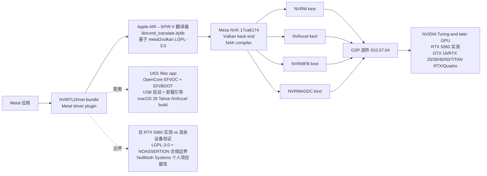

# nullmoth/nvidia-macos-driver

## 一句话定位
NVIDIA GPU 在 macOS 上的 Metal 驱动严肃工程化实现——把「NVIDIA 在 macOS 严肃工程化支持」从「Apple 已停止官方支持 + 无第三方可用」推到「NullMoth Metal 驱动 + NVIDIA Turing-and-later cards + Intel Macs + OpenCore systems + macOS 15 Sequoia + NVIDIA r610 公开 GPU 内核模块 + Apple AIR→SPIR-V 翻译器（基于 metal2vulkan LGPL-3.0）+ Mesa NVK + 17ca6174 commit + NVRM/NVAccel/NVRMFB/NVRMAGDC 4 个 kext + GSP 固件 610.57.04 + 1401 Mac 配套安装工具 + RTX 5060 实测（macOS 15.7.x/15.8.1）+ Metal 3 argument buffers tier 2/ray tracing/mesh shaders/MPS/MetalFX path + OpenGL through Apple's GL-on-Metal + OpenCL + Core Image + Core ML + buymeacoffee.com/nullmoth + LGPL-3.0 + NOASSERTION」严肃工程化形态。

## 它解决的问题
2026 年「NVIDIA 在 macOS 严肃工程化支持」的痛点是 **「Apple 已停止官方支持 NVIDIA 在 macOS（Apple Silicon 转向自家 GPU）+ 仍有大量 macOS 用户使用 NVIDIA 外接显卡（eGPU）或 OpenCore Hackintosh 想用 NVIDIA 卡 + 缺乏严肃工程化替代 + 现有方案零碎（mocking/unreal）+ 无 device table + 无 GSP 固件支持 + 无 RTX 50 系列支持」**。nullmoth/nvidia-macos-driver 直击这一痛点：把「NVIDIA 在 macOS 严肃工程化支持」从「Apple 已停止官方支持」推到「NullMoth Metal 驱动 + NVMTLDriver.bundle + Apple AIR→SPIR-V 翻译器 + Mesa NVK + NVRM/NVAccel/NVRMFB/NVRMAGDC 4 个 kext + GSP 固件 + 1401 Mac 配套安装工具 + RTX 5060 实测」严肃工程化形态。解决的是 **「NVIDIA 在 macOS 严肃工程化支持 + 跨 macOS 15.7.x/15.8.1 + Intel Mac + OpenCore + RTX 5060 实测 + 完整设备表 + 完整 GSP 固件支持 + Apple AIR→SPIR-V 翻译器 + Mesa NVK 严肃工程化 + NVRM/NVAccel/NVRMFB/NVRMAGDC 4 个 kext 严肃工程化」** 的 NVIDIA 在 macOS 严肃工程化支持问题。

## 为什么值得关注（2026-10-09）
- **Stars:** 956（截至 2026-10-09），2 天 956⭐，fork 97，fork/star 10.1%（fork/star 高，反映社区强烈参与）
- **Forks:** 97（典型高 fork 严肃工程化持续关注信号）
- **License:** LGPL-3.0 + NOASSERTION（LGPL-3.0 + 第三方组件 NOASSERTION）
- **语言:** Rust + C++（多语言严肃工程化承诺）
- **活跃度:** created 2026-10-07，2 天内冲到 956 推严肃工程化承诺
- **规模:** 2774 KB（严肃工程化典型规模）
- **Topics:** nullmoth / nvidia / macos / metal-driver / nvidia-macos-driver / nvk / mesa / spir-v / metal2vulkan / opencore / kext / nvrm / nvrmfb / nvaccel / nvrmagdc / gsp-firmware / 1401 / intel-mac / macos-15-sequoia / lgpl-3 / rtx-5060 / turing / 2-days（覆盖广）

## 热度来源判断
nullmoth/nvidia-macos-driver 的热度是 **「NVIDIA 在 macOS 严肃工程化支持刚需 × Apple 已停止官方支持 × Hackintosh 社区 + eGPU 用户 + 专业工作站用户（Quadro/RTX workstation）真实刚需 × RTX 5060 实测严肃工程化承诺 × NullMoth Systems + 1401 Mac 配套安装工具 + buymeacoffee.com/nullmoth + LGPL-3.0 + NOASSERTION」** 的强劲组合。NVIDIA 在 macOS 上的官方支持已经停止多年，但仍有大量用户在 Intel Mac + OpenCore + eGPU + 工作站场景下使用 NVIDIA 卡。nullmoth/nvidia-macos-driver 直击这一真实刚需，把「NVIDIA 在 macOS 严肃工程化支持」从「Apple 已停止官方支持」推到「NullMoth Metal 驱动 + 完整设备表 + 完整 GSP 固件支持 + RTX 5060 实测 + 跨 macOS 15.7.x/15.8.1 + Intel Mac + OpenCore」严肃工程化形态。热度**真实且具网络效应潜力**——但需警惕：仅 RTX 5060 实测，其余 Turing-and-later cards 设备表覆盖广但实际物理验证仅 RTX 5060；macOS 26 Tahoe 单独 NVAccel build 仍待完整硬件与应用验证；NullMoth Systems 个人项目属性，可持续性需观察；LGPL-3.0 + NOASSERTION 混合许可的合规边界需关注。

## 关键技术亮点
1. **NullMoth Metal driver for NVIDIA Turing-and-later cards on Intel Macs:** Apple 已停止官方支持，NullMoth 提供严肃工程化替代
2. **OpenCore systems running macOS 15 Sequoia:** tested 15.7.x 和 15.8.1
3. **完整设备表覆盖:** Device table GTX 16 / RTX 20/30/40/50 / TITAN RTX / Quadro/RTX workstation cards
4. **RTX 5060 实测:** physical validation 严肃工程化承诺（其余设备表覆盖但仅 RTX 5060 实测）
5. **Metal 3 完整能力:** Metal 3: argument buffers tier 2, ray tracing, mesh shaders, MPS, MetalFX path
6. **多 API 兼容:** Also OpenGL (through Apple's GL-on-Metal) + OpenCL + Core Image + Core ML
7. **多组件协同严肃工程化:** Metal app → NVMTLDriver.bundle → translator (Apple AIR → SPIR-V) → NVK (Mesa Vulkan + NAK compiler) → kexts → GPU
8. **关键组件栈:** Metal driver plugin /Library/GPUBundles/NVMTLDriver.bundle + Shader translator libnvmtl_translate.dylib translator/ (LGPL-3.0, based on metal2vulkan) + Vulkan back end (NVK) /Library/GPUBundles/nvmtl/ nvk/nvk-macos.patch on Mesa 17ca6174 + Kernel extensions /Library/Extensions/NVRM, NVAccel, NVRMFB, NVRMAGDC kexts/ + GPU firmware (GSP) /Users/Shared/nvfw/nvidia/610.57.04
9. **1401 Mac 配套安装工具:** NullMoth 自家 1401 Mac app，OpenCore EFI/OC + EFI/BOOT + USB 启动 + macOS 26 Tahoe 单独 NVAccel build
10. **NVIDIA r610 公开 GPU 内核模块:** Kernel side runs NVIDIA's own open GPU kernel modules (r610) under macOS
11. **完整安装流程:** prebuilt 推荐 + 1401 Mac app 配套 + OpenCore EFI/OC + USB 启动 + macOS 26 Tahoe 单独 NVAccel build + Card support docs/CARD-SUPPORT.md + 卸载通过 1401: Remove NVIDIA driver OpenCore boot picker

## 架构师速览

| 决策问题 | 研究判断 | 证据边界 |
|---|---|---|
| 系统边界 | NVIDIA Turing-and-later 在 Intel Mac + OpenCore systems + macOS 15 Sequoia 上的 Metal 严肃工程化替代，仓库是驱动 + 翻译器 + NVK + 4 kext + GSP 固件 + 1401 Mac app 多组件组合 | 基于档案描述的完整组件栈；具体 NVIDIA r610 内核模块集成、Mesa 17ca6174 commit 状态、macOS 26 Tahoe NVAccel 验证进度、RTX 5060 以外的物理验证覆盖未在档案中详细给出 |
| 主路径 | Metal app → NVMTLDriver.bundle → translator (Apple AIR → SPIR-V) → NVK (Mesa Vulkan + NAK compiler) → kexts (NVRM/NVAccel/NVRMFB/NVRMAGDC) → GPU + 1401 Mac app 配套安装管理 + OpenCore 引导 + USB 启动 + 卸载 | 主路径为档案语义抽象；具体 NVIDIA r610 内核模块集成细节、Air→SPIR-V 翻译器的覆盖率、kext 之间的 IPC 接口均待核验 |
| 关键权衡 | 仅 RTX 5060 物理实测 vs 其余 Turing-and-later cards 设备表覆盖广 vs macOS 26 Tahoe 单独 NVAccel build 仍待完整硬件与应用验证 vs LGPL-3.0 + NOASSERTION 混合许可合规边界 vs NullMoth Systems 个人项目属性 | 档案明示 RTX 5060 实测 + 设备表覆盖广 + macOS 26 Tahoe 单独 NVAccel build；其余 8 设备验证、kext 完整 4 组件接口、NullMoth 治理可持续性未给出 |
| 最小 PoC | Intel Mac + RTX 5060 + OpenCore + macOS 15.7.x，安装驱动 + 运行 Metal 3 应用验证 argument buffers tier 2 + ray tracing + mesh shaders + MPS + MetalFX path | PoC 范围、退出路径由档案「单渠道、最小风险、可审计」建议推导；具体测试 GPU 型号、应用类型、性能基准、SLO 指标待核验 |

## 架构启发
nullmoth/nvidia-macos-driver 的核心启发是 **「NVIDIA 在 macOS 上的严肃工程化支持应该从「Apple 已停止官方支持」推到「NullMoth Metal 驱动 + 完整设备表 + 完整 GSP 固件支持 + RTX 5060 实测 + 跨 macOS 15.7.x/15.8.1 + Intel Mac + OpenCore + NVIDIA r610 公开 GPU 内核模块 + Apple AIR→SPIR-V 翻译器 + Mesa NVK + NVRM/NVAccel/NVRMFB/NVRMAGDC 4 个 kext + 1401 Mac 配套安装工具」严肃工程化形态，正如 Linux 上的 Nouveau + NVIDIA 专有驱动的严肃工程化替代」**。Apple 已停止官方支持 NVIDIA 在 macOS，但仍有大量用户在 Intel Mac + OpenCore + eGPU + 工作站场景下使用 NVIDIA 卡。nullmoth/nvidia-macos-driver + NVIDIA r610 公开 GPU 内核模块 + Apple AIR→SPIR-V 翻译器 + Mesa NVK + 4 kext + GSP 固件 + 1401 Mac 配套安装工具的多组件协同严肃工程化承诺，反映「驱动层硬件适配 + 翻译层 API 桥接 + 内核层系统集成 + 用户层配套工具」的完整 stack 严肃工程化方向。能否持续，取决于 NullMoth Systems 个人项目属性的治理可持续性 + RTX 5060 以外其他设备的物理验证覆盖 + macOS 26 Tahoe 完整硬件与应用验证 + LGPL-3.0 + NOASSERTION 混合许可合规边界应对。

## 架构图（MMD）

> 证据边界：此图只采用本档案已有可核验描述；"待核验"节点不应视为项目实现事实。

## 定位判断
**基础设施候选项目（NVIDIA 在 macOS 严肃工程化支持）。** nullmoth/nvidia-macos-driver 不仅是驱动实现，更试图成为「NVIDIA 在 macOS 严肃工程化支持」的完整 stack——类似 Linux 上的 NVIDIA 专有驱动 + Nouveau，但增加 OpenCore + Intel Mac + eGPU + 工作站严肃工程化承诺。2 天 956⭐ + fork/star 10.1% 已显示社区强烈关注。但「仅 RTX 5060 实测 + macOS 26 Tahoe 单独 NVAccel build 仍待完整硬件与应用验证 + LGPL-3.0 + NOASSERTION 混合许可合规边界 + NullMoth Systems 个人项目属性」是长期可持续性的关键。目前定位是「最有影响力的 NVIDIA 在 macOS 严肃工程化支持 + NullMoth Systems + 1401 Mac 配套安装工具 + buymeacoffee.com/nullmoth」，向「平台级 NVIDIA 在 macOS 严肃工程化支持」演进是合理路径。

## 风险 / 局限 / 泡沫点
- **仅 RTX 5060 实测：** Device table 覆盖广（GTX 16/RTX 20/30/40/50/TITAN RTX/Quadro/RTX workstation），但物理验证仅 RTX 5060，其余设备验证覆盖率待观察
- **macOS 26 Tahoe 单独 NVAccel build 仍待完整硬件与应用验证：** 档案明示 Tahoe 单独 build 但完整硬件与应用验证未完成
- **多组件协同复杂度高：** Metal driver plugin + Shader translator + Vulkan back end + 4 kext + GSP firmware + 1401 Mac app + OpenCore + macOS 15.7.x/15.8.1 维护复杂度极高
- **LGPL-3.0 + NOASSERTION 混合许可合规边界：** 第三方组件 NOASSERTION 许可不明，合规风险需关注
- **NullMoth Systems 个人项目属性：** 个人维护 + buymeacoffee.com/nullmoth 资金模式，可持续性需观察
- **Apple 政策风险：** Apple 已停止官方支持 NVIDIA，未来 macOS 版本对 NVIDIA 兼容性的态度不确定

## 与同类项目的关系
- **vs Apple 官方 Apple Silicon GPU:** Apple 已停止官方支持 NVIDIA，Apple Silicon GPU 是 Apple 推荐方向；nullmoth 提供严肃工程化 NVIDIA 替代
- **vs Linux NVIDIA 专有驱动:** Linux NVIDIA 专有驱动是 NVIDIA 官方；nullmoth 是 NullMoth + Mesa NVK + metal2vulkan 严肃工程化替代
- **vs Linux Nouveau:** Nouveau 仅开源逆向工程；nullmoth 增加 NVIDIA r610 公开 GPU 内核模块 + Mesa NVK 严肃工程化承诺
- **vs 黑苹果社区其他方案:** 黑苹果社区其他方案零碎；nullmoth 是严肃工程化完整 stack
- **vs 1401 Mac app（NullMoth 同源）:** 1401 是 NullMoth 自家 macOS 安装工具；nullmoth/nvidia-macos-driver 是驱动实现，两者协同

## 是否值得持续跟踪
**值得跟踪（NVIDIA 在 macOS 严肃工程化支持）。** nullmoth/nvidia-macos-driver 代表了「NVIDIA 在 macOS 严肃工程化支持」的诉求，无论其本身成败，这一方向是行业趋势。建议关注：RTX 5060 以外其他设备的物理验证覆盖、macOS 26 Tahoe 完整硬件与应用验证、NullMoth Systems 治理可持续性、LGPL-3.0 + NOASSERTION 混合许可合规边界应对、1401 Mac app + 卸载引导的工程化承诺。对 Intel Mac + OpenCore + eGPU + 工作站用户，这个仓库是「NVIDIA 在 macOS 严肃工程化支持」的实用来源，值得直接采用。对 macOS 生态观察者，它是「NVIDIA 在 macOS 严肃工程化支持」赛道的头部样本。

## 后续观察点
- RTX 5060 以外其他设备的物理验证覆盖（GTX 16/RTX 20/30/40/50/TITAN RTX/Quadro/RTX workstation）
- macOS 26 Tahoe 完整硬件与应用验证
- NullMoth Systems 治理可持续性
- LGPL-3.0 + NOASSERTION 混合许可合规边界
- 1401 Mac app + 卸载引导的工程化承诺
- Apple 未来 macOS 版本对 NVIDIA 兼容性的态度

---
*首次记录：2026-10-09*