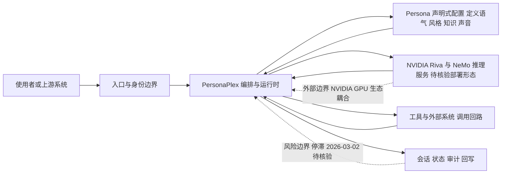

# NVIDIA PersonaPlex

## 一句话定位
NVIDIA 出品的人格复用框架，提供全双工语音到语音（speech-to-speech）的 AI 人格基础设施，让 AI Agent 拥有一致、可迁移的对话人格和声音身份。

## 它解决的问题
当前的 AI Agent 语音交互存在两大痛点：(1) 人格碎片化——同一个 AI 在不同场景下的语气、风格、知识库不一致，用户体验割裂；(2) 语音交互延迟高——传统 ASR→LLM→TTS 级联管线延迟可达数秒，无法实现自然对话。PersonaPlex 通过全双工语音处理架构解决延迟问题，同时通过"Persona"抽象统一管理 AI 的人格定义，使同一人格可在多个 Agent 实例间复用。

## 为什么值得关注
- **NVIDIA 出品:** 代表了 GPU 巨头对 AI Agent 人格层基础设施的战略判断
- **全双工语音:** 真正的实时双向语音交互，支持打断、重叠说话
- **10,316 stars:** NVIDIA 开源项目中关注度增长最快的之一
- **Persona 抽象:** "人格即资产"——将 AI 人格从应用代码中解耦，可独立管理、迁移、交易

## 热度来源判断
热度来自 NVIDIA 品牌 + 语音 AI 热点的叠加。2026 年语音交互成为 AI Agent 的核心交互模态（GPT-4o 语音模式、Gemini Live 的成功验证了市场需求）。PersonaPlex 作为 NVIDIA 在这个方向的官方开源方案，自然获得了大量关注。开发者社区对"语音 AI Agent"的探索热情也推高了关注度。

## 关键技术亮点亮点
- 全双工语音处理：基于 NVIDIA Riva 和 NeMo 框架，实现低延迟双向语音流
- Persona 定义系统：声明式配置 AI 人格（语气、风格、知识、声音特征）
- 人格迁移：Persona 配置可在不同模型和部署环境间移植
- 多 Agent 人格网络：支持定义多个 Persona 之间的交互关系和协作模式
- GPU 加速推理：利用 NVIDIA GPU 生态实现端到端语音管线优化

## 架构师速览

| 决策问题 | 研究判断 | 证据边界 |
|---|---|---|
| 系统边界 | PersonaPlex 是定位在"AI 人格层"的编排基础设施，覆盖入口渠道、模型供应商（含 NVIDIA Riva/NeMo）、工具/数据源之间的人格抽象与全双工语音管线；GitHub 资料未给出明确的 API 边界与部署形态。 | 仅档案描述的 Persona 抽象、全双工语音、模型/工具调用回路；具体协议、接口面待核验。 |
| 主路径 | 主路径为：使用者/上游 → 入口与身份边界 → PersonaPlex 编排与运行时 → 模型推理（Riva/NeMo）+ 工具/外部系统 → 会话/状态/审计回写。 | 路径基于档案"关键技术亮点亮点"与"架构师速览"表推断；具体管线组件、消息格式与持久化策略待核验。 |
| 关键权衡 | 核心权衡是 NVIDIA GPU/Riva/NeMo 生态耦合带来的性能/一致性收益，与跨平台可移植性、供应商锁定、生态活跃度风险之间的平衡；MLX 社区移植侧面印证跨平台诉求。 | 权衡基于"风险/局限"段及 personaplex-mlx 移植记录；活跃度判断依赖 pushed_at 2026-03-02 后是否更新。 |
| 最小 PoC | 建议先在单入口渠道、声明式 Persona 配置、最小工具权限与可审计日志下验证全双工语音延迟与一致性，再扩展到多 Persona/多 Agent 网络；安全、成本、SLO、退出路径作为验收项。 | 来自"采用建议"与"后续观察点"中关于延迟/成本/Persona 标准化等条目；具体阈值与基线待核验。 |

## 架构启发
PersonaPlex 的核心架构启发是"人格层的抽象与解耦"。传统 AI 应用的"模型 + Prompt"耦合在一起，难以独立管理和复用人格。将 Persona 提升为一级架构对象——就像微服务架构中的"服务定义"——使得人格成为可版本化、可组合、可分发的独立资产。对架构师的启发是：**AI 系统中"软"属性（人格、记忆、偏好）应该像"硬"属性（模型、数据）一样有明确的管理边界**。

## 架构图（MMD）

> 证据边界：此图只采用本档案已有可核验描述；“待核验”节点不应视为项目实现事实。

## 定位判断
**平台候选（战略卡位）。** PersonaPlex 本身是工具型框架，但 NVIDIA 的战略意图是建立"AI 人格标准"——如果 Persona 定义格式成为行业标准，NVIDIA 就掌握了 AI 人格层的话语权。定位为"AI 人格基础设施的参考实现"。

## 风险/局限/泡沫点
- **强绑定 NVIDIA 硬件生态:** 核心依赖 Riva/NeMo，非 NVIDIA GPU 用户使用门槛高
- **更新停滞:** pushed_at 停留在 2026-03-02，之后无更新（4 个月），活跃度存疑
- **语音 AI 竞争激烈:** OpenAI Realtime API、Google Gemini Live 都是强劲对手
- Persona 标准化面临生态碎片化——行业标准需要多方共识，单方推动困难
- 10k stars 可能反映 NVIDIA 品牌效应而非实际采用

## 与同类项目的关系
- 与 **OpenAI Realtime API** 在全双工语音能力上竞争——PersonaPlex 开源但绑定 NVIDIA，OpenAI 闭源但通用
- 与 **Google Gemini Live** 在实时语音 Agent 维度竞争
- 与 **moshi**（Kyutai 开源语音模型）在开源语音 AI 维度竞争
- 在 NVIDIA 生态内，与 NeMo、Riva、NIM 微服务形成 AI 基础设施栈
- MLX 社区有 personaplex-mlx 移植版本，说明跨平台需求存在

## 是否值得持续跟踪
**选择性跟踪。** 如果使用 NVIDIA 硬件构建语音 Agent，PersonaPlex 是重要参考。但从项目活跃度和生态广度来看，建议同时关注 OpenAI 和 Google 的语音 API 演进。NVIDIA 的更新节奏是关键信号。

## 后续观察点
- 项目是否恢复活跃更新（2026-03 后停滞值得关注）
- Persona 定义格式是否被其他框架采纳
- 与 OpenAI Realtime API / Gemini Live 的能力对比
- NVIDIA 是否将其作为 NIM 微服务商业化
- 全双工语音的延迟和成本指标在生产环境的实际表现

---
> 数据来源: GitHub API (NVIDIA/personaplex) | 星标: 10,316 | 语言: Python | 许可证: MIT
