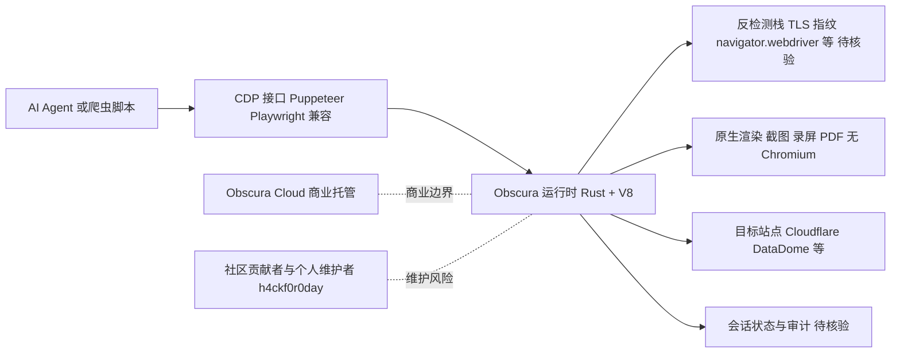

# Obscura — AI Agent 专用 Rust 无头浏览器

## 一句话定位
Rust 实现的轻量无头浏览器引擎，内存仅 30MB（Chrome 的 1/7），专为 AI Agent 自动化和大规模网页抓取设计，兼容 Puppeteer/Playwright API，内置反检测能力。

## 它解决的问题
现有 headless browser 方案（Chrome Headless、Playwright、Puppeteer）本质上是**为浏览器测试设计的**，存在三大问题：**重**（Chrome 进程内存 200+MB，二进制 300+MB）、**慢**（启动需 2 秒，页面加载约 500ms）、**无反检测**（被 Cloudflare/reCAPTCHA 等反爬系统轻松识别）。对于 AI Agent 自动化和大规模数据抓取场景，这些是致命瓶颈。Obscura 用 Rust 从零构建浏览器引擎，内存仅 30MB、二进制 70MB、页面加载 85ms、启动瞬时完成，并内置反检测——**为自动化而生的浏览器**。

## 为什么值得关注（2026-08-11）
- **Stars:** 21,201（截至 2026-08-11），4 个月从 9.2K 增至 21.2K
- **Forks:** 1,520
- **Watchers:** 69
- **License:** Apache-2.0
- **语言:** Rust
- **Open Issues:** 70（维护良好）
- **活跃度:** created 2026-04-13，pushed_at 2026-08-10（持续高频更新）
- **核心指标:** 内存 30MB / 二进制 70MB / 页面加载 85ms / 启动瞬时
- **商业路径:** 已推出 Obscura Cloud（托管版），开源引擎 Apache-2.0 全功能开放
- **原生渲染:** 已支持无需 Chromium 的原生渲染——截图、屏幕录制、PDF 导出

## 热度来源判断
Obscura 的热度是**"AI Agent 爆发 × Rust 性能优势 × 反检测刚需 × Chrome 替代需求"**的强劲组合。2026 年 AI Agent 需要操控浏览器是共识（Browser Use 场景无处不在），但 Chrome Headless 太重太慢，**每个 Agent 实例消耗 200MB+ 内存**——当同时运行数十个 Agent 时成本不可承受。Obscura 的 30MB 内存意味着同样资源可运行 7 倍以上的并发 Agent。反检测能力（绕过 Cloudflare、DataDome 等）更是数据抓取和 Agent 自动化的刚需。热度**真实且有强劲工程驱动**——这不是概念项目，而是已发布可用的二进制工具，有明确的性能对比数据。5093 个 open issues 的高活跃度（对于 paperclip 是噪音，对于 obscura 的 70 个 issue 来说是健康的）说明有真实用户在使用。

## 关键技术亮点
1. **Rust 实现 + V8 引擎:** 从零构建的浏览器引擎，运行真实 JavaScript（V8），不是简单的 HTTP 客户端或 DOM 模拟器
2. **CDP 兼容:** 支持 Chrome DevTools Protocol，可直接作为 Puppeteer / Playwright 的 drop-in 替换——迁移成本几乎为零
3. **极致轻量:** 内存 30MB（Chrome 200+MB 的 1/7），二进制 70MB（Chrome 300+MB 的 1/4），页面加载 85ms（Chrome 500ms 的 1/6）
4. **内置反检测:** 自动处理 navigator.webdriver、浏览器指纹、TLS 指纹等反爬检测信号——Chrome Headless 需要额外 stealth 插件才能实现
5. **原生渲染（无 Chromium）:** 可直接截图、屏幕录制、PDF 导出，不依赖 Chromium 渲染引擎——这是与 Chrome Headless 架构的根本区别
6. **跨平台:** Linux x86_64/ARM64、macOS Intel/Apple Silicon、Arch Linux (AUR)、NixOS 原生支持

## 架构师速览

| 决策问题 | 研究判断 | 证据边界 |
|---|---|---|
| 系统边界 | Obscura 是一个用 Rust 从零构建的轻量无头浏览器引擎（30MB 内存 / 70MB 二进制），原生渲染支持截图、录屏、PDF，对外以 CDP 接口暴露，定位为 Puppeteer/Playwright 的 drop-in 替代层 | 性能指标来自档案叙述，非独立基准；引擎内部子模块（DOM/CSS/网络栈）档案未展开，无法逐项核验 |
| 主路径 | 上游 Agent/脚本通过 CDP 接入 → Obscura 运行时执行渲染与 JS（V8）→ 通过内置反检测栈发起对目标站点的请求 → 会话结果（页面 DOM、截图、PDF）回写调用方 | CDP 协议本身是档案明确列出的；具体网络栈、TLS 指纹处理实现细节档案未给出，待核验 |
| 关键权衡 | 在 Chrome Headless 的"全 Web 兼容性 / 200MB+ 资源"与 Obscura 的"30MB / 内置反检测 / 可能 WebGL 与复杂 CSS 覆盖不足"之间取舍；同时承受个人维护者（h4ckf0r0day）长期可持续性与反爬军备升级带来的不确定性 | WebGL、媒体播放等覆盖度仅以"可能不支持"描述，未见官方兼容矩阵；维护风险属档案给出的明确风险点 |
| 最小 PoC | 在 Linux x86_64 单节点上以 Apache-2.0 二进制启动 Obscura，替换现有 Puppeteer/Playwright 调用 CDP 端点，跑通一个含 Cloudflare 防护的目标站点截图与 PDF 导出用例，对比 30MB 内存上限与页面加载 85ms 的复现度，并把法律与反检测合规作为验收门槛 | 跨平台清单（Linux/macOS/ARM64/NixOS）档案明确；85ms 加载为厂商数据，需在自有目标站上重测；Cloudflare/DataDome 对抗效果档案仅有定性描述 |

## 架构启发
Obscura 代表了**"Agent 专用基础设施正在从通用工具中分化"**的深刻趋势。当前 AI Agent 操作浏览器的主流方案是"Playwright/Puppeteer + stealth 插件 + Chrome Headless"，这是一种**补丁式架构**——用插件修补一个本非为 Agent 设计的工具。Obscura 的架构启发是：**Agent 需要原生设计的基础设施**。这和 AI 领域的通用规律一致——从"通用模型 + 提示工程"到"专用模型"，从"通用 CLI + wrapper"到"Agent-Native CLI"。基础设施层的分化意味着：**每一个被 Agent 高频调用的通用工具，都可能催生一个 Agent 专用替代品**。

更深层的启发是 Rust 在系统级 AI 基础设施中的优势——内存安全 + 零成本抽象 + 无 GC 暂停，对于需要高并发、低延迟的 Agent 运行时是理想选择。

## 架构图（MMD）

> 证据边界：此图只采用本档案已有可核验描述；“待核验”节点不应视为项目实现事实。

## 定位判断
**基础设施候选（强）。** Obscura 已经不是概念——21K stars + 可用二进制 + 明确性能优势 + 商业化路径（Obscura Cloud）。它定位为 AI Agent 浏览器自动化的**轻量高性能替代层**。如果 Agent 生态持续爆发（这是确定性趋势），Agent 专用浏览器的市场空间巨大。Obscura 有成为**Agent 基础设施栈标准组件**的潜力——类似 Playwright 之于测试自动化。

## 风险 / 局限 / 泡沫点
- **功能完整性差距:** 与 Chrome 的完整 Web API 支持相比，Obscura 可能不支持所有复杂网页特性（WebGL、特定 CSS、媒体播放等）
- **JS 兼容性:** 虽然 V8 运行真实 JS，但某些网站的复杂交互链可能无法完全复现
- **反检测军备竞赛:** Cloudflare/DataDome 等反爬系统也在持续升级，反检测是永恒的猫鼠游戏
- **单人/小团队维护:** h4ckf0r0day 个人项目，Rust 浏览器引擎的长期维护负担极重
- **商业化与开源的平衡:** Obscura Cloud 是商业产品，需警惕开源引擎功能被逐步限制以推动商业化
- **法律灰色地带:** 反检测浏览器的主要用途之一是绕过反爬系统，可能面临法律风险

## 与同类项目的关系
- **vs Chrome Headless / Puppeteer:** 通用测试工具，Obscura 是 Agent 专用替代——更轻、更快、内置反检测
- **vs Playwright:** 功能更全的通用浏览器自动化框架，但依赖 Chrome，资源消耗大
- **vs Browser Use:** Browser Use 是 Agent 操控浏览器的上层框架，Obscura 是底层引擎——可能互补
- **vs Crawlee / Scrapy:** 爬虫框架，偏数据提取；Obscura 偏 JS 渲染和交互自动化
- **vs Browserless / Apify:** 商业化的 headless Chrome 托管服务，Obscura 是自托管的开源替代

## 是否值得持续跟踪
**是（高优先级）。** 作为 Agent 专用浏览器方向的头部项目，Obscura 值得重点跟踪。它不仅是一个工具，更是**"Agent 基础设施分化"**趋势的标志性项目。对于构建 Agent 系统的团队，Obscura 可以直接评估采用（Apache-2.0 + Puppeteer/Playwright 兼容，迁移成本低）。对于 AI 基础设施观察者，它是"通用工具→Agent 专用工具"演进路线的重要样本。

## 后续观察点
1. **Agent 框架集成:** LangChain / CrewAI / AutoGPT 等是否开始原生集成 Obscura
2. **功能完整性:** 复杂网站（WebGL、SPA、媒体）的支持覆盖率
3. **社区贡献者增长:** 个人项目能否吸引核心贡献者形成团队
4. **Obscura Cloud 定价与采用:** 商业化路径是否验证了市场需求
5. **反检测能力持续更新:** 与 Cloudflare/DataDome 的对抗动态
6. **是否推出 Agent SDK:** 超越 Puppeteer/Playwright 兼容，提供 Agent 原生 API

---
> 数据来源: GitHub API (2026-08-11) | Stars: 21,201 | Forks: 1,520 | License: Apache-2.0 | 语言: Rust | 创建: 2026-04-13
