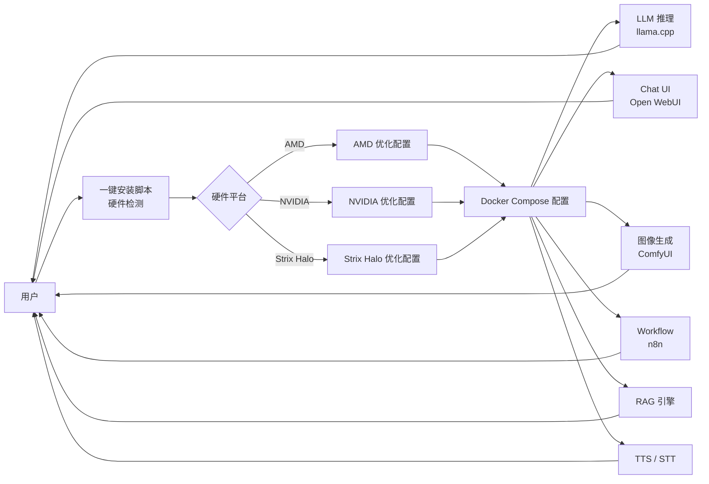

# Osmantic/ODS

## 一句话定位
把 PC / Mac / Linux 盒子变成 AI Server 的开源 OS——LLM 推理（llama.cpp）+ Chat UI（Open WebUI）+ 语音（TTS/STT）+ Agent + Workflow（n8n）+ RAG + 图像生成（ComfyUI）的 all-in-one 自托管栈；多硬件支持（AMD / NVIDIA / Strix Halo）；6 个月 4,864⭐。

## 它解决的问题
企业 / 个人用户部署本地 AI Server 时面临：(1) **工具分散**——LLM 推理（llama.cpp / Ollama）、Chat UI（Open WebUI）、图像生成（ComfyUI）、Workflow（n8n）、TTS/STT 各自独立；(2) **硬件适配复杂**——AMD / NVIDIA / Apple Silicon / Strix Halo 各有优化配置；(3) **集成门槛高**——多个容器 / 服务 / 配置的整合需要专业知识。ODS 直接把这三类问题工程化：用 Docker Compose / 配置文件集合 + 多硬件自动适配 + 一键安装脚本，把"本地 AI Server"做成标准化产品。

## 为什么值得关注（2026-08-30）
- **Stars:** 4,864（截至 2026-08-30），**6 个月增长**——首次进入 GitHub Trending 日榜
- **Forks:** 741——社区二次使用率极高
- **License:** Apache-2.0——下游商业可采用
- **语言:** Python（推测，含 Docker Compose / 配置脚本）
- **活跃度:** created 2026-02-09，pushed 2026-08-29，6 个月内持续高活跃
- **规模:** 23 MB（含 Docker Compose 配置 + 硬件适配脚本）
- **多硬件支持：** Topics 明示 `amd` / `nvidia` / `strix-halo`——三大主流硬件平台覆盖
- **Topics 完整覆盖：** `ai-agents` / `comfyui` / `docker` / `llama-cpp` / `llm` / `local-ai` / `n8n` / `open-webui` / `rag` / `self-hosted` / `speech-to-text` / `strix-halo` / `text-to-speech` / `workflow-automation` 14 个明确标签

## 热度来源判断
ODS 的热度是 **"本地 AI Server 标准化刚需 × 多硬件适配 × 一键安装简化 × Apache-2.0 大厂许可 × Docker Compose 集合易用"** 的组合。4,864⭐/6 个月 + 741 forks 反映社区对该模式的高度认可。热度**真实且具可持续性**——但需警惕：(1) 23 MB 仓库主要是 Docker Compose 配置 + 脚本，技术壁垒低，若上游组件（Open WebUI / ComfyUI / llama.cpp / n8n）版本变动，整合稳定性受影响；(2) "复用主流组件"意味着差异化有限——核心价值在工程整合 + 多硬件适配。

## 关键技术亮点
1. **Open WebUI + ComfyUI + llama.cpp + n8n 四件套打包**：Topics 明示四个核心组件的整合——LLM 推理 + Chat UI + 图像生成 + Workflow 自动化
2. **多硬件支持**：AMD / NVIDIA / Strix Halo 三大硬件平台——Topics 明示三个明确标签
3. **all-in-one 自托管**：本地 AI Server 的完整栈——Topics 明示 `self-hosted` / `local-ai`
4. **完整 AI 能力覆盖**：LLM + 语音（TTS/STT）+ Agent + Workflow + RAG + 图像生成——Topics 明示 14 个标签
5. **Apache-2.0 License**：宽松开源许可，下游商业可采用
6. **Docker Compose 集合形式**：23 MB 仓库——主要是配置文件 + 脚本，安装门槛低

## 架构师速览

| 决策问题 | 研究判断 | 证据边界 |
|---|---|---|
| 系统边界 | Docker Compose / 配置脚本集合 + 多硬件适配层（AMD / NVIDIA / Strix Halo）+ 一键安装脚本；不修改上游组件源码 | Topics 明示 `docker` / 14 个标签；具体 Docker Compose 配置清单需 README 独立核验 |
| 主路径 | 用户下载 ODS → 跑一键安装脚本 → 自动检测硬件（AMD / NVIDIA / Strix Halo）→ 拉取 Docker Compose 配置 → 启动 LLM 推理 + Chat UI + 图像生成 + Workflow 等服务 | 多硬件适配 + 一键安装是 Topics 明示；具体硬件检测算法 / 自动配置策略需核验 |
| 关键权衡 | 复用主流组件（低开发成本）vs 上游版本变动风险（维护成本）vs 多硬件适配深度 vs 一键安装简化 vs 与上游社区的关系 | "all-in-one" 是 Topics 明示；上游组件（Open WebUI / ComfyUI / llama.cpp / n8n）的版本兼容性需独立核验 |
| 最小 PoC | 在 AMD 或 NVIDIA 桌面机上下载 ODS → 跑一键安装脚本 → 验证 LLM 推理 + Chat UI + RAG 启动并工作 → 验证硬件加速（GPU 推理）正常 | 一键安装命令是 Topics 明示；具体硬件检测与自动配置逻辑需 README 独立核验 |

## 架构启发
ODS 的核心启发是 **"本地 AI Server 是 2026 下半年的标准化品类"**。随着 Llama 4 / Qwen3 / DeepSeek-V3 等本地可跑大模型成熟，企业 / 个人对"自托管 AI Server"的需求明确。ODS 的创新不在于"自研组件"（Open WebUI / ComfyUI / llama.cpp / n8n 都是现成的），而在于"all-in-one 整合 + 多硬件适配 + 一键安装"——这是把"AI Server"从"极客玩物"做成"普通用户可消费产品"的关键一步。更深层的启发是 **"Docker Compose 集合是有壁垒的工程整合"**——表面上 23 MB 仓库的技术含量低，但实际上多硬件适配 + 多组件版本兼容 + 一键安装的工程量大、试错成本高、社区贡献网络效应强（741 forks 反映此点）。下一波可能是 Open WebUI / ComfyUI 官方下场做"官方 all-in-one"。

## 架构图（MMD）

> 证据边界：此图只采用本档案已有可核验描述；"待核验"节点不应视为项目实现事实。

## 定位判断
**工具型项目（本地 AI Server 的开源 OS 栈）。** ODS 定位明确——把 PC / Mac / Linux 变成 AI Server 的标准化产品。4,864⭐/6 个月 + 741 forks 反映社区认可。但"开源 OS 栈"的护城河在于：(1) 多硬件适配深度（决定 AMD / NVIDIA / Apple Silicon 用户覆盖）；(2) 上游组件版本兼容性（决定稳定性）；(3) 一键安装的"开箱即用"体验（决定普通用户覆盖）。目前定位是"本地 AI Server 标准化品类的代表之一"，向"本地 AI OS 行业标准"演进是合理路径。

## 风险/局限/泡沫点
- **上游组件版本变动风险**：Open WebUI / ComfyUI / llama.cpp / n8n 任一组件重大版本更新（如 Open WebUI v2.0、ComfyUI 新模型架构）可能破坏 ODS 的整合
- **技术壁垒低**：23 MB 主要是 Docker Compose 配置 + 脚本，差异化主要在工程整合能力
- **与上游组件官方下场竞争**：若 Open WebUI / ComfyUI 官方推出"all-in-one"版本，ODS 的差异化会被吸收
- **多硬件适配深度有限**：AMD / NVIDIA / Strix Halo 覆盖广，但深度优化需独立基准测试
- **个人项目属性**：Osmantic 个人维护，741 forks 但核心治理集中，可持续性存疑
- **6 个月数据不足以判断长期采用曲线**：4,864⭐ 是早期增长，但 Docker Compose 集合类项目的长期价值取决于持续维护

## 与同类项目的关系
- **vs Open WebUI 单独部署：** Open WebUI 是单一组件，ODS 是 all-in-one 整合
- **vs ComfyUI 单独部署：** ComfyUI 是图像生成，ODS 是 LLM + UI + 图像 + Workflow 全栈
- **vs llama.cpp / Ollama 单独部署：** 推理引擎单一，ODS 是多组件整合
- **vs 8-26 heimdall/Perenna：** 偏 MCP memory 方向，ODS 偏本地 AI OS 方向
- **vs 8-28 control-center：** control-center 偏个人 BI，ODS 偏 AI Server

## 是否值得持续跟踪
**值得跟踪（本地 AI Server 标准化品类）。** ODS 代表"本地 AI Server 开源 OS"方向，无论其本身成败，这一方向是行业趋势。建议关注：上游组件版本兼容性、多硬件适配深度、是否被上游官方推荐。对本地 AI 部署用户，ODS 是当前最完整的 all-in-one 自托管栈。对生态观察者，它是"本地 AI Server 标准化"路径的成功样本。

## 后续观察点
- 上游组件版本兼容性（Open WebUI / ComfyUI / llama.cpp / n8n 任一重大版本更新）
- 多硬件适配深度（特别是 AMD Strix Halo / Apple Silicon 的优化进度）
- 是否被上游组件官方推荐 / 集成
- 6 个月增长曲线能否在 6 个月后保持稳定
- Apache-2.0 License 的企业采用情况
- 是否被云厂商（AWS / Azure / GCP）参考为"本地 AI 部署"模式

---
*首次记录：2026-08-30*