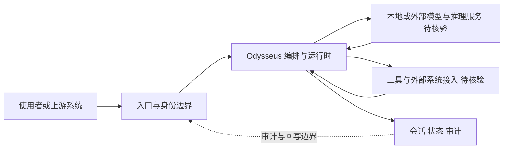

# Odysseus

## 一句话定位
自托管 AI 工作空间——Python 实现，MIT 协议，提供完整的本地 AI 工作环境。

## 它解决的问题
主流 AI 工具（ChatGPT、Claude、Copilot）都是 SaaS 模式，用户代码、文档、对话数据必须上传到云端。对于有数据合规要求的企业和注重隐私的个人开发者，缺少一个开箱即用的自托管 AI 工作空间。

## 为什么值得关注（2026-06-05）
一个月内 50.6K stars + 5.9K forks，是 2026 年 5 月以来增速最快的 Python 项目之一。5.9K forks 意味着大量用户在真实部署，不只是收藏。346 个 issues + 498 PRs 反映社区高度活跃。

## 热度来源判断
- **自托管需求真实**：数据隐私 + 本地推理 + 开源协议 = 不可能三角
- **增长模式需警惕**：组织名 pewdiepie-archdaemon 不够正规，无 topics，无详细 README 描述
- 可能是社交媒体驱动的集中式爆发
- 5.9K forks 是积极信号，但需观察 fork 后的实际使用

## 关键技术亮点亮点
1. **MIT 协议**：无商用限制，企业可直接使用
2. **Python 实现**：低门槛，社区易于贡献和扩展
3. **自托管架构**：数据完全在本地，不依赖外部 SaaS
4. **346 issues / 498 PRs**：社区活跃度极高，说明有大量真实用户在参与

## 架构师速览

| 决策问题 | 研究判断 | 证据边界 |
|---|---|---|
| 系统边界 | Odysseus 定位为自托管 AI 工作空间的 Python 编排层，介于使用者、模型推理与本地工具/数据源之间，职责是本地化集成而非替代模型本身 | 边界依据仅为项目分类（观察型）、tags（self-hosted / ai-workspace / privacy）与一行描述 "Self-hosted AI workspace."，无 README 详述，模型/工具接入细节待核验 |
| 主路径 | 在档案所给抽象下：使用者 → 入口与身份 → 项目编排与运行时 → 模型/工具调用 → 会话/状态/审计回写 | 主路径来自档案"架构师速览"的研究抽象，具体的协议、传输方式、持久化与并发模型均待核验 |
| 关键权衡 | 在数据隐私与本地化收益 vs. 扩展速度、可观测性、供应商耦合之间的平衡；Python+MIT 降低门槛但也带来依赖治理与维护可持续性风险 | 权衡判断仅基于 MIT、Python、self-hosted、privacy 标签与 stars/fork 增速；缺乏性能基准、安全模型与运维要求数据，证据边界有限 |
| 最小 PoC | 在单一入口渠道、关闭外部工具权限、开启可审计日志的前提下验证自托管推理回路、会话持久化与回退路径 | PoC 形态为档案"采用建议"的研究推断，未给出具体硬件栈、模型规格、部署形态；项目元数据不规范（组织名异常、无 topics）需先做信任核验 |

## 架构启发
- 自托管 AI 工作空间是 AI 工具市场的重要细分
- Python 生态在 AI 工具领域仍有压倒性优势
- 5.9K forks 提示：用户不只是想「尝试」，更想「拥有」自己的 AI 工作空间
- 启发：私有部署 + 本地推理 + 开源协议 是 AI 工具的差异化竞争优势

## 架构图（MMD）

> 证据边界：此图只采用本档案已有可核验描述；“待核验”节点不应视为项目实现事实。

## 定位判断
**观察型。** 50K+ stars 足够亮眼，但项目元数据不规范、组织名异常、无 topics 标记。需要观察 6 月后续增长和技术演进，确认是否为可持续项目。

## 风险 / 局限 / 泡沫点
1. **项目元数据不规范**：组织名 pewdiepie-archdaemon，无 topics，描述仅 "Self-hosted AI workspace."
2. **可能是泡沫**：50K stars 的集中式增长可能由社交媒体驱动，而非技术社区自然增长
3. **技术深度不明**：缺乏架构文档、设计哲学等技术内容
4. **维护风险**：如果是个体开发者项目，长期维护能力存疑

## 与同类项目的关系
- **Open WebUI (社区)**：浏览器端 AI 界面，Odysseus 定位更偏工作空间
- **LibreChat**：开源 ChatGPT 克隆，功能更专一
- **OpenBMB PilotDeck (3.0K)**：任务导向 AI Agent 生产力平台，更专业但用户群更窄

## 是否值得持续跟踪
**谨慎跟踪。** 需确认项目正规性后再决定是否升级为「持续跟踪」级别。重点观察 6 月第二周 stars 增速是否可持续。

## 后续观察点
1. 项目是否发布详细架构文档和技术博客
2. 6 月第二周 stars 增速（是否从集中爆发转为持续增长）
3. 组织背景和开发者身份
4. 与 Open WebUI / LibreChat 的差异化能力

---
*首次记录：2026-06-05*
