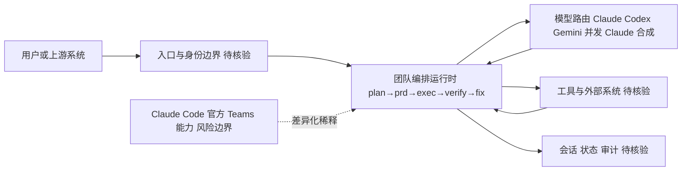

# oh-my-claudecode

## 一句话定位
以团队为原子的 Multi-Agent 编排平台，在 Claude Code 上构建团队化多 Agent 协作（executor、reviewer、architect），多 Provider 路由 + 流水线自愈。

## 它解决的问题
当前 Multi-Agent 编排方案多以单个 Agent 为原子单位，复杂任务难以自然拆解。oh-my-claudecode 以"团队"为编排单元，用户定义角色（executor、reviewer、architect），系统自动执行 `team-plan → team-prd → team-exec → team-verify → team-fix` 流水线，让多角色协作更符合工程直觉，避免在一个 Prompt 里堆叠复杂指令。

## 为什么值得关注
- **团队即编排单元**：以"团队"而非"Agent"为原子，更符合工程协作直觉
- **多 Provider 路由**：Claude + Codex + Gemini 三路并发，结果由 Claude 合成
- **流水线自愈**：`team-fix` 循环确保任务不静默失败
- **Marketplace 插件机制**：Claude Code 原生插件安装，工程化程度高
- **多种执行模式**：Team（推荐）、Autopilot、Ultrawork、Ralph
- **本周新增 7,832 stars**，增速极快，社区关注度高

## 热度来源判断
- Multi-Agent 是 2026 年 AI 工程的核心方向，社区需求旺盛
- Claude Code 用户基数快速增长，扩展生态需求强烈
- 团队化抽象相比单 Agent 编排有直观差异，容易引发讨论
- MIT License 开源，Discord 社区活跃

## 关键技术亮点亮点
1. **团队即编排单元**：将角色（executor/reviewer/architect）组合为一个"团队"，系统自动编排团队行为
2. **多 Provider 路由**：Claude、Codex、Gemini 并行执行，Claude 负责结果合成
3. **流水线自愈**：`team-fix` 阶段检测失败并自动修复，不静默失败
4. **Marketplace 插件机制**：Claude Code 原生插件安装流程
5. **多种执行模式**：Team（推荐）、Autopilot、Ultrawork、Ralph

## 架构师速览

| 决策问题 | 研究判断 | 证据边界 |
|---|---|---|
| 系统边界 | oh-my-claudecode 是位于 Claude Code 之上的编排层，向上承接用户/上游系统，向下路由 Claude/Codex/Gemini 三路模型与外部工具，并依赖 Claude Code 原生 Marketplace 插件机制进行分发 | 仅基于档案"多 Provider 路由 + Claude 合成 + Marketplace 插件"的描述；具体 API 边界与权限模型未在档案中给出 |
| 主路径 | 团队流水线 `team-plan → team-prd → team-exec → team-verify → team-fix`，由 executor/reviewer/architect 角色协作推进，team-fix 负责失败自愈并回写状态 | 阶段名与角色名取自档案；阶段间的输入输出契约、并发模型未披露 |
| 关键权衡 | 团队化抽象带来的工程直觉 vs 对 Claude Code 内部 API 与插件机制的深度耦合风险（尤其在官方推出 `CLAUDE_CODE_EXPERIMENTAL_AGENT_TEAMS` 后） | 档案明确将"平台绑定风险"列为局限，但耦合的具体接口面与可替换性未说明 |
| 最小 PoC | 选择 Team 模式，单一非关键任务，配置最小工具权限，开启可审计日志，验证 team-fix 自愈是否触发及失败处理路径 | 档案未给出部署形态、所需凭据、CLI/SDK 入口细节，需在 PoC 前从源码/文档核验 |

## 架构启发
以"团队"为原子的设计模式值得在企业内部 Copilot 平台中借鉴。这种设计让复杂任务可以自然地拆解为多个角色的协作，而非在一个 Prompt 里堆叠复杂指令。多 Provider 路由 + 合成结果的模式也为降低单一模型依赖提供了参考。

## 架构图（MMD）

> 证据边界：此图只采用本档案已有可核验描述；“待核验”节点不应视为项目实现事实。

## 定位判断
**平台候选** — 依赖 Claude Code 生态，但团队化编排抽象有独立价值。如果官方能力追平，差异化价值会稀释。

## 风险/局限/泡沫点
- **与 Claude Code 官方能力的关系**：Claude Code 官方正在引入原生 Teams 功能（`CLAUDE_CODE_EXPERIMENTAL_AGENT_TEAMS`），一旦官方能力追平，差异化价值会快速稀释
- **平台绑定风险**：严重依赖 Claude Code 的内部 API 和插件机制
- **企业定制化成本高**：依赖 Claude Code，企业内部定制化需要额外工程投入

## 与同类项目的关系
| 项目 | 定位 | 关系 |
|------|------|------|
| oh-my-codex | 同作者的 Codex 版本 | 同系列，不同平台 |
| hermes-agent | 独立 Agent 编排 | 不同路径：Claude Code 绑定 vs 独立部署 |

## 是否值得持续跟踪
**是** — Multi-Agent 团队化编排是真实方向。关注官方 Teams 功能的演进速度与 oh-my-claudecode 的差异化能力。

## 后续观察点
- Claude Code 官方 Teams 功能何时追平现有能力
- 团队化抽象是否能迁移到其他 Coding Agent 平台
- 企业级生产环境使用案例的积累
- Marketplace 插件生态的繁荣程度
