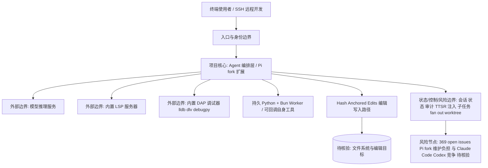

# oh-my-pi

## 一句话定位
终端 AI Coding Agent，将 IDE 级能力（LSP/DAP/Python/Browser）内置到终端，定义「终端里的 IDE」新形态。

## 它解决的问题
当前终端 Agent（如 Claude Code CLI、Codex）本质上是 CLI wrapper，依赖外部 IDE 提供 LSP、调试等能力。oh-my-pi 将这些能力内置到 Agent 本身，使终端 Agent 不再是 IDE 的附属品，而是独立的开发环境。

目标用户：偏好终端工作流的开发者，尤其是远程开发、SSH 场景。

## 为什么值得关注（2026-06-08）
1. Hash-Anchored Edits 将 Grok Code Fast 1 通过率从 6.7% 提升到 68.3%，是编辑精度的数量级提升
2. 持久 Python + Bun Worker，Agent 内部可回调自身工具，形成闭环
3. LSP/DAP 全集成，终端 Agent 首次具备与 IDE 等价的代码理解和调试能力
4. **2026-06-08 持续高热**：8.7K → 11K（+2.3K/week），周榜持续上榜
5. 369 个 open issues 反映了真实活跃用户基础

## 热度来源判断
- **真实性高。** 技术深度足够（27K 行 Rust 核心），不是简单包装
- Fork 自 Mario Zechner 的 Pi，在 Pi 基础上做了大量工程创新
- 解决的是终端 Agent 用户的真实痛点（编辑精度、代码理解、调试能力）

## 关键技术亮点亮点
1. **Hash-Anchored Edits**：基于文件内容 hash 的精准定位编辑，不依赖 diff/patch，对弱模型（如 Grok Code Fast 1）效果显著
2. **持久 Python + Bun Worker**：Agent 内部有持久运行时，可回调 read/search/task，形成工具使用闭环
3. **LSP/DAP 内置**：13 LSP ops + 27 DAP ops，Rename 走 workspace/willRenameFiles，调试支持 lldb/dlv/debugpy
4. **TTSR（Think-Then-Steer-and-Resume）**：规则注入不打断对话流，regex 匹配后 mid-token 中断注入
5. **Subagents**：task 可 fan-out 到隔离 worktree，每个 worker 独立工具面

## 架构师速览

| 决策问题 | 研究判断 | 证据边界 |
|---|---|---|
| 系统边界 | oh-my-pi 是一个终端 Coding Agent，自身承担 IDE 级能力（内置 LSP/DAP、持久 Python+Bun Worker、Hash-Anchored Edits），而非依赖外部 IDE 的 CLI wrapper；系统边界在“Agent 运行时 + 内置工具面” | 仅基于档案所述 13 LSP ops / 27 DAP ops、持久 Worker、TTSR、Subagents 等描述；具体协议、传输与进程模型未在档案给出 |
| 主路径 | 用户在终端发起请求 → Agent 编排（Pi fork 上的扩展层）→ 调用模型与内置工具（LSP/DAP/Python/Bun）→ 通过 Hash-Anchored Edits 与状态/会话回写完成编辑闭环 | “请求 → 编排 → 模型与工具 → 状态回写”来自档案引用的架构抽象；具体调度协议、并发模型、IPC 方式档案未披露 |
| 关键权衡 | 在“内置 IDE 能力带来的精度/能力增益”（如 Grok 6.7%→68.3%）与“LSP server 自行管理、Pi fork 维护负担、与 Claude Code/Codex 官方迭代竞争”之间取舍 | 收益数字与权衡点仅出自档案摘要；性能数据样本、用户规模分布、官方竞品动态未给出独立验证 |
| 最小 PoC | 在受控本地仓库启 Agent，仅挂单一 LSP/DAP、最小 Python+Bun Worker、最小权限，验证 Hash-Anchored Edits 精度与子任务 fan-out 行为，记录可审计日志与回滚路径 | 档案未提供安装方式、依赖版本、可复现评测脚本；PoC 步骤为基于风险点（fork 依赖、369 open issues、LSP 自管复杂度）的推导 |

## 架构启发
- **Agent 即 IDE**：将 IDE 能力内置到 Agent 而非让 Agent 调用外部 IDE，这是方向性创新
- **编辑格式的重要性**：Hash-Anchored Edits 证明了编辑格式对模型表现的影响远超预期
- **持久运行时的价值**：Agent 内部持久运行时使复杂工作流（数据分析 → 可视化 → 报告）成为可能

## 架构图（MMD）

> 证据边界：此图只采用本档案已有可核验描述；“待核验”节点不应视为项目实现事实。

## 定位判断
- 更偏**工具型**，但有**平台候选**潜力
- 如果继续发展，可能成为 Agent 运行时标准

## 风险/局限/泡沫点
1. 依赖 Pi 的 fork，维护负担
2. 11K 对终端 Agent 来说仍不够大，需要更多真实用户验证
3. LSP/DAP 内置意味着每个 LSP server 需要自行管理，复杂度高
4. 与 Cursor / VS Code 的 Agent 集成竞争，市场空间可能有限
5. Claude Code 官方快速迭代可能查食其差异化优势

## 与同类项目的关系
- **vs Claude Code CLI**：oh-my-pi 更底层，内置更多 IDE 能力
- **vs Codex CLI**：Codex 是 OpenAI 官方，oh-my-pi 更灵活
- **vs Pi（原始项目）**：Pi 是基础框架，oh-my-pi 是面向开发者的完整 Agent

## 是否值得持续跟踪
**是。** 终端 Agent IDE 化是明确趋势，oh-my-pi 的技术深度足够，值得关注其发展。

## 后续观察点
1. Hash-Anchored Edits 是否会被其他 Agent 采用
2. LSP/DAP 内置的稳定性
3. 与 OpenAI Codex / Claude Code 的竞争态势
4. 是否会发展出自己的插件/扩展生态
5. 11K 后的增长趋势和商业化路径

---

## 更新记录

### 2026-06-08
- Stars: 8.7K → 11K（+2.3K/week）
- Score: 88 → 87（微调，竞争加剧）
- 369 个 open issues 说明用户基数活跃
- 持续判断：终端 Agent IDE 化是明确趋势
