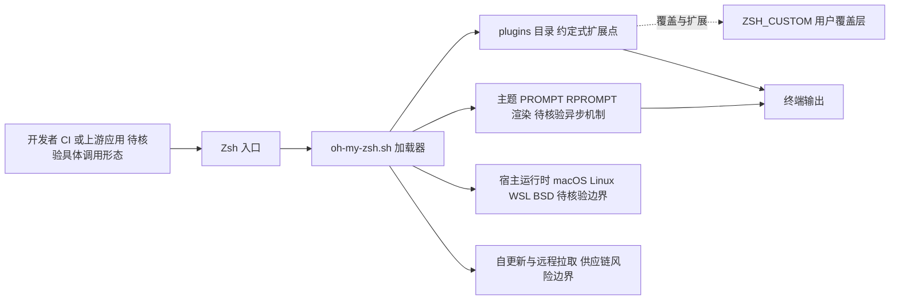

# ohmyzsh/ohmyzsh

## 一句话定位
最流行的 Zsh 配置管理框架，提供 150+ 主题、300+ 插件和开箱即用的终端增强体验，是开发者终端美化的事实标准。

## 它解决的问题
原生 Zsh 功能强大但配置门槛高——补全、提示、语法高亮、Git 状态显示都需要大量手写 `.zshrc` 配置。Oh My Zsh 将这些常见需求打包为预置插件和主题，一条命令安装即可获得"别人家的终端"体验，让开发者无需深究 Zsh 配置细节就能拥有美观高效的命令行环境。

## 为什么值得关注
- **Stars:** 189,077 stars，长期位居 GitHub Top 15，是终端工具类目 Star 数第一
- **装机量巨大:** 估计全球数百万开发者使用，几乎是 Mac/Linux 开发者的"标配"
- **插件生态:** 300+ 官方/社区插件覆盖 Git、Docker、K8s、Node、Python 等几乎所有开发场景
- **主题体系:** Powerlevel10k、agnoster 等主题成为终端美学标杆
- **社区惯性:** 历经 15+ 年迭代，文档完善，故障排查资源丰富

## 热度来源判断
Oh My Zsh 的热度是纯粹的产品力 + 时间积累。它诞生于 2009 年，比 Star 体系本身更早成熟。热度来源：(1) 每个新开发者入行都会被推荐安装，形成持续的自然流量；(2) 开发者社区的"终端炫耀"文化驱动主题分享和传播；(3) macOS 默认 Zsh 后，Oh My Zsh 成为升级体验的第一选择。这是一个不依赖任何炒作、纯粹靠口碑传播的项目。

## 关键技术亮点亮点
- **插件加载机制:** 按需加载（lazy load），仅 source 用户声明的插件，避免性能浪费
- **主题系统:** 通过 PROMPT / RPROMPT 变量组合，支持异步渲染（Powerlevel10k）
- **自动更新:** 内置自更新机制，定期拉取最新版本
- **completions 增强:** 集成大量命令行工具的 Tab 补全规则
- **跨平台:** macOS / Linux / WSL / BSD 全平台支持

## 架构师速览

| 决策问题 | 研究判断 | 证据边界 |
|---|---|---|
| 系统边界 | 本质是 Zsh 脚本集合 + 一个加载器（`oh-my-zsh.sh`），由 `plugins/` 目录约定承载扩展点；运行边界绑定宿主 Zsh 与 OS 文件系统，配置入口为 `$ZSH_CUSTOM`。 | 档案明确"目录即插件"与 `$ZSH_CUSTOM` 覆盖机制；未列出具体 CLI 命令签名或 IPC 接口。 |
| 主路径 | 开发者/CI → 调用 Zsh 入口 → `oh-my-zsh.sh` 加载器按需 source 主题与插件 → 接管 PROMPT/RPROMPT 与补全 → 输出至终端宿主。 | 档案描述了按需/lazy 加载与 PROMPT 主题渲染路径；未提供具体 source 顺序或优先级策略。 |
| 关键权衡 | 易用性、跨平台覆盖、插件生态广度 vs. 启动延迟、Zsh 单语言绑定、外部插件供应链（Git 拉取）风险。 | 档案明示"启动变慢（数百毫秒到数秒）"与"仅支持 Zsh"；未给出实测数据或具体插件审计机制。 |
| 最小 PoC | 在 macOS/Linux/WSL 任一宿主安装 Zsh + Oh My Zsh，仅启用 1 个主题与 1 个插件，记录启动时间、内存与交互回归，再评估是否扩展 CI 接入。 | 档案支持该最小验证范围；未声明 SLO、安全策略或离线部署形态，须另行核验。 |

## 架构启发
Oh My Zsh 的架构极简——本质是一个 Zsh 脚本集合 + 一个加载器（`oh-my-zsh.sh`）。其设计哲学是"约定优于代码"：插件只需放在 `plugins/` 目录下，包含 `_plugin_name` 补全文件和 `plugin_name.plugin.zsh` 脚本即可被自动识别。这种"目录即插件"的模式简单但有效，降低了贡献门槛。其 `$ZSH_CUSTOM` 机制允许用户在不修改核心代码的情况下覆盖和扩展。

## 架构图（MMD）

> 证据边界：此图只采用本档案已有可核验描述；“待核验”节点不应视为项目实现事实。

## 定位判断
**工具型项目（成熟期）。** Oh My Zsh 是一个高度成熟的开发者工具，功能已趋稳定，迭代主要是新插件和兼容性修复。它不追求技术前沿，而是追求"稳定可靠、开箱即用"。在 AI 时代，它依然有存在价值——终端是开发者最常用的界面，而 Oh My Zsh 让这个界面更好用。

## 风险 / 局限 / 泡沫点
- **启动速度:** 加载大量插件时 Zsh 启动可能变慢（数百毫秒到数秒），影响体验
- **Shell 局限:** 仅支持 Zsh，不支持 Fish / Nushell 等现代 Shell
- **现代替代:** Starship（跨 Shell）、Fish（开箱即用）正在分流用户
- **维护放缓:** 核心功能已固化，新功能开发节奏明显放缓

## 与同类项目的关系
- **vs Starship:** Starship 跨 Shell、Rust 实现、更快；Oh My Zsh 更成熟、插件更多
- **vs Fish Shell:** Fish 自带智能补全和语法高亮，无需框架；Oh My Zsh 需额外安装但更灵活
- **vs zinit / antidote:** 新一代 Zsh 插件管理器，更快的并行加载；Oh My Zsh 更简单但更慢
- **vs prezto:** Oh My Zsh 的早期 fork，更注重性能，但社区更小

## 是否值得持续跟踪
**低优先级跟踪。** Oh My Zsh 已进入维护成熟期，重大变化概率低。值得偶尔关注的是：是否有性能优化（启动速度）、是否适配新的开发工作流（如 AI CLI 工具的集成插件）、以及与现代 Shell（Nushell）的关系。

## 后续观察点
- 启动性能优化进展（是否引入并行加载或延迟加载机制）
- AI 开发工具相关插件（如 Claude Code、Cursor 的终端集成）
- 是否有 Oh My Zsh "v2" 或下一代重构计划
- 与 Zsh 新版本特性的适配速度

---
> 数据来源: GitHub API (2026-08-07) | 首次发现: 2026-07-26
