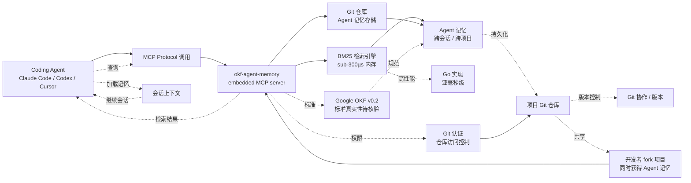

# okf-memory/okf-agent-memory

## 一句话定位
Git-native Agent 记忆层——Git-native persistent memory for AI coding agents. Implements Google OKF v0.2 with sub-300µs in-memory BM25 search, embedded MCP server, and...，Go，把 Agent 记忆持久化下推到 Git 仓库层，是与 wshobson/agents Memory / ECC Memory 并列的"Agent 持久化"第三方案。

## 它解决的问题
2026 年 Coding Agent 缺乏跨会话 / 跨项目的长期记忆——用户每次启动 Agent 都要重新解释上下文（项目结构 / 个人偏好 / 历史决策），严重影响开发效率。当前主流方案：(a) wshobson/agents Memory 层的"skill memory"（与 Skill 集合耦合）；(b) ECC Memory 的"instincts + memory"（Harness 优化层耦合）；(c) **okf-agent-memory 的"Git-native + Google OKF v0.2 + BM25"**——把 Agent 记忆下推到 Git 仓库层，独立于 Skill / Harness。这与 Git-native Skills / Git-native Agent Identity 等"Git-native Agent 基础设施"趋势一致。

## 为什么值得关注
- **Stars:** 340（截至 2026-09-07），2 天净增，单日均速 ~170⭐/day
- **Forks:** 15（fork/star **4.4%**，偏低，反映"新概念"早期传播 + Agent Memory 概念的开发者群体较小）
- **语言:** Go 主导
- **Git-native 持久化:** 把 Agent 记忆下推到 Git 仓库层（与项目代码同仓库管理）
- **Google OKF v0.2:** 自述实现 Google 开放知识框架 v0.2（需要核验 Google 是否真有该规范）
- **sub-300µs BM25 检索:** 内存 BM25 检索亚毫秒级（Go 高性能实现）
- **embedded MCP server:** 把 Agent 记忆服务内嵌到 Coding Agent 进程

## 热度来源判断
okf-agent-memory 的热度来自三个趋势的交汇：(1) **Agent 持久化刚需**——Coding Agent 用户对跨会话 / 跨项目长期记忆的需求强烈；(2) **Git-native 趋势**——把 Agent 相关配置 / 记忆 / 技能下推到 Git 仓库层（与 dotfiles / project memory 管理一致）；(3) **MCP 生态成熟**——embedded MCP server 让 Agent 记忆服务可被任何 Coding Agent 通过 MCP 协议调用。

2 天 340⭐ / fork/star 4.4% 与"新概念早期传播 + Agent Memory 概念群体小"特征一致。**提示：** "Google OKF v0.2" 命名是项目方主张，需要核验 Google 是否真有该规范发布；如果只是项目方命名（Open Knowledge Format？），需要明确归属；okf-memory 是新 Org，可持续性是风险。

## 关键技术亮点
1. **Git-native 持久化:** Agent 记忆存储在 Git 仓库中（与项目代码同仓库管理），便于版本控制 / 协作共享
2. **sub-300µs BM25 检索:** Go 高性能 BM25 实现，亚毫秒级检索
3. **embedded MCP server:** 内嵌 MCP server，让任何支持 MCP 的 Coding Agent 调用
4. **Google OKF v0.2:** 自述实现 Google 开放知识框架 v0.2（待核验）
5. **跨会话 / 跨项目记忆:** Agent 记忆跨会话 / 跨项目持久化
6. **Go 主导:** 与 okf-agent-memory 性能需求一致（Go 高性能）

## 架构师速览

| 决策问题 | 研究判断 | 证据边界 |
|---|---|---|
| 系统边界 | Git-native Agent 记忆层——把 Agent 记忆持久化下推到 Git 仓库层 + BM25 检索 + MCP server 暴露 | 边界由 trending 描述明示；"Google OKF v0.2" 标准的真实性需核验；具体存储格式（commit / branch / file 级别）需 README 核验 |
| 主路径 | Coding Agent 通过 MCP 调用 → okf-agent-memory server → Git 仓库检索记忆 → 返回上下文 → Agent 加载记忆继续会话 | 主路径为描述语义抽象；MCP server 的具体接口（query / insert / update）未在 trending 中可见 |
| 关键权衡 | Git-native（版本控制 / 协作共享）vs 性能（Git 操作开销）vs 隐私（记忆存在 Git 仓库可能泄露）；BM25 检索（亚毫秒级）vs 语义检索（LLM embedding）的精度差距 | Git-native 由 trending 描述明示；BM25 vs 语义检索的精度对比需 benchmark |
| 最小 PoC | 在 Git 仓库中初始化 okf-agent-memory → Coding Agent 通过 MCP 连接 → Agent 询问"上次我们讨论了什么" → 验证 Git 仓库记忆被检索并加载 → 跨会话验证记忆持久化 | 安装命令需 README 独立核验；"Google OKF v0.2" 标准真实性需独立验证 |

## 架构启发
okf-agent-memory 的核心启发是 **"Agent 记忆应该 Git-native"**。当前 Agent 记忆方案（wshobson/agents / ECC）把记忆与 Skill / Harness 耦合，导致记忆难以跨项目共享、版本控制、协作。okf-agent-memory 把记忆下推到 Git 仓库层，让记忆成为项目代码的一部分——开发者 fork 项目时同时获得 Agent 记忆，跨项目复用。更深层的启发是：**Git-native 是 Agent 基础设施的下一个前沿**——继 Git-native Skills / Git-native Memory 之后，可能还会有 Git-native Agent Identity / Git-native Agent Workflow 等。

风险提示：**"Google OKF v0.2" 标准真实性**——需要核验 Google 是否真有该规范发布；如果只是项目方命名，需要明确归属；Git-native 性能开销——Git 操作（commit / push / clone）的延迟可能影响 Agent 记忆的实时性；okf-memory 是新 Org，可持续性是核心风险。

## 架构图（MMD）

> 证据边界：此图只采用本档案已有可核验描述；"待核验"节点不应视为项目实现事实。

## 定位判断
**工具型项目（Git-native Agent 记忆层）。** okf-memory/okf-agent-memory 是与 wshobson/agents Memory / ECC Memory 并列的"Agent 持久化"第三方案，差异化在"Git-native + Google OKF v0.2 + BM25"。2 天 340⭐ / fork/star 4.4% 显示该细分需求有早期采用。但作为独立产品的天花板：(a) "Google OKF v0.2" 标准真实性需要核验；(b) 与 wshobson/agents / ECC 的竞争（用户可能选择已建立的方案）；(c) Git-native 性能开销；(d) okf-memory Org 可持续性。当前定位是"Git-native Agent 记忆层头部样本"，向"Git-native Agent 基础设施平台"演进是合理路径。

## 风险/局限/泡沫点
- **"Google OKF v0.2" 标准真实性:** 需要核验 Google 是否真有该规范发布；如果只是项目方命名，需要明确归属
- **Git-native 性能开销:** Git 操作（commit / push / clone）的延迟可能影响实时性
- **与 wshobson/agents / ECC 竞争:** 已建立的 Agent Memory 方案的用户基础与生态优势
- **fork/star 4.4% 偏低:** 反映"新概念早期传播 + Agent Memory 概念群体小"
- **okf-memory 新 Org 风险:** 长期可持续性 / 治理结构 / 安全漏洞响应未验证
- **BM25 vs 语义检索:** BM25（关键词匹配）vs LLM embedding（语义检索）的精度差距——可能需要混合方案

## 与同类项目的关系
- **vs wshobson/agents:** wshobson 的 Memory 模块（与 Skill 集合耦合）；okf-agent-memory 是独立的 Git-native 记忆层
- **vs affaan-m/ECC:** ECC 的 Instincts + Memory（Harness 优化层耦合）；okf-agent-memory 是独立的 Git-native 记忆层
- **vs anthropics/skills:** Anthropic 官方 Skills 仓库（无 Memory 模块）；okf-agent-memory 是独立的 Memory 层
- **vs MemGPT / Letta:** MemGPT / Letta 是学术 Agent Memory 框架；okf-agent-memory 是 Git-native 实用工具
- **vs dotfiles:** dotfiles 是个人配置文件管理；okf-agent-memory 是 Agent 记忆 Git-native 化

## 是否值得持续跟踪
**值得跟踪（Git-native Agent 记忆层）。** okf-agent-memory 代表了 Agent 持久化从"Skill / Harness 耦合"升级到"Git-native 独立"的诉求。建议关注：(a) "Google OKF v0.2" 标准真实性；(b) 与 wshobson/agents / ECC 的差异化；(c) Git-native 性能开销；(d) okf-memory Org 可持续性。对 Coding Agent 重度用户，okf-agent-memory 是值得尝试的 Git-native 记忆方案。

## 后续观察点
- "Google OKF v0.2" 标准真实性（Google 官方规范？）
- 与 wshobson/agents / ECC 的功能对比 benchmark
- Git-native 性能开销（commit / push / clone 延迟）
- BM25 vs 语义检索的精度对比
- 是否演化为"Git-native Agent 基础设施平台"
- okf-memory Org 可持续性 / 治理结构

---
> 数据来源: GitHub API (2026-09-07) | Stars: 340 | Forks: 15 | License: 待核验 | 语言: Go | 创建: 2026-09-05
