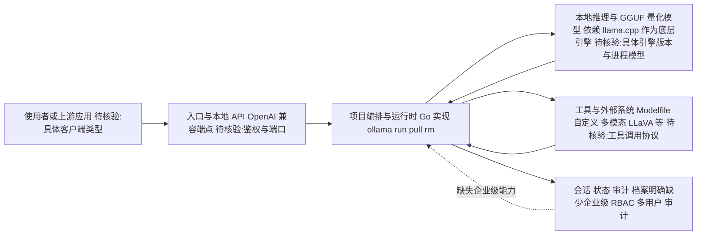

# ollama

## 一句话定位

本地 LLM 部署工具，一行命令在个人硬件上运行大模型，支持 Kimi-K2.5、Gemma、Llama 等主流模型。

## 它解决的问题

大模型的推理依赖云端 API，带来三个核心问题：

1. **成本**：按 token 计费，高频使用成本高昂
2. **隐私**：数据必须发送到第三方服务器，企业敏感代码和数据存在泄露风险
3. **延迟**：网络延迟在实时交互场景下体验差

ollama 让开发者在本地硬件上零门槛运行大模型，一行 `ollama run llama3` 即可开始对话。

## 为什么值得关注（2026-04-11）

167.7K stars，持续 GitHub Trending，是本地推理赛道的绝对王者。支持最新模型（Kimi-K2.5、Gemma 4），AI 开发者的必备基础设施。

这不是一个正在验证的项目，而是已经被大规模采用的基础设施。

## 热度来源判断

- **零门槛体验**：`ollama run` 一行命令即可开始，降低了本地推理的技术门槛
- **模型生态丰富**：支持几乎所有主流开源模型，模型库持续更新
- **跨平台支持**：macOS、Linux、Windows 全覆盖
- **开发者刚需**：在 API 成本上升和隐私合规要求的背景下，本地推理成为刚需

## 关键技术亮点亮点

1. **极简模型管理**：`ollama pull` / `ollama run` 管理 LLM，体验类似 Docker 管理容器
2. **GGUF 格式优化**：自动处理模型量化（Q4_K_M、Q5_K_M 等），在消费级硬件上实现可接受的推理速度
3. **API 兼容 OpenAI**：提供 OpenAI 兼容的 API 接口，现有应用可以无缝切换到本地推理
4. **多模态支持**：支持 LLaVA 等多模态模型，本地推理不限于文本
5. **Modelfile 自定义**：支持自定义模型配置，类似 Dockerfile 的体验

## 架构师速览

| 决策问题 | 研究判断 | 证据边界 |
|---|---|---|
| 系统边界 | 面向桌面/边缘硬件的本地 LLM 推理运行时，作为模型供应、本地算力与调用方之间的编排层；上层暴露 OpenAI 兼容 API，下层调用 llama.cpp/GGUF 等底层引擎 | 基于"OpenAI 兼容 API""GGUF 格式优化""llama.cpp 是底层推理引擎"；具体引擎版本、进程模型、端口与持久化未在档案中确认 |
| 主路径 | 用户一行命令（如 `ollama run`）→ 入口与本地 API → 编排/运行时 → 本地推理与量化模型 → 会话/状态回写，并可通过同套 API 触发外部工具 | 由"极简模型管理""运行时抽象屏蔽 llama.cpp/GGUF""API 标准化"等档案条目归纳；多模态、Modelfile 触发链路未给出源码细节 |
| 关键权衡 | 在零门槛体验与本地硬件性能/合规性之间取舍：消费级硬件速度低于云端 GPU，量化加速带来精度损失，且缺少企业级 RBAC/审计 | 档案明确指出"推理速度无法与云端 GPU 集群相比""硬件门槛""企业级功能缺失"；量化档位与精度损失的量化数据未提供 |
| 最小 PoC | 单机 macOS/Linux/Windows 安装 ollama，`ollama pull` 一个主流模型，以 OpenAI 兼容端点接入一个内部应用，验证本地延迟、显存占用、量化档位与日志可审计性 | 由"跨平台支持""一行命令开始对话""OpenAI 兼容 API"可推导；具体基准、显存阈值与日志字段需在 PoC 中实测，档案未给出 |

## 架构启发

ollama 的核心设计哲学是 **LLM 的 Docker 化**：

- **镜像管理**：模型 = 镜像，pull/run/rm 语义与 Docker 一致
- **运行时抽象**：屏蔽 llama.cpp、GGUF 等底层细节，用户无需关心
- **API 标准化**：OpenAI 兼容 API，让本地推理可以无缝替代云端
- **量化自动化**：根据硬件自动选择最佳量化级别

Trade-off：消费级硬件上推理速度仍远低于云端，适合非实时场景和开发测试，不适合高并发生产环境。

## 架构图（MMD）

> 证据边界：此图只采用本档案已有可核验描述；“待核验”节点不应视为项目实现事实。

## 定位判断

**基础设施**。ollama 是本地 LLM 推理的基础设施层，所有需要本地运行大模型的工具和应用都可以基于 ollama 构建。

## 风险 / 局限 / 泡沫点

- **硬件门槛**：高质量推理仍需要足够的 GPU/内存，并非所有人都能流畅运行
- **推理速度**：消费级硬件上的推理速度无法与云端 GPU 集群相比
- **模型更新延迟**：新模型发布后，GGUF 量化版本通常有几天延迟
- **企业级功能缺失**：缺少企业需要的 RBAC、审计、多用户管理等

## 与同类项目的关系

- **llama.cpp**：ollama 的底层推理引擎，ollama 在其上提供了更友好的用户体验
- **LM Studio**：竞品，提供 GUI 但非开源
- **vLLM / TGI**：面向生产环境的推理引擎，ollama 面向开发和边缘场景
- **litert-inference**：Google 端侧推理方案，面向移动端，ollama 面向桌面端

## 是否值得持续跟踪

⭐ **必须跟踪。** 167.7K stars 已经证明了市场地位。本地推理是 AI 基础设施的确定性趋势，ollama 是这个赛道的标准工具。

## 后续观察点

1. **企业版功能**：是否会推出面向企业的管理功能
2. **硬件加速进展**：对 Apple Silicon、NVIDIA、AMD 等硬件的优化深度
3. **模型生态扩展**：对新发布模型的跟进速度
4. **与 Agent 框架集成**：与 Claude Code、Cursor 等 Agent 工具的集成深度

---

*首次记录：2026-04-11*
