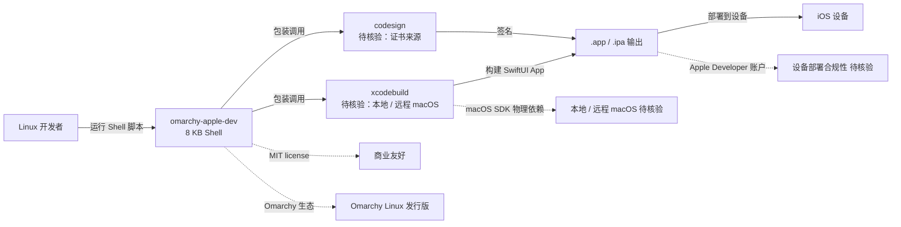

# joshuaswarren/omarchy-apple-dev

## 一句话定位
omarchy-apple-dev——Omarchy Linux + Apple Silicon 直接构建部署 iOS SwiftUI App，**无需 Xcode**；8 KB 纯 Shell 脚本；MIT license。

## 它解决的问题
iOS / iPadOS 开发传统上强绑定 macOS + Xcode——开发者必须在 macOS 上启动 Xcode IDE，使用 Apple Silicon 工具链构建 .ipa 文件。但很多开发者主力机器是 Linux（特别是 Arch 系发行版），为了 iOS 开发被迫双系统或远程 macOS。**omarchy-apple-dev 把 iOS 开发搬到 Linux 工作流**——通过 Shell 脚本把 xcodebuild + codesign 命令包装起来，在 Omarchy Linux（Arch on Apple Silicon）上直接执行。**注意：物理上 iOS IPA 构建仍依赖 macOS SDK；该项目本质是 xcodebuild 的 Linux 端包装器 + 工作流自动化**。

## 为什么值得关注（2026-09-12）
- 3 天 102⭐ / fork 5
- MIT license——商业友好
- 8 KB 仓库体积（极简）
- 纯 Shell 脚本（无外部依赖）
- 精准定位 Omarchy Linux + Apple Silicon
- 响应 Omarchy 发行版"Arch-on-Apple-Silicon"定位

## 热度来源判断
Omarchy 是 Arch 系轻量级 Linux 发行版，主打 Apple Silicon 原生体验——`omarchy-apple-dev` 是其生态延伸项目。**热度来源是「Omarchy 生态扩展 × Linux 开发者基数 × Apple Silicon 渗透 × iOS 开发 Linux 工作流刚需」四因素叠加**。但 8 KB / Shell 暗示它本质是 xcodebuild + codesign 的包装器——**物理上不可能在纯 Linux 端独立完成 IPA 签名**，需要明确外部依赖（远程 macOS 编译服务器 / Swift 工具链 / 模拟器运行等）。**热度真实但属于细分场景**，且**8 KB 体积需警惕"包装器 vs 完整工具"的边界**。

## 关键技术亮点
1. **纯 Shell 脚本**：8 KB 仓库，无外部依赖；可直接 review 全部逻辑
2. **Omarchy Linux + Apple Silicon 精准定位**：响应 Omarchy 发行版定位
3. **无需 Xcode GUI**：通过 Shell 包装 xcodebuild + codesign 命令
4. **MIT license**：商业友好，可自由衍生
5. **极简体积**：8 KB 仓库，clone 成本几乎为零

## 架构师速览

| 决策问题 | 研究判断 | 证据边界 |
|---|---|---|
| 系统边界 | 纯 Shell 脚本包装 xcodebuild + codesign 命令；运行在 Omarchy Linux + Apple Silicon 上；**iOS IPA 构建物理上仍需 macOS SDK**——仓库边界需进一步核验 | 仅基于 README 与 GitHub 元数据；具体 xcodebuild 调用链、codesign 证书管理、IPA 签名机制均待核验；8 KB 体积暗示"包装器 vs 完整工具"的边界模糊 |
| 主路径 | 开发者运行 Shell 脚本 → 脚本调用 xcodebuild / codesign → 构建 SwiftUI App → 输出 .app 或 .ipa → 可选部署到设备 | 主路径为 README 语义抽象；xcodebuild 在 Linux 端的可用性、远程 macOS 构建服务器依赖、IPA 签名合规性均待核验 |
| 关键权衡 | Linux 工作流 vs iOS 工具链 macOS 依赖 vs 8 KB 包装器 vs 远程构建 vs MIT 商业 vs Omarchy 生态绑定 vs "无 Xcode"声明边界 | 档案明示「Linux + Apple Silicon + 无 Xcode」三点；**"无 Xcode"声明的物理边界（是否仍需 macOS SDK / 远程 macOS）需独立核验**；SwiftUI 在 Linux 端的模拟运行能力待核验 |
| 最小 PoC | 在 Omarchy Linux + Apple Silicon 上 clone + 运行 Shell 脚本；尝试构建一个 Hello World SwiftUI App；检查 (a) 是否真正产出 .app 或 .ipa (b) 工具链调用链是否完整 (c) 是否仍需 macOS 远程依赖 | PoC 范围与退出路径由档案"先 Hello World、最小化工具链、可审计"原则推导；具体 Apple Developer 账户配置、设备部署流程、IPA 签名机制均待核验 |
| 依赖与红线 | 依赖 Omarchy Linux + Apple Silicon；MIT license；**物理上 iOS IPA 构建仍需 macOS SDK——"无 Xcode"声明的边界需核验**；SwiftUI App 部署到设备需要 Apple Developer 账户 | 依赖与红线均来自 README + GitHub 元数据；具体 macOS SDK 来源（本地 / 远程 / 容器化）、Apple Developer 账户配置流程、设备部署机制均需独立核验 |

## 架构图（MMD）

> 证据边界：此图只采用本档案已有可核验描述；“待核验”节点不应视为项目实现事实。

## 架构启发
omarchy-apple-dev 的核心启发是 **「Linux 工作流对 iOS 开发的尝试」**——开发者主力机器是 Linux（特别是 Arch 系发行版），为了 iOS 开发被迫双系统或远程 macOS，omarchy-apple-dev 尝试把构建流程搬到 Linux 端。**更深层的启发是「8 KB 极简 Shell 包装器」**——只做工作流自动化，不重写工具链，物理依赖（macOS SDK）仍由外部提供。**最值得警惕的是「无 Xcode 声明的物理边界」**——8 KB 体积暗示它本质是 xcodebuild 的包装器，物理上 iOS IPA 构建仍需 macOS SDK；这点 README 应有明示，避免误导。

## 定位判断
**工具型项目（iOS 开发 Linux 工作流自动化）。** omarchy-apple-dev 与 fastlane / xcodebuild / Bitrise / CircleCI 等处于"iOS 构建工具"赛道，但走"Linux 端 Shell 包装器"差异化路线。**真正的差异化是「Omarchy 生态绑定 + 8 KB 极简 Shell」**——精准定位 Omarchy Linux 用户，避免与 fastlane 等成熟工具竞争。能否扩展取决于：(a) "无 Xcode"声明的物理边界是否清晰（决定是否误导）；(b) 是否需要远程 macOS 依赖（决定实际可用性）；(c) 是否提供 Apple Developer 账户配置流程（决定入门门槛）。当前定位是"Omarchy 生态的 iOS 构建工具极简样本"，向更完整的 iOS Linux 工作流演进是合理路径。

## 风险 / 局限 / 泡沫点
- **"无 Xcode"声明的物理边界**：8 KB 体积暗示仍需 macOS SDK（本地 / 远程 / 容器化）；README 是否明示待核验
- **Omarchy 生态绑定**：仅服务 Omarchy Linux 用户，对其他发行版用户价值有限
- **早期阶段**：102⭐ / fork 5 反映用户基础小，文档与生态尚未成熟
- **SwiftUI App 部署合规性**：设备部署需要 Apple Developer 账户 + 签名证书，配置流程复杂度待核验
- **xcodebuild 在 Linux 端的可用性**：如果依赖远程 macOS，延迟与稳定性是新风险
- **个人项目属性**：joshuaswarren 个人维护，长期维护依赖作者持续投入

## 与同类项目的关系
- **vs fastlane**：fastlane 是 iOS 自动化构建工具（macOS 上跑）；omarchy-apple-dev 是 Linux 端 Shell 包装器
- **vs Bitrise / CircleCI / GitHub Actions iOS 构建**：这些是 CI/CD 平台；omarchy-apple-dev 是本地 Shell 工具
- **vs Xcode Cloud**：Xcode Cloud 是 Apple 官方云构建；omarchy-apple-dev 是本地 Shell 工具
- **vs Swift Package Manager（SPM）**：SPM 是 Swift 依赖管理；omarchy-apple-dev 是 iOS App 构建工具
- **vs Tuist**：Tuist 是 iOS 项目生成工具（macOS）；omarchy-apple-dev 是 iOS App 构建工具

## 是否值得持续跟踪
**值得短期观察（Omarchy 生态延伸项目）。** omarchy-apple-dev 代表了"Linux 开发者主力 + iOS 开发需求"的细分尝试，无论其本身成败，这一方向对 Omarchy 生态有意义。建议关注：(a) "无 Xcode"声明的物理边界是否清晰（决定是否误导）；(b) 是否需要远程 macOS 依赖（决定实际可用性）；(c) 文档完善度（决定入门门槛）。**对 Omarchy Linux 用户，这是值得评估的生态延伸项目**。对 iOS 开发工具观察者，它是"Linux 端 iOS 构建"的代表样本。

## 后续观察点
- README 是否明示 macOS SDK 来源（本地 / 远程 / 容器化）
- 文档完善度（Apple Developer 账户配置 + 证书管理）
- 是否支持模拟器运行（SwiftUI 在 Linux 端的预览）
- 是否扩展到其他 Arch 系发行版（不仅是 Omarchy）
- 是否被 Omarchy 官方文档引用
- 是否提供 GitHub Actions 工作流示例

---

*首次记录：2026-09-12*
