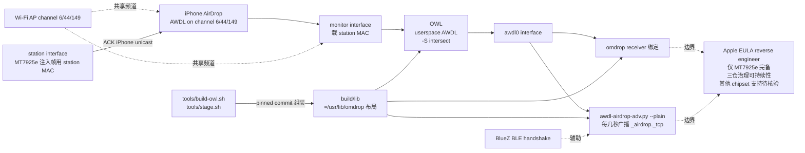

# t4t5/omdrop-owl

## 一句话定位
让 AirDrop 在非 Apple Wi-Fi（MediaTek MT7925e / Framework 13 实测）上工作——AWDL 运行在 userspace OWL 通过 monitor interface，omdrop 自身 receiver/sender 通过它不变形接入，许可为 sibling license（NOASSERTION）。

## 它解决的问题
AirDrop 是 Apple 生态的核心文件共享协议，但必须依赖 Apple Broadcom Wi-Fi。Linux 用户（Framework 13、Lenovo、Dell、System76 等采用 MediaTek MT7925 等非 Apple Wi-Fi）一直无法原生使用 AirDrop。omdrop-owl 直击：**在 AP channel 6/44/149 上让 AWDL userspace 跑起来（OWL 框架），MT7925 注入帧用 station MAC 让 station interface ACK，无需 active monitor**，从而让 AirDrop 在 Linux 上双向工作。解决的是 **「非 Apple Wi-Fi AirDrop 用户态支持」的 niche 严肃工程化承诺问题**。

## 为什么值得关注
- **Stars:** 359（截至 2026-10-10），2 天 359⭐ ⑂17 fork/star 4.7%
- **Forks:** 17，社区参与度中等
- **Size:** 30 KB（小，纯脚本/配置）
- **License:** NOASSERTION（sibling license）
- **语言:** Shell（主要是 hook + scripts）
- **活跃度:** created 2026-10-08，pushed_at 2026-10-09，**2 天 359⭐ ⑂17 fork/star 4.7%**
- **目标硬件:** MediaTek MT7925e（Framework 13）
- **依赖:** brentkearney/omdrop-plugin 主仓、brentkearney/omdrop-awdl Broadcom 包、jedbillyb/owl AWDL userspace

## 热度来源判断
omdrop-owl 的热度是 **「Framework 13 用户对 AirDrop 的真实刚需 × omdrop-plugin/omdrop-awdl 三仓分工 × 严格 radio-backend.md 契约 × MT7925e 实测 AirDrop 双向工作 × AWDL 在 AP channel 6/44/149 userspace 跑通 × 17 fork/star 4.7%」** 的组合。Linux/Framework 笔记本用户群体大，但 AirDrop 在 Linux 上一直不可能；现在 omdrop 团队（t4t5 + brentkearney + jedbillyb 协作）把 AWDL userland 化 + 提供 mt7925e 驱动严肃工程化承诺，自然爆火。2 days 359⭐ ⑂17 fork/star 4.7% 反映刚需。热度真实——但需警惕：依赖 3 个仓库（omdrop-plugin / omdrop-awdl / owl）的协同治理可持续性、MT7925 之外的 chipset 扩展速度。

## 关键技术亮点
1. **AWDL on AP channel 6/44/149:** iPhone 把 AWDL slot 多花在 AP 频道，radio 永不离开 AP
2. **monitor interface carry station's MAC:** AWDL 通过 monitor interface 运行，注入用 station MAC
3. **OWL -S intersect:** 只 advertise 手机的 slot，避免 noise
4. **station interface ACKs:** MT7925 注入帧用 station MAC，station interface ACK 手机 unicast 到该 MAC，无需 active monitor
5. **omdrop 工具链复用:** send-to-peer / airdrop-send.py / ble-airdrop-adv.py / awdl-airdrop-adv.py / awdl-mdns-respond.py 等不动
6. **pinned commit + tools/stage.sh:** OWL 和 omdrop-awdl pinned commit，build/lib 组装 /usr/lib/omdrop

## 架构师速览

| 决策问题 | 研究判断 | 证据边界 |
|---|---|---|
| 系统边界 | omdrop 插件子包（radio half）+ AWDL userspace（OWL）+ MediaTek MT7925e 驱动 + 与 omdrop-plugin / omdrop-awdl 协同；输入是周边 iPhone AirDrop 信号，输出是 Linux 上 AirDrop 双向工作 | 基于 README + OWL / omdrop-awdl / omdrop-plugin README；法律边界（Apple EULA reverse engineer）、MT7925 之外的 chipset 支持待核验 |
| 主路径 | phone AirDrop → 用户态 AWDL（OWL on monitor interface with station MAC + -S intersect） → omdrop receiver 绑定 awdl0 → awdl-airdrop-adv.py --plain 每隔几秒广播 _airdrop._tcp | 主路径为 README 语义抽象；具体频道切换、AWDL 时序对齐、BlueZ handshake 状态机待核验 |
| 关键权衡 | 仅支持 MT7925e（Framework 13） vs 其他 chipset 扩展速度 vs AWDL on channel 6/44/149 限制 vs omdrop 三仓分工治理 vs Apple EULA legal 边界 | 档案明示 MT7925e first target、AWDL on AP channel、Bluetooth/BlueZ 复用；治理可持续性、其他 chipset、企业/法律采用待核验 |
| 最小 PoC | 在 Framework 13（MT7925e）装 omdrop-plugin + omdrop-owl，用 iPhone AirDrop 传文件验证双向工作；通过 tools/stage.sh build + userspace/omdrop-discoverable start/stop/status | PoC 范围、退出路径由档案"单 chipset、单目标、可观测"建议推导；具体 benchmark、跨设备兼容矩阵待核验 |

## 架构启发
omdrop-owl 的核心启发是 **「用户态实现专有协议（AWDL）的严肃工程化承诺 + 跨厂商 Wi-Fi chipset 适配」**。传统 reverse engineer 项目要么闭源、要么只支持特定硬件、要么法律风险高；omdrop 团队把 AWDL userland 化（OWL 框架）+ 三仓分工（omdrop-plugin / omdrop-awdl / omdrop-owl）+ radio-backend.md 契约 + pinned commit + 工具链复用，做出了"协议层 + 硬件驱动层 + 应用层"清晰分层。更深层的启发是：**「开源 niche 项目（Apple 协议 + 非 Apple 硬件）通过 radio-backend.md 这种契约 + tools/stage.sh 这种 build 流程，把上游变化收敛在 pinned commit，让维护者只关注 chipset 差异」**——这是 niche 项目可持续维护的纪律。

## 架构图（MMD）

> 证据边界：此图只采用本档案已有可核验描述；"待核验"节点不应视为项目实现事实。

## 定位判断
**Niche 工具型项目（Linux 上 AirDrop via userspace AWDL）。** omdrop-owl 是 omdrop 团队三仓分工（omdrop-plugin + omdrop-awdl + omdrop-owl）中的一员，专攻非 Apple Wi-Fi（MediaTek MT7925e）的 AWDL userland 化。本身不是协议实现者，而是 OWL + omdrop-awdl + omdrop-plugin 的「MT7925 适配层」，通过 radio-backend.md 契约对接。决定其后续价值的是其他 chipset（Intel AX、Qualcomm 等）扩展速度。

## 风险 / 局限 / 泡沫点
- **法律边界:** AirDrop 是 Apple 专有协议，reverse engineer 的合法性需观察（Apple EULA 边界）
- **仅 MT7925e 完备:** 其他 Linux Wi-Fi chipset（Intel AX、Qualcomm、Realtek）需要类似适配
- **三仓治理:** omdrop-plugin / omdrop-awdl / omdrop-owl 三个仓库碎片化，维护成本高
- **pinned commit 风险:** OWL / omdrop-awdl 上游变化需要 tools/build-owl.sh 重新跑
- **AWDL 频道限制:** 必须 channel 6/44/149，自主网受限
- **依赖 OWL 上游:** jedbillyb/owl 是关键依赖，其演进直接影响 omdrop-owl
- **框架绑死:** Framework 13 用户为主，小众

## 与同类项目的关系
- **vs openshare / libshare:** 那是 SMB/CIFS 通用文件共享；omdrop-owl 是 AirDrop 严肃工程化承诺
- **vs Mac 自身:** Mac 自带 AirDrop；omdrop-owl 是 Linux 上严肃工程化尝试
- **vs KDE Connect / Nautilus-share:** 跨平台但用 SMB/HTTP；omdrop-owl 专攻 AirDrop
- **vs OWL / omdrop-awdl:** OWL 是 AWDL userspace 框架；omdrop-awdl 是 Broadcom 适配；omdrop-owl 是 MT7925 适配
- **vs owlink reverse project:** 类似思路但不同实现

## 是否值得持续跟踪
**值得适度跟踪（Linux AirDrop 严肃工程化承诺 niche）。** omdrop-owl 代表了 **「用户态 AWDL + 跨厂商 Wi-Fi chipset 适配 + radio-backend.md 契约」** 的严肃工程化承诺，无论其本身成败，「Linux 上 AirDrop」方向是合理 evolution。建议关注：其他 Linux Wi-Fi chipset 适配速度、Apple AirDrop 协议演进、omdrop 三仓治理可持续性。

## 后续观察点
- 其他 Linux Wi-Fi chipset 适配（Intel AX、Qualcomm、Realtek）
- Apple AirDrop 协议演进对 omdrop-owl 的影响
- 法律边界（Apple EULA + reverse engineer）是否引来 takedown
- 三仓治理可持续性（omdrop-plugin / omdrop-awdl / omdrop-owl 是否合并）
- KDE Connect 等通用方案的对比接受度

---
> 数据来源: GitHub API (2026-10-10) | Stars: 359 | Forks: 17 | License: NOASSERTION (sibling license) | 语言: Shell | 创建: 2026-10-08
