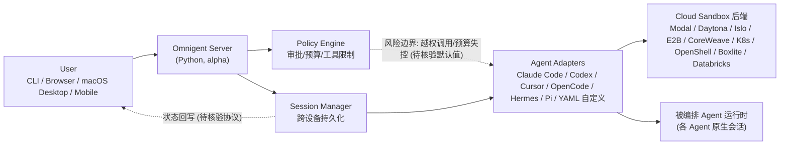

# Omnigent

## 最近动态（2026-07-31）
- Stars 增至 7,924（+924 since 7/11），forks 1,177，仍处 alpha（README 标注 status: alpha）。
- 在今日 "coding agent harness 多极化" 趋势中作为 **meta-harness 编排层**代表，与 grok-build（官方 harness 本体）、vercel/eve（filesystem-first 范式）三线并进。
- 已扩展支持的 agent：Claude Code、Codex、Cursor、OpenCode、Hermes、Pi + YAML 自定义 agent。
- 云沙箱后端扩展至 Modal/Daytona/Islo/E2B/CoreWeave/Kubernetes/OpenShell/Boxlite/Databricks。

---

*首次记录：2026-06-19*

## 一句话定位
开源 AI Agent meta-harness——用统一的编排层管理 Claude Code、Codex、Cursor、Pi 和自定义 agent，支持跨设备实时协作、策略治理和沙箱隔离。

## 它解决的问题
当团队同时使用 3-5 种 Coding Agent（Claude Code、Codex、Cursor、Pi 等）时，每个 agent 有自己的协议、自己的沙箱、自己的会话管理。无法跨 agent 协作、无法统一治理、无法从手机继续终端会话。这是一个真实的多 agent 管理痛点。

## 为什么值得关注（2026-06-19）
- 7 天 3,785 stars，212 个 issue 说明有真实用户在用
- Apache 2.0 License，macOS 桌面应用已可下载
- 首次提出 "meta-harness" 概念——不替换你的 agent，统一编排它们
- 支持 Modal/Daytona/Islo 云沙箱，从 CLI 或 server 按需启动

## 热度来源判断
真实需求驱动。多 agent 管理是每个重度 AI 开发者已经遇到的痛点。热度不是炒作，但 alpha 阶段（212 issue）说明工程成熟度还有距离。

## 关键技术亮点亮点
1. **Transport 抽象层** — Claude Code、Codex、Cursor 的差异被封装在 adapter 中，上层 API 统一
2. **Policy 引擎** — 可在 server/agent/chat 三个粒度配置审批、预算上限、工具限制
3. **Session 持久化** — 终端 → 浏览器 → 手机，会话状态完整同步
4. **Cloud Sandbox** — 支持 Modal/Daytona/Islo，disposable 环境隔离

## 架构师速览

| 决策问题 | 研究判断 | 证据边界 |
|---|---|---|
| 系统边界 | omnigent 是位于终端用户（CLI/浏览器/macOS 桌面/移动端）、被编排的 Coding Agent（Claude Code、Codex、Cursor、OpenCode、Hermes、Pi + YAML 自定义）以及云沙箱后端（Modal/Daytona/Islo/E2B/CoreWeave/Kubernetes/OpenShell/Boxlite/Databricks）之间的 Python 编写的 meta-harness 编排层，承担协议适配、策略治理与会话持久化职责。 | 基于档案"meta-harness 编排层"定位、标签（agent-orchestration/meta-harness/multi-agent/policy/sandbox）、语言（Python）及 README 描述的能力组合；未做源码审计，协议细节与部署形态待核验。 |
| 主路径 | 请求从入口渠道进入 Omnigent Server，由 Policy Engine 做审批/预算/工具限制判定，Session Manager 通过 Adapter 路由到目标 Agent 会话，必要时调度 Cloud Sandbox 隔离执行，状态回写到 Session Manager 以支撑跨设备继续。 | 基于档案"关键技术亮点"四节与架构启发 mermaid 图；具体协议、消息格式、持久化存储与传输细节均待核验。 |
| 关键权衡 | 抽象层次（统一编排 5+ 类 Agent）与适配脆弱性之间的张力：任一被编排 Agent 的协议 breaking change 都可能冲击 Omnigent；项目仍处 alpha（212 issue），且 Python 3.12+ 限定带来部署门槛。 | 基于档案"风险/局限/泡沫点"四条与"架构启发"段落对 meta-harness trade-off 的描述；issue 关闭速度、beta 时间线、Adapter 维护活跃度列为后续观察点，未给出具体 SLA。 |
| 最小 PoC | 在单一入口渠道（CLI 或 macOS 桌面）接入 1 种成熟 Agent（如 Claude Code），绑定 1 种云沙箱（如 Modal 或 Daytona），启用 Policy Engine 的审批与预算上限，开启跨设备 Session 同步日志；以安全、成本、SLO、退出路径为验收项，再扩大接入面。 | 基于档案"采用建议"行与"为什么值得关注"中"macOS 桌面应用已可下载""支持 Modal/Daytona/Islo 云沙箱"的描述；具体配置项、性能基准、CLI/桌面/移动端 SDK 稳定性待核验。 |

## 架构启发
meta-harness 模式的核心 trade-off：**抽象层次越高，兼容性越脆弱**。omnigent 需要追踪 5+ 个 agent 的协议变化，任何一个 agent 的 breaking change 都可能破坏编排层。这与 Kubernetes 管理 CRD 的挑战类似。

## 架构图（MMD）

> 证据边界：此图只采用本档案已有可核验描述；“待核验”节点不应视为项目实现事实。

## 定位判断
在 Agent 生态中，omnigent 试图成为 **Agent 层的 Kubernetes**——不提供 agent 本身，但提供编排、治理、调度能力。如果成功，它将成为基础设施。如果失败，它会被各 agent 原生的编排能力取代。

## 风险 / 局限 / 泡沫点
1. **alpha 阶段，212 个 issue** — 不适合生产环境
2. **Adapter 维护成本** — 每个支持的 agent 协议变化都需要适配
3. **Python 3.12+ 限定** — 部署门槛比 Go/Node 高
4. **竞争风险** — 如果 Claude Code 原生支持多 agent 编排，omnigent 价值大减

## 与同类项目的关系
- **vs OpenClaw** — OpenClaw 是个人助理，omnigent 是团队编排层，定位不同
- **vs vercel/eve** — eve 是 filesystem-first 的开发框架，omnigent 是 runtime-first 的编排层
- **vs Claude Code 内置 subagent** — Claude Code 的 subagent 是单 agent 内部，omnigent 是跨 agent

## 是否值得持续跟踪
**是，强烈建议持续跟踪。** meta-harness 是 Agent 生态的关键缺失层，如果 omnigent 能稳定到 beta，将有很大的平台化潜力。

## 后续观察点
1. issue 关闭速度和 beta 发布时间线
2. 是否有企业用户案例
3. Adapter 数量和维护活跃度
4. 是否被某个大 agent（Claude Code/Codex）原生集成

---
*首次记录：2026-06-19*
