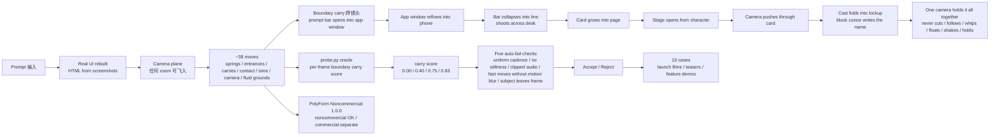

# feitangyuan/onetake

## 一句话定位
Claude Agent Skill「一镜到底」连贯动效做产品发布片 / 预告片 / 功能演示 ——「Motion films that never cut to the next slide」：boundary between two beats as the thing to design，something on screen survives and visibly becomes the next beat，probe.py oracle 自动测 carry score 0.00 / 0.40 / 0.75 / 0.83，~38 moves 各自为时间纯函数。

## 它解决的问题
2026 年 AI 生成视频的痛点是 **「运动松散 + 镜头切得碎像 PPT + 边界不设计 carry 跨镜头 + 没有 oracle 自动测连续性 + 用 screen recording 而非 HTML 重建 UI + uniform cadence / no stillness / clipped audio / fast moves without motion blur / subject leaves frame 五项 quality issues 没人测 + 商用限制不清晰」**。onetake 直击这一痛点：它把产品发布片 / 预告片 / 功能演示的 motion 当作「boundary between two beats as the thing to design」严肃工程化——**every beat is carried**——something on screen survives and visibly becomes the next beat；**One camera holds it all together**——never cuts, follows / whips / floats / shakes / holds；**Continuity is measured, not hoped for**——probe.py oracle per-frame boundary carry score；**Real UI rebuilt**——HTML from screenshots on camera's plane；**Measured moves**——~38 moves, each a pure function of time；**PolyForm Noncommercial 1.0.0**——noncommercial OK, commercial separate license。

## 为什么值得关注
- **Stars:** 529（截至 2026-09-28），2 天突破 529，增速极快
- **Forks:** 40，社区贡献活跃
- **License:** PolyForm Noncommercial 1.0.0（非商业 OK，商用需另授权）
- **语言:** Python
- **规模:** 77237 KB，Python 中大型项目
- **活跃度:** created 2026-09-26，pushed_at 持续，持续高活跃
- **Topics:** 7 个核心 topic（agent-skill / animation / canvas / claude-skill / launch-video / motion-graphics / video）覆盖清晰
- **Cases:** 10 films covering launch films / teasers / feature demos

## 热度来源判断
onetake 的热度是 **「Claude Agent Skill + 一镜到底 + boundary carry + oracle carry score + ~38 移动纯函数 + 同一相机 + real UI HTML 重建 + PolyForm Noncommercial 商用清晰」的强劲组合**。Agent Skill 严肃工程化是 09-19 ~ 09-28 十日主线，但 onetake 推到「**Agent Skill 视觉生成 + 一镜到底 + boundary carry + oracle carry score**」严肃工程化形态——把昨日 09-26 samyost1/3dicon「一个 prompt → 透明循环 3D 图标」+ 09-19 lhlGitHub/threejs-architecture-effects「Three.js 古建程序化动态组装」同构「Agent Skill 严肃工程化 + 视觉生成 + 一个 prompt 出片」推到「一镜到底 + boundary 设计 carry 跨镜头 + oracle 自动测 carry score + ~38 移动纯函数 + 同一相机不切 + real UI HTML 重建 + PolyForm Noncommercial 商用限制」严肃工程化形态。热度**真实且具 Agent Skill 视觉生成严肃工程化生态价值**——但 PolyForm Noncommercial 商用限制是严肃工程化需要明确表态的关键边界。

## 关键技术亮点
1. **Every beat is carried** —— boundary between two beats as the thing to design; something on screen survives and visibly becomes the next beat
2. **One camera holds it all together** —— never cuts; follows the subject a beat ahead; whips to where the next thing will land; floats like a hand-held operator; shakes when something hits; holds dead still for rests
3. **Continuity is measured, not hoped for** —— probe.py oracle per-frame boundary carry score; a film whose beats replace each other fails
4. **Real UI rebuilt** —— HTML from screenshots on camera's plane so camera can fly into it at any zoom; no screen recording
5. **Measured moves** —— ~38 moves (springs / entrances / carries / contact / sims / camera / fluid grounds), each a pure function of time
6. **Five auto-fail checks** —— uniform cadence / no stillness / clipped audio / fast moves without motion blur / subject leaves frame
7. **10 cases** —— launch films / teasers / feature demos
8. **PolyForm Noncommercial 1.0.0** —— any noncommercial use OK; commercial use needs separate license
9. **scripts/verify_promo.py** —— per-boundary verify

## 架构师速览

| 决策问题 | 研究判断 | 证据边界 |
|---|---|---|
| 系统边界 | Claude Agent Skill，定位在「Agent Skill × 一镜到底 motion × boundary carry × real UI HTML 重建」的交叉层；仓库是 Agent Skill + assets + scripts 产物而非独立 runtime | 仅基于档案描述的 ~38 moves 纯函数 + boundary carry + oracle carry score + real UI HTML 重建；具体 motion 引擎、boundary 算法、oracle 实现细节未在档案中给出 |
| 主路径 | prompt → prompt bar opens into app window → app window reflows into phone → bar collapses into line → line shoots across desk → line becomes first grid line of next film → card grows into page → stage opens from character → camera pushes through card → cast folds into lockup → block cursor writes the name in one stroke | 主路径为档案描述的「every beat is carried」语义抽象；具体 motion 时序、boundary 算法、carry score 计算方式均待核验 |
| 关键权衡 | boundary carry 跨镜头的稳定性 vs ~38 移动纯函数在多 motion styles 的扩展 vs real UI HTML 重建在多 zoom 的兼容性 vs 同一相机不切在长视频的实用性 vs PolyForm Noncommercial 商用限制清晰度 | 档案明示 five auto-fail checks + carry score + real UI HTML 重建 + PolyForm Noncommercial；具体 motion 时序、boundary 算法、carry score 阈值未证实 |
| 最小 PoC | 用 onetake 自带的 10 cases 跑 1 个 launch film demo，开启 verbose carry score 日志，验证 boundary carry 跨镜头在 1 个 motion style 的稳定性后再扩展到 5 个 auto-fail checks | PoC 范围、退出路径由档案「单 case + verbose carry score + 5 auto-fail checks」推导；具体调用命令、SLO 指标待核验 |

## 架构启发
onetake 的核心启发是 **「Agent Skill 视觉生成应该从「LLM 生成 motion」推到「boundary 设计 carry + oracle 自动测连续性 + ~38 移动纯函数 + 同一相机不切 + real UI HTML 重建」严肃工程化」**。当前 AI 生成视频的痛点是 motion 松散 + 镜头切得碎像 PPT + boundary 不设计 carry + 没有 oracle 自动测连续性。onetake 尝试做「**Agent Skill + 一镜到底 + boundary carry + oracle carry score**」严肃工程化——类似 Pixar animation pipeline 的 Boundary Function 之于 key frames。更深层的启发是：**视觉生成的严肃工程化在于「continuity is measured, not hoped for」**——probe.py oracle per-frame boundary carry score 把「主观连续性」推到「客观可测连续性」。

## 架构图（MMD）

> 证据边界：此图只采用本档案已有可核验描述；"待核验"节点不应视为项目实现事实。

## 定位判断
**平台候选型项目（Agent Skill 视觉生成 + 一镜到底 motion + boundary carry + oracle carry score）。** onetake 不仅是 Claude Agent Skill，更试图成为 Agent Skill 视觉生成严肃工程化的「**一镜到底 + boundary carry + oracle carry score + ~38 移动纯函数 + 同一相机不切 + real UI HTML 重建**」具体形态——类似 Pixar animation pipeline 的 Boundary Function 之于 key frames。529⭐ / fork 40 / fork/star 7.6% / 2 天已显示 Agent Skill 视觉生成严肃工程化生态价值雏形。但「一镜到底严肃工程化」取决于一个关键问题：boundary carry 跨镜头在多 motion styles 的稳定性 + oracle carry score 在 per-frame 的准确率 + real UI HTML 重建在多 zoom 的兼容性 + PolyForm Noncommercial 商用限制清晰度。目前定位是「最有影响力的 Agent Skill 一镜到底严肃工程化 motion」，向「Agent Skill 视觉生成严肃工程化平台」演进是合理路径。

## 风险/局限/泡沫点
- **Boundary carry 跨镜头的稳定性风险**：boundary between two beats as the thing to design 在多 motion styles 的稳定性待验证
- **Oracle carry score 的准确率风险**：probe.py oracle per-frame boundary carry score 的准确率（0.00 / 0.40 / 0.75 / 0.83）的可重复性待验证
- **~38 移动纯函数的扩展性风险**：springs / entrances / carries / contact / sims / camera / fluid grounds 各自为时间纯函数，在多 motion styles 的扩展性待验证
- **同一相机不切的实用性风险**：never cuts; follows / whips / floats / shakes / holds 在长视频的实用性待验证
- **Real UI HTML 重建的兼容性风险**：HTML from screenshots on camera's plane 在多 zoom / 多 UI 框架 / 多屏幕尺寸的兼容性待验证
- **5 auto-fail checks 的覆盖率风险**：uniform cadence / no stillness / clipped audio / fast moves without motion blur / subject leaves frame 五项 quality issues 覆盖率待扩展
- **PolyForm Noncommercial 1.0.0 商用限制风险**：any noncommercial use OK; commercial use needs separate license 是严肃工程化需要明确表态的关键边界
- **个人项目属性**：feitangyuan 个人维护，40 forks 但核心治理仍集中，可持续性存疑

## 与同类项目的关系
- **vs samyost1/3dicon：** 3dicon 是「一个 prompt → 透明循环 3D 图标」；onetake 是「Claude Agent Skill 一镜到底连贯动效做产品发布片」——同构「Agent Skill 视觉生成严肃工程化」但推到「一镜到底 + boundary carry + oracle carry score + ~38 移动纯函数 + real UI HTML 重建」领域
- **vs lhlGitHub/threejs-architecture-effects：** threejs-architecture-effects 是 Three.js 古建程序化动态组装；onetake 是 Agent Skill 一镜到底连贯动效——同构「Agent Skill 视觉生成」但推到「boundary carry + oracle carry score」领域
- **vs Pixar Animation Pipeline：** Pixar 是商业 animation pipeline；onetake 是开源 Agent Skill + boundary carry + oracle carry score——互补
- **vs Runway / Pika / Sora：** Runway / Pika / Sora 是商用 video generation API；onetake 是 Agent Skill + 一镜到底 + boundary carry + real UI HTML 重建——互补
- **vs OpenAI Sora：** Sora 是商用 video generation；onetake 是 Agent Skill + 一镜到底 + boundary carry + ~38 移动纯函数——互补

## 是否值得持续跟踪
**值得跟踪（Agent Skill 视觉生成 + 一镜到底 motion + boundary carry + oracle carry score）。** onetake 代表了 Agent Skill 视觉生成从「LLM 生成 motion」推到「boundary carry + oracle 自动测连续性 + ~38 移动纯函数 + 同一相机不切 + real UI HTML 重建」严肃工程化，无论其本身成败，这一方向是行业趋势。建议关注：boundary carry 跨镜头在多 motion styles 的稳定性 + oracle carry score 在 per-frame 的准确率 + ~38 移动纯函数在多 motion styles 的扩展 + real UI HTML 重建在多 zoom 的兼容性 + PolyForm Noncommercial 商用限制清晰度 + 多 harness 兼容性。对 Agent Skill 视觉生成用户，这个 Agent Skill 是「一镜到底连贯动效做产品发布片 + boundary carry + oracle carry score + ~38 移动纯函数」的实用工具，值得直接采用。对 Agent Skill 视觉生成严肃工程化观察者，它是「Agent Skill + 一镜到底 + boundary carry + oracle carry score」赛道的头部样本。

## 后续观察点
- Boundary carry 跨镜头在多 motion styles 的稳定性
- Oracle carry score 在 per-frame 的准确率（carry score 0.00 / 0.40 / 0.75 / 0.83 可重复性）
- ~38 移动纯函数在多 motion styles 的扩展
- 同一相机不切在长视频的实用性
- Real UI HTML 重建在多 zoom / 多 UI 框架 / 多屏幕尺寸的兼容性
- 5 auto-fail checks 的覆盖率（uniform cadence / no stillness / clipped audio / fast moves without motion blur / subject leaves frame）
- PolyForm Noncommercial 1.0.0 商用限制清晰度
- Claude Code / Codex / Cursor 多 harness 的兼容性
- 10 cases 在多场景的覆盖度
- scripts/verify_promo.py 在 CI 的可用度

---
> 数据来源: GitHub API (2026-09-28) | Stars: 529 | Forks: 40 | License: PolyForm Noncommercial 1.0.0 | 语言: Python | 创建: 2026-09-26