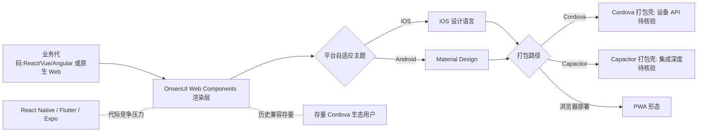

# OnsenUI/OnsenUI

## 一句话定位
基于 Web Components 的跨平台移动应用开发框架——使用 HTML5/JS 构建 iOS/Android 原生体验的混合应用，支持 React/Vue/Angular。

## 它解决的问题
移动应用开发面临"原生 vs 跨平台"的经典选择。原生开发（Swift/Kotlin）体验最好但需维护两套代码。OnsenUI 提供了第三条路：用 Web 技术（HTML/CSS/JS）构建 UI，通过 Cordova/Capacitor 打包为原生应用，同时提供接近原生体验的 UI 组件（导航栏、标签页、列表、模态框等）。它支持 React、Vue、Angular 三大前端框架，降低了 Web 开发者进入移动端的门槛。

## 为什么值得关注
- **8,862 stars:** 混合应用框架领域的老牌项目
- **13 年历史:** 创建于 2013 年，经历了移动开发范式的多次变迁
- **框架无关:** Web Components 核心，支持 React/Vue/Angular
- **Material Design + iOS 双主题:** 自动适配平台风格
- **企业级:** 被 Monaca 平台商业化支持

## 热度来源判断
热度主要来自历史积累——OnsenUI 是早期混合应用开发的主要框架之一，与 Ionic 并称。但随着 React Native、Flutter 等更现代的跨平台方案崛起，OnsenUI 的关注度逐年下降。当前的 stars 维持主要来自存量用户和 Cordova/Capacitor 生态的补充需求。

## 关键技术亮点亮点
- Web Components 核心：框架无关的 UI 组件，可嵌入任何前端框架
- 平台自适应主题：自动检测 iOS/Android 并应用对应设计语言
- 丰富的移动 UI 组件：导航、标签栏、轮播、列表、表单等
- Cordova/Capacitor 集成：打包为原生应用，访问设备 API
- PWA 支持：同一套代码可部署为渐进式 Web 应用

## 架构师速览

| 决策问题 | 研究判断 | 证据边界 |
|---|---|---|
| 系统边界 | OnsenUI 是以 Web Components 为核心、面向移动端的 UI 框架，通过 Cordova/Capacitor 把 Web 产物打包为 iOS/Android 原生壳，并保留 PWA 部署形态；与之并列的 React/Vue/Angular 绑定是消费侧适配，不构成独立运行时。 | 来自档案"关键技术亮点"与标签 android/ios/cordova/pwa；具体打包链路与插件清单需源码/文档核验。 |
| 主路径 | 业务代码（React/Vue/Angular 或原生 Web）→ OnsenUI Web Components 渲染层 → 平台自适应主题（iOS / Material）→ Cordova 或 Capacitor → 设备 API；同一份产物可旁路出 PWA。 | 来自档案"它解决的问题"与"关键技术亮点"；Cordova vs Capacitor 的官方推荐度未在档案中明确，属待核验项。 |
| 关键权衡 | 框架无关与长期可维护性 vs WebView 性能上限及与现代跨平台方案（React Native/Flutter/Expo）的代际差；存量 Cordova 生态适配价值 vs 新项目招采的劣势。 | 取舍描述基于档案"风险/局限"与"热度来源判断"；性能基准与维护节奏细节需查证 pushed_at 历史与第三方基准。 |
| 最小 PoC | 选定一个已有 Web 端的轻量业务页（如表单/列表），用 OnsenUI 组件重写 UI 层，分别跑通三种出口——浏览器（PWA）、Cordova 包壳、Capacitor 包壳——以验证组件一致性、设备 API 调用与主题切换。 | PoC 框架来自档案支持的形态；具体 CLI、模板与设备 API 列表需以 OnsenUI 官方文档核验。 |

## 架构启发
OnsenUI 的核心启发是"Web Components 作为跨框架抽象层"。通过将 UI 组件实现为 Web Components，OnsenUI 实现了真正的框架无关性。对架构师的启发是：**在多前端框架并存的环境中，Web Components 是唯一能被所有框架消费的标准**。这种设计使 OnsenUI 在 React/Vue/Angular 的兴衰更替中保持了可用性。

## 架构图（MMD）

> 证据边界：此图只采用本档案已有可核验描述；“待核验”节点不应视为项目实现事实。

## 定位判断
**工具型（成熟但衰退中）。** 作为混合应用框架，OnsenUI 在技术上仍然可靠，但市场份额已被 React Native、Flutter、Expo 等更现代的方案大幅侵蚀。定位为"Cordova 生态的 UI 层"，服务于特定的存量市场。

## 风险/局限/泡沫点
- **市场份额持续下降:** React Native/Flutter 成为跨平台主流，Cordova/Capacitor 生态萎缩
- **维护节奏放缓:** pushed_at 2026-06-17，更新频率低于竞争对手
- **性能瓶颈:** WebView 渲染的性能上限低于原生渲染引擎
- **社区活力:** 新项目采用率低，主要靠存量用户维持
- **AI 时代适配不足:** 未看到与 AI/LLM 集成的明显方向

## 与同类项目的关系
- 与 **Ionic** 是最直接的历史竞品——两者都是 Cordova 生态的 UI 框架
- 与 **React Native**、**Flutter** 形成跨平台方案的代际竞争
- 与 **Capacitor**（Ionic 团队的 Cordova 替代品）在打包层互补
- 与 **Expo**（React Native 生态）在开发者体验维度有差距
- 在前端框架支持上，与 **Refine**（React 专用）定位不同

## 是否值得持续跟踪
**低优先级跟踪。** 除非你的项目已经在使用 OnsenUI 或 Cordova 生态，否则不建议新项目采用。作为技术趋势观察，建议更多关注 React Native/Expo/Flutter 的演进。

## 后续观察点
- 是否有重大版本更新以应对现代跨平台竞争
- 与 Capacitor 生态的集成深度
- 是否引入 AI 能力（如 AI 辅助 UI 生成）
- 存量用户社区的健康度
- 是否转向 PWA-first 策略

---
> 数据来源: GitHub API (OnsenUI/OnsenUI) | 星标: 8,862 | 语言: JavaScript | 创建于: 2013-09-11
