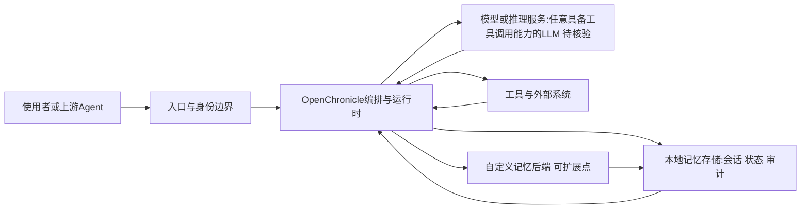

# OpenChronicle

## 一句话定位
开源、本地优先的 Agent 记忆系统 — OpenAI Chronicle 的开源替代，模型无关、可检查、可扩展。

## 它解决的问题
OpenAI 的 Chronicle 是一个强大的 Agent 记忆系统，但闭源、云锁定、仅支持 OpenAI 模型。对于需要在本地部署、使用多种 LLM、或者需要完全控制记忆数据的场景，缺乏好的替代方案。

OpenChronicle 解决了三个核心问题：
1. **记忆锁定** — Agent 的记忆不应绑定在特定云服务上
2. **模型绑定** — 记忆系统应支持任何 LLM，不只是 OpenAI
3. **可审计性** — 记忆的存储和检索过程应该是可检查的

## 为什么值得关注（2026-05-04）
- Agent Memory 赛道持续分化，本地优先 + 模型无关是差异化路线
- 定位清晰 — "OpenAI Chronicle but open"，对标明确
- 2.1K stars / 192 forks，关注度持续增长
- 与 MemPalace（50.7K）形成互补 — MemPalace 偏 MCP 集成，OpenChronicle 偏本地优先

## 热度来源判断
真实需求驱动。Agent Memory 是 AI Agent 从"无状态工具"到"有状态助手"的关键基础设施。市场需要多个方案在不同场景下竞争。

## 关键技术亮点亮点

1. **本地优先** — 记忆数据存储在本地，不需要云服务
2. **模型无关** — 支持任何具备工具调用能力的 LLM
3. **可检查** — 记忆的存储和检索过程对开发者透明
4. **可扩展** — 架构设计允许自定义记忆后端

## 架构师速览

| 决策问题 | 研究判断 | 证据边界 |
|---|---|---|
| 系统边界 | OpenChronicle 是一个本地优先、模型无关的 Agent 记忆系统（Python），定位为 OpenAI Chronicle 的开源替代 | 档案"一句话定位"、"标签（agent-memory/local-first/llm/open-source/chronicle/model-agnostic）"；具体持久化后端、存储介质与部署形态档案未披露 |
| 主路径 | 上游 Agent/使用者 → 本地编排与运行时 → 调用任意具备工具调用能力的 LLM + 自定义记忆后端 → 记忆读写回写到本地 | 档案"关键技术亮点"明确"本地优先、模型无关、可检查、可扩展"；编排协议、记忆检索机制、向量/图后端细节档案未披露 |
| 关键权衡 | 本地优先带来的数据主权/低延迟收益，与"模型无关"放弃特定模型记忆优化的代价；可扩展记忆后端与一致性、可审计性之间的张力 | 档案"架构师启发"明列"本地 vs 云（数据主权/延迟/成本）"与"模型无关的代价"；未给出具体后端、性能基准或多租户隔离方案 |
| 最小 PoC | 在本地用单实例部署，绑定一种开源 LLM 作为模型侧、自挂一种本地记忆后端作为持久层，跑通"写入—检索—回读"闭环，并记录审计日志 | 档案"采用建议"指出"单一渠道、最小工具权限、可审计日志下验证"；具体后端选型、向量库、容量与 SLO 档案未披露 |

## 架构启发

OpenChronicle 代表了 Agent Memory 赛道的一个重要分支：本地优先路线。与 MCP 集成路线（MemPalace）不同，它强调的是完全本地化、不依赖外部服务的记忆管理。

对架构师的启发：
- **记忆是 Agent 的核心竞争力** — 没有记忆的 Agent 只是无状态函数
- **本地 vs 云的记忆之争** — 与数据主权、延迟、成本三个维度相关
- **模型无关的代价** — 可能牺牲了特定模型（如 GPT）的记忆优化能力

## 架构图（MMD）

> 证据边界：此图只采用本档案已有可核验描述；“待核验”节点不应视为项目实现事实。

## 定位判断
Agent Memory 基础设施的有力竞争者。目前处于早期阶段，但方向正确。如果能在"本地优先 + 模型无关"的定位上持续深耕，有机会成为该赛道的标准选择之一。

## 风险 / 局限 / 泡沫点

1. **与 MemPalace 竞争** — MemPalace 已有 50.7K stars 和庞大的用户基础
2. **功能深度存疑** — 项目较新（13天），核心功能的成熟度需要验证
3. **社区活跃度** — 最后推送 4月26日，近期无更新
4. **差异化不明确** — "开源 + 本地优先"的定位虽好，但实现上能否真正差异化还需观察

## 与同类项目的关系

| 项目 | 定位 | 优势 | 劣势 |
|------|------|------|------|
| OpenChronicle | 本地优先 Agent Memory | 开源、本地、模型无关 | 早期、社区小 |
| MemPalace | MCP 集成 Agent Memory | 50.7K stars、生态成熟 | 依赖 MCP |
| OpenAI Chronicle | 商业 Agent Memory | 深度集成 OpenAI 生态 | 闭源、云锁定 |

## 是否值得持续跟踪
**是。** Agent Memory 赛道的本地优先路线值得关注，即使短期内难以撼动 MemPalace 的地位。

## 后续观察点

1. 社区活跃度恢复 — 是否有新的 commit 和 issue
2. 记忆后端实现 — 是否支持向量数据库、图数据库等
3. 与主流 Agent 框架的集成 — 是否支持 Claude Code / Codex / LangChain

---
*首次记录：2026-05-04*
