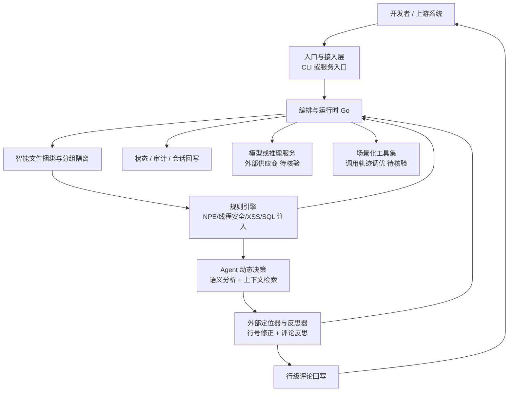

# Alibaba Open Code Review

## 一句话定位
阿里内部两年验证的 AI 代码审查工具，采用确定性工程流水线 + Agent 动态决策的混合架构。

## 它解决的问题
企业级代码审查的核心痛点：纯 LLM/Agent 方案在大变更集上覆盖不全、定位漂移、质量不稳定。开发团队需要一个可靠、可审计、行级精确的 AI 审查工具。

## 为什么值得关注（2026-06-06）
阿里集团内部两年生产验证，服务数万开发者，识别数百万代码缺陷。这目前是 GitHub 上经过最大规模生产验证的开源 AI Code Review 工具。混合架构设计范式对整个 Agent 落地领域都有启发。

## 热度来源判断
- 阿里品牌背书，大厂开源
- 解决 AI Code Review 真实痛点（覆盖、定位、稳定性）
- Apache 2.0 协议，NPM 一行安装
- Go 语言实现，跨平台分发
- 2754 stars + 130 forks 增长稳健

## 关键技术亮点亮点
1. **确定性 + Agent 混合架构**：文件选择、规则匹配、评论定位由工程代码保证；语义分析、上下文检索由 Agent 动态决策
2. **智能文件捆绑**：关联文件自动分组（如 message_en.properties 和 message_zh.properties），分组隔离审查 + 并发执行
3. **外部定位 + 反思模块**：独立的评论行号定位器和评论内容反思器，系统性提升准确率
4. **生产调优工具集**：基于大规模工具调用轨迹分析（调用频率、重复率、调用链影响）提炼场景化工具集
5. **内置规则引擎**：NPE、线程安全、XSS、SQL 注入，模板引擎规则匹配，可扩展

## 架构师速览

| 决策问题 | 研究判断 | 证据边界 |
|---|---|---|
| 系统边界 | 阿里 Open Code Review 是一个面向企业级代码审查的混合架构工具：确定性工程流水线负责文件选择、规则匹配、评论行号定位；Agent 负责语义分析与上下文检索。Go 实现，Apache 2.0，NPM 一键安装，混合架构是其本质边界特征。 | 来自项目标签（hybrid-architecture, agent, llm, deterministic-pipeline）与一句话定位；具体模块拆分以源码为准。 |
| 主路径 | 代码变更 → 文件选择与捆绑分组 → 规则引擎预筛（NPE/线程安全/XSS/SQL 注入） → Agent 语义分析 → 行号定位器与反思器修正 → 行级评论回写。确定性步骤保证覆盖与定位，Agent 步骤提供语义判断。 | 来自"关键技术亮点"五条描述；调用链细节、并发模型、持久化未在档案中展开。 |
| 关键权衡 | 确定性 vs Agent 的职责切分：确定性强但僵化，Agent 灵活但不稳定。该项目选择"不该出错的部分用代码，需要判断的部分用 LLM"。另一权衡是内置规则覆盖（当前偏 Java/Go）vs 多语言扩展速度。 | 基于"架构启发"与"风险/局限"中"规则引擎初期覆盖有限"得出；具体规则集与扩展机制以仓库为准。 |
| 最小 PoC | 取一个真实 Git 仓库的小型 PR（最好为 Java 或 Go），启用内置规则引擎，配置一个 LLM 供应商，跑一次行级评论；验收项：评论行号偏差、漏报率、规则命中率、LLM 调用成本。 | "后续观察点"建议从单一渠道起步；LLM 供应商、行号精度验证方式需自行确认。 |

## 架构启发
核心设计哲学：**不该出错的部分用代码，需要判断的部分用 LLM**。

这个模式适用于所有 Agent 落地生产场景：
- 自动化测试：确定性 fixture 生成 + Agent 探索性测试
- 数据管道：确定性 schema 校验 + Agent 数据质量判断
- 安全审计：确定性扫描规则 + Agent 语义级威胁分析

## 架构图（MMD）

> 证据边界：此图只采用本档案已有可核验描述；“待核验”节点不应视为项目实现事实。

## 定位判断
**生产可用的 DevTools。** 在 AI Code Review 赛道中，是目前工程成熟度最高的开源方案。混合架构范式可能演化为审查平台的基础框架。

## 风险 / 局限 / 泡沫点
1. **规则引擎初期覆盖有限**：内置规则主要面向 Java/Go，Python/TS 生态覆盖待补全
2. **LLM 依赖**：审查质量上限受限于配置的 LLM 能力
3. **阿里维护承诺不确定**：内部工具开源后的社区响应速度有待观察
4. **定位精度依赖 diff 格式**：对于极端重构场景（大段移动），行号定位可能仍有偏差

## 与同类项目的关系
| 项目 | 定位 | 差异 |
|------|------|------|
| openclaw/clawpatch (705⭐) | Review + Patch + PR 全流程 | 更轻量，但审查深度不足 |
| CodeRabbit | SaaS AI Code Review | 闭源，商用，无自托管 |
| Graphite | PR 审查 + stacked diffs | 非 AI，流程驱动 |

## 是否值得持续跟踪
**是。** 混合架构范式 + 生产验证 + 阿里背书，是 AI Code Review 赛道的标杆项目。

## 后续观察点
1. 规则引擎扩展速度：Python / TypeScript / Rust 规则何时上线
2. 社区采纳：forks 是否从 130 持续增长
3. 竞品响应：CodeRabbit / Graphite 是否跟进混合架构
4. Agent 工具链开源：生产调优的工具调用轨迹分析是否独立开源

---
*首次记录：2026-06-06*
