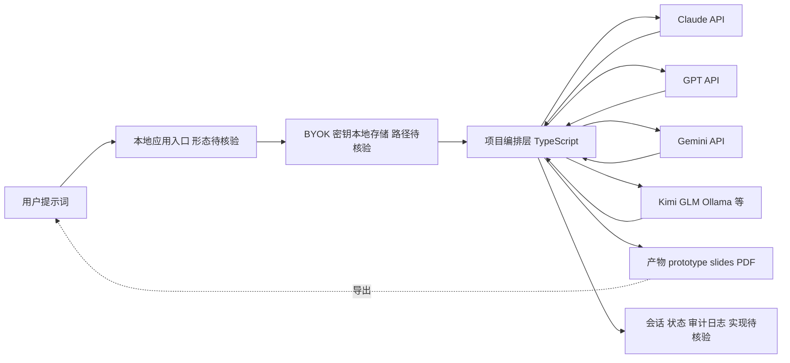

# OpenCoworkAI/open-codesign — Open-source Claude Design alternative. One-click import your Claude Code / Codex

## 一句话定位

Open-source Claude Design alternative. One-click import your Claude Code / Codex API key. Prompt → prototype / slides / PDF. Multi-model (Claude, GPT, Gemini, Kimi, GLM, Ollama). BYOK, local-first, MIT.。主要使用 TypeScript 编写，当前 7,698 stars / 810 forks / 36 subscribers。

## 它解决的问题

**目标用户**：使用 typescript 生态的开发者、AI Agent 构建者。

**痛点**：该项目解决的核心问题是 Open-source Claude Design alternative. One-click import your Claude Code / Codex API key. Prompt → prototype / slides / PDF. Multi-model (Claude, GPT, Gemini, Kimi, GLM, Ollama). BYOK, local-first, MIT.。从 README 来看，项目提供了 # Open CoDesign **简体中文**: [README.zh-CN.md](./README.zh-CN.md) > Your prompts. Your model. Your laptop. > > Turn prompts into polished artifacts — locally, openly, and with whichever model you already。

**场景**：适用于需要 ai-design, anthropic, byok 的开发场景。

## 为什么值得关注（2026-04-23）

1. **Stars 增长**：7,698 stars，810 forks——fork/star 比为 10.5% （高 fork 比例说明部署/集成意愿强）
2. **活跃度**：创建于 2026-04-18，最后更新 2026-08-04，78 open issues
3. **技术栈**：TypeScript，License: MIT
4. **生态定位**：Topics: ai-design, anthropic, byok, claude, claude-code

## 热度来源判断

**真实需求信号**：forks 810（高部署意愿），subscribers 36（深度关注）。

**品类时机**：从 topics 来看，ai-design, anthropic, byok 是当前社区关注的方向。

## 关键技术亮点

1. **# Open CoDesign**
2. ****简体中文**: [README.zh-CN.md](./README.zh-CN.md)**
3. **> Your prompts. Your model. Your laptop.**
5. **> Turn prompts into polished artifacts — locally, openly, and with whichever model you already pay f**
6. **[Website](https://opencoworkai.github.io/open-codesign/) · [Quickstart](#quickstart) · [What's new](**

## 架构师速览

| 决策问题 | 研究判断 | 证据边界 |
|---|---|---|
| 系统边界 | open-codesign 是一个 TypeScript 实现的 BYOK 编排层，位于用户提示词与多模型供应商（Claude/GPT/Gemini/Kimi/GLM/Ollama）之间，本地优先，输出 prototype/slides/PDF | 基于分类"工具型"、标签 byok/ai-design/anthropic 与一句话定位推断；具体入口、密钥注入路径与产物渲染管线未在档案中描述，待核验 |
| 主路径 | 提示词 → 本地应用入口（CLI/Web 待核验）→ BYOK 密钥读取 → 多模型路由调用 → 产物（原型/幻灯片/PDF）落盘 | 档案仅明确"prompt → prototype / slides / PDF"与多模型支持；运行时形态、协议（HTTP/MCP/CLI）与会话状态机制未披露 |
| 关键权衡 | BYOK + local-first 降低厂商耦合与数据外泄面，但换来多供应商适配成本与密钥本地管理责任；TypeScript/MIT 利于集成但 78 open issues 与较新创建时间（2026-04-18）提示成熟度风险 | 推断自 byok/local-first 定位与 78 open issues 计数；性能、协议、安全细节均未给出 |
| 最小 PoC | 用单一模型（如本地 Ollama）导入 BYOK 密钥生成一份 prototype + 一份 PDF，验证密钥管理、产物格式、可审计日志与卸载/换模成本后再扩展多模型与团队接入 | 由定位与"local-first、BYOK、可换模型"反推；具体命令、产物 schema 与日志方案档案未提供 |

## 架构启发

从 OpenCoworkAI/open-codesign 的设计来看，核心思路是 **"Open-source Claude Design alternative. One-click import your"**。这反映了 TypeScript 生态中 Agent / AI 工具链 的演进方向——降低集成复杂度、提供开箱即用的能力。开源 License (MIT) 降低了采用门槛。

## 架构图（MMD）

> 证据边界：此图只采用本档案已有可核验描述；“待核验”节点不应视为项目实现事实。

## 定位判断

**工具型**。在生态中定位为Open-source Claude Design alternative. O方向的工具。Stars 7698 说明已有一定社区基础。

## 风险 / 局限 / 泡沫点

1. **规模风险**：7,698 stars，但 fork 810 说明有实际部署
2. **维护风险**：最后 push 时间 2026-08-04，活跃维护中
3. **Open Issues**：78 个 open issues，活跃社区反馈
4. **License**：MIT（宽松许可，适合商用）

## 与同类项目的关系

- 与同 TypeScript 生态的同类工具形成竞争/互补关系。具体竞品对比需参考社区讨论。
- 从 topics (ai-design, anthropic, byok) 来看，与关注 ai-design 的其他项目有交叉。

## 是否值得持续跟踪

**是。** 7698 stars + 活跃更新说明项目有持续价值。建议关注后续版本迭代和社区增长。

## 后续观察点

1. Star 增速是否可持续（当前 7,698）
2. Fork 增长趋势（当前 810）
3. 功能迭代频率（最后更新 2026-08-04）
4. 社区活跃度（subscribers 36, open issues 78）

---
> 数据来源: GitHub API (2026-08-04) | Stars: 7,698 | Forks: 810 | License: MIT | 语言: TypeScript | 创建: 2026-04-18
