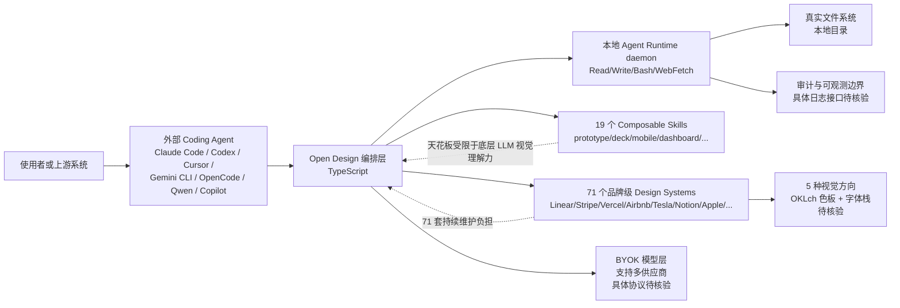

# Open Design

## 一句话定位
开源 Claude Design 替代 — 71 个品牌级 Design Systems + 19 个 Skills，让任何 Coding Agent 成为设计引擎。

## 它解决的问题
Anthropic 发布 Claude Design 后引爆了"AI 做设计"的需求，但 Claude Design 闭源、付费、云锁定、只支持 Anthropic 模型。Open Design 提供同等能力但完全开放。

目标用户：使用 Coding Agent 的设计师、前端开发者、产品经理。

## 为什么值得关注（2026-04-30）
- 2 天 4.1K stars，增速极快
- 整合了 huashu-design、guizang-ppt-skill、open-codesign 等多个热门项目的成果
- BYOK 全层，支持 Claude Code / Codex / Cursor / Gemini CLI / OpenCode / Qwen / Copilot

## 热度来源判断
**真实需求 + 生态聚合效应**。Claude Design 验证了市场，Open Design 满足了"我也要但不想被锁定"的需求。增速中部分来自关联项目的 Star 互带。

## 关键技术亮点亮点

1. **71 个品牌级 Design Systems**：涵盖 Linear、Stripe、Vercel、Airbnb、Tesla、Notion、Apple 等，基于 awesome-design-md 导入。
2. **19 个 Composable Skills**：prototype、deck、mobile、dashboard、pricing、docs、blog、SaaS landing 等，按需组合。
3. **5 种视觉方向**（Editorial Monocle / Modern Minimal / Tech Utility / Brutalist / Soft Warm），每种自带 OKLch 色板 + 字体栈。
4. **Agent Runtime 架构**：本地 daemon 启动 CLI，Agent 获得真实的 Read/Write/Bash/WebFetch 能力，操作真实文件系统。

## 架构师速览

| 决策问题 | 研究判断 | 证据边界 |
|---|---|---|
| 系统边界 | Open Design 是覆盖 Coding Agent（Claude Code/Codex/Cursor/Gemini CLI/OpenCode/Qwen/Copilot）、本地 Runtime daemon、71 个 Design Systems 与 19 个 Composable Skills 的编排层，本身不造 Agent | 边界由 TypeScript 语言、BYOK 标签、Agent Runtime 架构描述与多 CLI 支持列表共同界定；具体守护进程通信协议未在档案中给出 |
| 主路径 | 使用者经 Coding Agent 调用 → 本地 daemon 暴露 Read/Write/Bash/WebFetch 真实文件系统能力 → Skill + Design System 组合 → 返回设计产物（原型/PPT/页面/Dashboard 等） | 路径依据"Agent 获得真实的 Read/Write/Bash/WebFetch 能力，操作真实文件系统"及 19 个 Skill 列表；会话持久化、错误恢复机制未披露 |
| 关键权衡 | 以"不造 Agent，只做 Skill+Design System+Runtime 层"换取上线速度与生态广度，代价是设计质量上限受底层 LLM 视觉理解力制约，且 71 个 Design Systems 的持续维护成长期负担 | 权衡直接取自"架构启发"段；可观测性、安全沙箱、模型供应商耦合度档案未提 |
| 最小 PoC | 选定单一 Coding Agent（建议 Cursor 或 Claude Code），固定 1 套 Design System（如 Linear）+ 1 个 Skill（如 dashboard），在受控目录开启 daemon，开启审计日志，验证产物可复现与权限可回收 | PoC 设计依据 Agent Runtime + BYOK + 19 Skills/71 DS 事实；具体审计日志接口、最小权限粒度需源码核验 |

## 架构启发

**设计哲学**：不造 Agent，利用现有最强的 Coding Agent。Open Design 只做 Skill 层 + Design System 层 + Runtime 层。

**Trade-off**：依赖外部 Agent 的能力上限，设计质量受限于底层 LLM 的设计"品味"。

## 架构图（MMD）

> 证据边界：此图只采用本档案已有可核验描述；“待核验”节点不应视为项目实现事实。

## 定位判断
**工具型**，有平台化潜力。目前是高质量工具，如果 Skill 生态持续繁荣，可能成为 Agent 设计工作流的标准框架。

## 风险 / 局限 / 泡沫点

1. **2 天 4K stars 的泡沫风险**：部分增长来自关联项目的 Star 互带，实际活跃用户数需要 2-4 周观察。
2. **依赖 LLM 设计能力**：设计质量的"天花板"完全取决于底层模型的视觉理解力，Skill 只能引导不能创造。
3. **维护负担**：71 个 Design Systems 的持续更新是长期挑战。

## 与同类项目的关系

| 项目 | 定位 | 差异 |
|------|------|------|
| Claude Design | Anthropic 官方 | 闭源，仅 Anthropic 模型 |
| open-codesign | 桌面 Electron 应用 | 聚焦桌面端，Open Design 是 Web + CLI |
| huashu-design | 单一设计 Skill | 被 Open Design 整合 |

## 是否值得持续跟踪
**是，中优先级**。Skill 生态整合方向正确，需要观察用户留存和 Design System 更新节奏。

## 后续观察点

1. 2 周后的 star 增速是否回落
2. 71 个 Design Systems 的实际使用率和反馈
3. 是否出现企业级用户案例

---
*首次记录：2026-04-30*

## 最近动态

### 2026-05-13（实测）
- **Stars 实测 38,354**（forks 4,358）— 断网推演偏差仅 1.1%
- 15 天从 0 到 38.4K，日增 ~425，从爆发期过渡到平台巩固期
- 19 Skills + 71 Design Systems 生态完备
- **平台地位确认**：从赛道领跑者进化为 Agent Design 默认平台
- 维持

## 历史动态
- 2026-05-08: Stars 32.1K，平台级确认
- 2026-05-07: 预估 ~31K，赛道进入整合期
- 2026-05-06: Stars 27.3K（fork 2987），7 天增速持续，Apache 2.0
- 2026-05-05: Stars 23.7K，赛道红海化
- 2026-05-04: Stars 19.1K，6天从4K到19K

## 最近动态 (2026-05-15)

- **2026-05-15:** 网络受限日，趋势延续分析。基于 05-14 实测数据推算，持续跟踪中。
- Stars 数据为推算值，网络恢复后验证。

---
