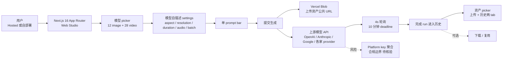

# wide-trace/open-higgsfield

## 一句话定位
**开源的"40 个图像/视频模型统一编排 Studio"** ——一个 prompt bar 同时调度 12 image + 28 video 模型，Next.js 16 App Router on Vercel + React 19 + Zustand + Vercel Blob，**自带 platform key 即可自部署**，是 Higgsfield AI 的开源替代品。

## 它解决的问题
Higgsfield AI、Runway、Pika 等多模型商业订阅服务存在三类痛点：(1) **高门槛订阅费**——个人开发者难以承担月度订阅；(2) **vendor lock-in**——所有编辑 / 资产 / 历史都被锁定在平台；(3) **平台硬编码模型 settings**——每个新模型需要平台主动适配。open-higgsfield 直击这三点：**自部署 + 自带 platform key + per-model 自描述 settings**，让模型 settings 声明在模型自身（不是平台硬编码），UI 自动渲染对应字段。

## 为什么值得关注（2026-08-27）
- **1 天 545⭐**：反映对"Higgsfield AI 开源替代品"品类有真实替代需求
- **40 个模型（12 image + 28 video）**：覆盖 Nano Banana 系列、Soul 系列、Gemini Omni Flash、Kling 3、Veo 3.1、Wan、Flux、GPT Image 2、Ideogram、Recraft、LTX、MiniMax、PixVerse、Grok、Qwen 等
- **Per-model 自描述 settings**：避免为每个模型维护并行的硬编码字段（aspect / resolution / duration / output format / audio / batch size / prompt enhancement）
- **资产 picker**：上传库 + 历史完成库两 tab 过滤，role-based cap 自动应用
- **Live run lifecycle**：4s 轮询 + 10 分钟 deadline，每个完成 run 在历史中独立 tile
- **Hosted 版本**：[openhiggsfield.ai](https://openhiggsfield.ai)，无需安装即可在浏览器使用

## 热度来源判断
热度来自 **"商业订阅高门槛 × vendor lock-in × per-model 硬编码 settings"** 三痛点的组合：(1) 商业订阅服务月费数十美元，个人开发者难以承担；(2) 资产 / 历史被平台锁定，无法迁移；(3) 平台每加一个新模型需要主动适配。1 天 545⭐ 是"高门槛商业订阅类工具被开源替代"的典型爆发曲线——和"Adobe 替代品" / "Figma 替代品" / "Photoshop 替代品"的开源爆发逻辑一致。**主要风险：** 无 license（README 没明示 OSI 兼容 license）阻碍企业 fork 与商用；40 个模型的 key 与计费对个人开发者是否真实可用（README 强调 "Your key"）；1 天新项目维护持续性待观察。

## 关键技术亮点
1. **Per-model 自描述 settings**：每个模型在自身的 config 中声明 aspect / resolution / duration / output format / audio / batch size / prompt enhancement 等允许范围，UI 自动渲染对应字段，**避免并行硬编码列表**
2. **Media inputs by role**：start frame / end frame / references / video / audio 各自有 per-role 上限，模型自身声明
3. **Batch**：每次提交最多 4 个结果，原生 count 字段的模型用之，否则每次提交一个结果
4. **Live run lifecycle**：skeleton 在网格上立即出现，4s 轮询直至终端状态（10 分钟 deadline）
5. **Vercel Blob 公共 URL**：上传文件自动转 public URL，可携带至 generate 请求
6. **Hosted + 自部署双形态**：提供 [openhiggsfield.ai](https://openhiggsfield.ai) 在线版 + 完整 GitHub 仓库供自部署

## 架构师速览

| 决策问题 | 研究判断 | 证据边界 |
|---|---|---|
| 系统边界 | 一个 Next.js 16 App Router Web 应用作为多模型媒体编排前端，后端只代理用户 platform key 到上游模型 API（OpenAI / Anthropic / Google / 各家） | 仅基于 README 的 "Next.js 16 App Router on Vercel · React 19 · Zustand · pnpm" 与 "add your platform key"；后端代理层是否独立服务、key 加密存储路径未在档案中明示 |
| 主路径 | 用户上传资产 → 选择模型 → 单 prompt bar 输入 → 模型自描述 settings 自动渲染 → 提交 → 4s 轮询 → 完成 run 进入历史 | 主路径来自 README "One composer for Image and Video" 与 "live run lifecycle" 段落；具体上游 provider 的容错、回退策略未在档案中明示 |
| 关键权衡 | 多模型覆盖广度 vs 单 provider 稳定性 vs 平台 key 聚合的合规边界 vs 自部署的资产存储（Vercel Blob）成本 | 档案明示 40 模型覆盖、自带 key、双形态；具体 provider 失败处理、Vercel Blob 限额计费、企业部署替代存储未证实 |
| 最小 PoC | 用 platform key 部署 1 个文本到图像模型（如 GPT Image 2 或 Flux），跑 1 次单图生成 + 1 次 4-batch，对比单 provider UI 验证 per-model settings 自描述的实际收益 | PoC 范围与退出路径由"先单模型、最小批量、可对照"原则推导；具体 provider 列表、退出成本待核验 |

## 架构启发
open-higgsfield 的核心启发是 **"per-model 自描述 settings > 平台硬编码"**——这是 multi-model UI 的工程化最佳实践。**当前主流 multi-model 平台（如 Replicate、fal、OpenRouter）的 UI 都遵循"通用 settings + 每个模型单独适配"的反模式**，导致 UI 维护成本随模型数量线性增长。open-higgsfield 把 settings 声明在模型自身，UI 自动渲染——**让模型成为 first-class declarative artifact**。更深层的启发是：**商业订阅类工具的开源替代品的爆发曲线具有"1 天数百 stars"特征**——Higgsfield AI / Runway / Pika / Midjourney / Adobe Firefly 等都有"开源替代品"的爆发潜力，因为这些服务的核心价值是"前端编排"而非"模型本身"（模型来自 OpenAI / Anthropic / Google 等开源 / 商业 API）。

## 架构图（MMD）

> 证据边界：此图只采用本档案已有可核验描述；"待核验"节点不应视为项目实现事实。

## 定位判断
**工具型项目（multi-model media studio）。** open-higgsfield 不做模型，只做"多模型编排前端 + 资产存储 + live run lifecycle"——这是工具型定位。**核心竞争壁垒：** per-model 自描述 settings 的设计哲学 + 40 个模型的覆盖广度。**主要风险：** 1 天新项目维护持续性 + 无 license 阻碍商用 + 平台 key 聚合的合规边界。若持续维护，**6-12 月内有潜力成为 multi-model Studio 赛道的开源标杆**。

## 风险 / 局限 / 泡沫点
- **无 license**：README 没明示 OSI 兼容 license，阻碍企业 fork 与商用
- **1 天新项目**：维护持续性待观察（3-6 个月活跃度）
- **平台 key 聚合**：40 个模型需要用户分别注册并管理 key，使用门槛高于商业订阅的"统一订阅"
- **Provider 失败回退**：多 provider 并发与失败回退机制未在 README 中明示
- **Vercel Blob 限额**：资产存储依赖 Vercel Blob，免费层有上传限额
- **Hosted 版 vs 开源**：README 提供 hosted 版 [openhiggsfield.ai](https://openhiggsfield.ai) 与 GitHub 仓库，两者关系（项目方同时维护两个版本 vs hosted 是商业版）是潜在分叉风险

## 与同类项目的关系
- **vs Higgsfield AI / Runway / Pika**：商业订阅服务，open-higgsfield 是开源 + 自带 key 的替代品
- **vs Replicate / fal**：多模型 API marketplace，open-higgsfield 是 Web 前端而非 API 层
- **vs OpenRouter**：模型路由服务（OpenAI 兼容 API），open-higgsfield 是 Web UI 而非 API 层
- **vs Vercel AI Playground**：Vercel 官方的 multi-model playground，open-higgsfield 定位类似但开源 + 覆盖更广
- **vs gradio / streamlit**：通用 LLM demo 框架，open-higgsfield 是 multi-model media studio 的特定场景实现

## 是否值得持续跟踪
**值得跟踪（multi-model Studio 开源标杆候选）。** open-higgsfield 1 天 545⭐ 体现市场对该品类的真实需求，**核心设计哲学（per-model 自描述 settings）值得所有 multi-model UI 借鉴**。建议关注：(1) 是否补上 OSI license（决定企业采用可能）；(2) 40 个模型的覆盖广度是否持续（决定用户粘性）；(3) 是否会被主流 multi-model API（OpenRouter / Replicate）官方化（标准化威胁）。对独立开发者：**这是直接可用的"商业订阅替代品"，自部署后立即可用**。对产品设计者：**per-model 自描述 settings 的设计哲学值得学习**。

## 后续观察点
- OSI license 是否补上（决定企业采用）
- 40 个模型覆盖广度是否持续（决定用户粘性）
- 是否演化为 multi-model Studio 平台（从 Web Studio 升级为插件市场）
- per-model 自描述 settings 是否被主流 multi-model API 接纳为标准
- 自部署 vs hosted 版的边界（开源 vs 商业化）

---
> 数据来源: GitHub API (2026-08-27) | Stars: 545 | Forks: 未公开 | License: 未声明 | 语言: TypeScript | 创建: 2026-08-26 | 数据截至 2026-08-27 19:30 UTC