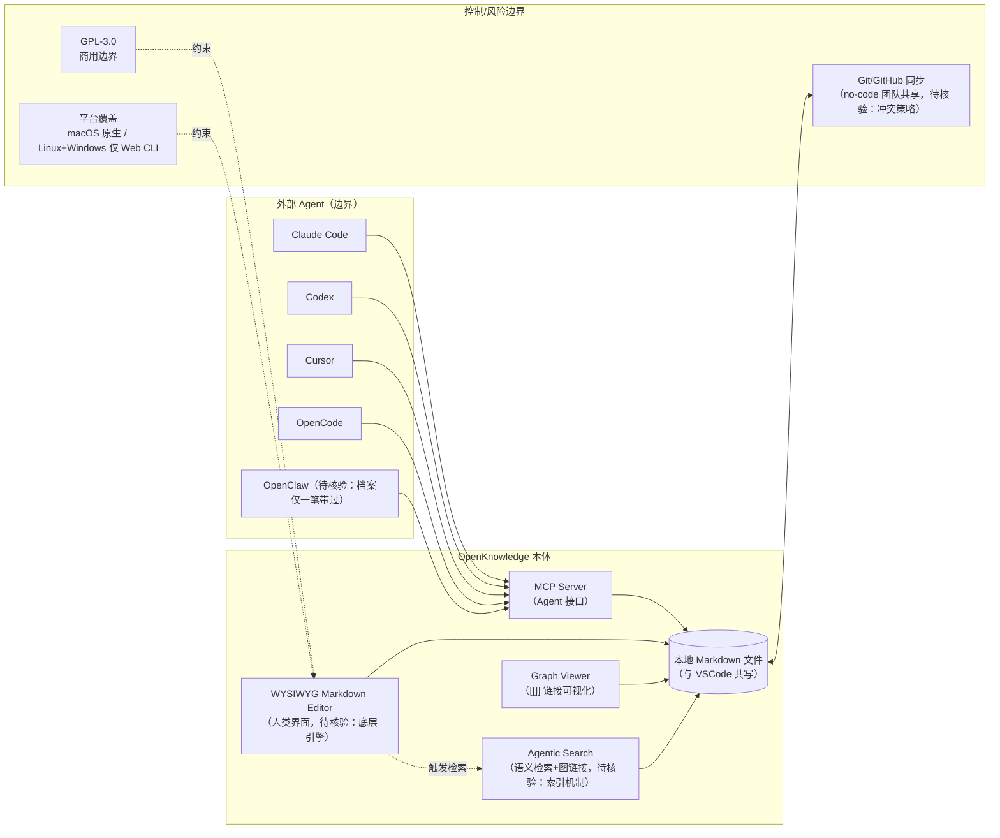

# OpenKnowledge

## 一句话定位
AI原生的 WYSIWYG Markdown 编辑器 + LLM Wiki——Notion meets VSCode 的开源替代，原生集成 Claude/Codex/Cursor 协同编辑。

## 它解决的问题
知识管理工具存在两极分化：Notion/Confluence 易用但封闭、数据不透明；Obsidian/VSCode 灵活但编辑体验差、AI 集成弱。开发者需要既像 Google Doc 那样所见即所得，又能原生接入 AI Agent 的 Markdown 知识库工具。

## 为什么值得关注（2026-07-11）
Inkeep（AI搜索公司）从搜索工具延伸到知识管理，代表着"AI-native知识管理"赛道的成型。OpenKnowledge 不是在传统编辑器上"加AI功能"，而是从底层以 MCP+agentic search 为基础架构。这意味着知识库不只是被编辑的文档，而是 Agent 可检索、可推理、可更新的活体系统。

## 热度来源判断
- **Inkeep品牌信任**：Inkeep的AI搜索产品已有用户基础
- **真实需求**：开发者对"AI-native知识管理"有明确痛点
- **WYSIWYG Markdown**：真正做到像Notion一样编辑.md文件
- **MCP生态红利**：随着MCP成为Agent工具调用标准，支持MCP的知识库自然受关注

## 关键技术亮点亮点

### 1. 真正的 WYSIWYG Markdown
不是分屏预览，而是直接在编辑区看到渲染结果（像Google Doc/Notion），底层文件仍然是纯.md。这意味着你可以同时用VSCode和OpenKnowledge编辑同一批文件。

### 2. 多Agent协同编辑
原生集成 Claude Code、Codex、Cursor、OpenCode、OpenClaw。`ok init` 自动检测已安装的Agent工具并配置MCP连接。

### 3. MCP + Agentic Search
内置MCP server，Agent可以检索知识库内容。Agentic search不依赖关键词匹配，而是语义检索+图链接。

### 4. 知识图谱可视化
Graph wiki link viewer——可视化Markdown文件间的`[[]]`链接关系。

### 5. 团队共享 + Git同步
基于Git/GitHub的no-code团队共享和自动同步。

## 架构师速览

| 决策问题 | 研究判断 | 证据边界 |
|---|---|---|
| 系统边界 | OpenKnowledge 是面向 Markdown 知识库的人类/Agent 协同编辑器，边界包含 WYSIWYG 编辑器（人类界面）、MCP Server（Agent 界面）、Agentic Search、Graph Viewer 与本地 Markdown 文件存储；外部 Agent 通过 MCP 接入。 | 基于档案"关键技术亮点"与"架构启发"中给出的组件列表；具体进程边界、协议版本、部署形态未在档案中给出，须以源码核验。 |
| 主路径 | 用户在 WYSIWYG 编辑器编辑 → 落盘为 Markdown 文件（与 VSCode 共写同一批文件）→ Agent（Claude Code/Codex/Cursor/OpenCode/OpenClaw）通过 MCP Server 读取并调用 Agentic Search（语义+图链接）→ 回写到 Markdown 文件 → Graph Viewer 展示 `[[]]` 链接关系。 | 主路径中的每一步在档案"关键技术亮点"均有描述；Git/GitHub 同步的具体工作流与冲突策略未详述，标为待核验。 |
| 关键权衡 | GPL-3.0 与商用分发的张力；macOS 原生优先与 Linux/Windows 仅 Web/CLI 的体验差距；与 Obsidian（插件生态）、Notion（用户规模）、Continue（代码侧重）相比的差异化压力；Inkeep 公司主导方向的风险。 | 档案"风险/局限/泡沫点"明确列出前四点；性能、权限模型、可观测性等档案未提及，须以源码/文档核验。 |
| 最小 PoC | 在 macOS 上用 `ok init` 让本地 Markdown 目录接入 MCP，验证 Claude Code 或 Codex 能通过 MCP 检索与编辑文档；用 VSCode 同步打开同一目录确认双端一致；用 Graph Viewer 检查 `[[]]` 链接渲染；将验收项设为 GPL-3.0 合规、跨平台降级体验、Git 同步冲突处理。 | 步骤均来自档案"关键技术亮点"与"采用建议"；Agent 实际可调用的工具集合、鉴权方式、搜索质量等档案未量化，标为待核验。 |

## 架构启发

**"AI-native"不是功能，而是架构。** 传统工具加AI功能（如Notion AI）是"功能层AI"。OpenKnowledge从MCP协议层接入Agent，意味着：
- Agent不只能"写"文档，还能"读"、"搜索"、"推理"整个知识库
- 知识库是Agent的第二大脑（second brain），不是被动存储
- 编辑器是Agent和人类的共同界面

## 架构图（MMD）

> 证据边界：此图只采用本档案已有可核验描述；“待核验”节点不应视为项目实现事实。

## 定位判断
**工具型，有平台化潜力。** 当前是优秀的Markdown编辑器+AI集成。如果MCP生态持续增长，OpenKnowledge可能成为"AI知识管理"的标准前端。

## 风险 / 局限 / 泡沫点
1. **GPL-3.0限制商用**：想做商业产品的公司可能犹豫
2. **Inkeep公司依赖**：虽然是开源，但核心开发由Inkeep团队控制，方向可能随公司战略变化
3. **macOS app优先**：Linux/Windows用户只能用web CLI，体验差距
4. **竞争激烈**：Obsidian（插件生态更强）、Notion（用户基础更大）、Continue（更偏代码）

## 与同类项目的关系
| 项目 | 定位 | 差异 |
|------|------|------|
| Obsidian | Markdown知识管理 | 插件生态丰富但AI集成弱，非WYSIWYG |
| Notion | 协作知识管理 | 封闭格式，非Markdown，AI是附加功能 |
| Continue | AI代码助手 | 更偏代码编辑而非知识管理 |
| Logseq | 大纲式知识管理 | 不同编辑范式（outliner） |

## 是否值得持续跟踪
**是（轻量跟踪）。** AI-native知识管理是确定趋势。关注MCP集成深度和社区增长。

## 后续观察点
1. MCP集成是否会催生"Agent知识库工作流"新模式
2. 社区是否贡献非macOS的桌面app（Linux/Windows原生）
3. 是否出现基于OpenKnowledge的企业知识库产品
4. Inkeep是否将搜索产品与OpenKnowledge深度整合

---
*首次记录：2026-07-11*
