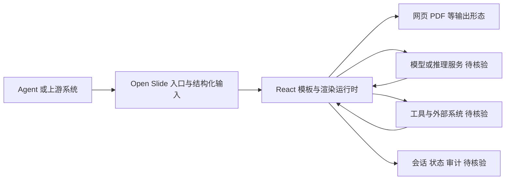

# Open Slide

## 一句话定位
为 AI Agent 构建的幻灯片生成框架，Agent 原生的 PPT 生成方案。

## 它解决的问题
**目标用户：** 需要自动化生成演示文稿的开发者和知识工作者。

**痛点：**
- 传统 PPT 生成工具（python-pptx、Slidev 等）不是为 Agent 设计的
- Agent 生成 PPT 需要专门的框架：结构化输入、模板系统、输出格式
- 现有 Skill（如 PPT Skill for Claude Code）分散且不统一

## 为什么值得关注（2026-05-05）
"Agent 生成 PPT" 是当前 Agent Skill 生态中的高频需求（多个 PPT Skill 同时上 Trending）。Open Slide 试图做一个通用的 Agent Slide 框架，而非单次 Skill。方向正确但验证不足。

## 热度来源判断
- **Skill 生态带动** — PPT 生成是 Agent Skill 的高频场景
- **真实需求** — 自动化 PPT 生成在企业场景有应用
- **竞争激烈** — 同时存在多个 PPT Skill 项目，赛道拥挤

## 关键技术亮点亮点
1. **Agent-First 设计** — API 专为 Agent 调用优化，结构化输入输出
2. **React 组件系统** — 基于 React 的幻灯片渲染，可定制性强
3. **多格式输出** — 支持网页、PDF 等多格式导出

## 架构师速览

| 决策问题 | 研究判断 | 证据边界 |
|---|---|---|
| 系统边界 | Open Slide 是面向 AI Agent 调用的幻灯片生成框架（"Agent-Native"），承担 Agent 与幻灯片渲染之间的编排与模板职能，外部边界包含使用者/上游 Agent、模型与推理服务、以及"网页/PDF"等输出形态。 | 仅基于档案中"Agent-First 设计""React 组件系统""多格式输出：网页、PDF"以及分类/标签声明；具体协议、API 形态与部署方式未在档案中证实。 |
| 主路径 | Agent 发出结构化输入 → Open Slide 运行时（React 渲染 + 模板系统）→ 输出网页/PDF 形态的演示文稿；与"模型/推理服务""工具与外部系统""会话/状态/审计"为可调用或受控的侧边连接。 | 依据档案"结构化输入/输出""React 幻灯片渲染"与架构启发图抽象得出；具体调用链、状态回写与持久化方式信息不足，标注"待核验"。 |
| 关键权衡 | 扩展速度（通用框架覆盖更多 Skill 场景）与权限、可观测性、模型/模板供应商耦合之间的平衡；React 模板系统带来可定制性，也带来框架锁定。 | 由档案"赛道拥挤""差异化困难""Agent-Native API 设计"等表述归纳；非项目实测结论，缺少性能、合规与配额数据。 |
| 最小 PoC | 在单一 Agent 渠道（如 Claude Code 或 Codex）下，用受控工具权限、可审计日志和最小模板集跑一遍"结构化输入 → 网页/PDF 输出"，对比人工评审质量与退出成本后再扩接入面。 | 仅复述档案"采用建议"与"后续观察点 1"的评估口径；具体集成方式、模型选型与模板策略需源码核实。 |

## 架构启发
- Agent 生成内容的标准化：如果 Agent 要生成 PPT/文档/报告，需要标准化的中间格式
- "Agent-Native" 框架设计：API 设计从 Agent 调用场景出发，而非人类操作场景

## 架构图（MMD）

> 证据边界：此图只采用本档案已有可核验描述；“待核验”节点不应视为项目实现事实。

## 定位判断
**工具型。** 在 Agent Skill 生态中是一个垂直工具。需要与大量同类 PPT Skill 竞争。

## 风险 / 局限 / 泡沫点
1. **赛道拥挤** — PPT Skill 项目泛滥，差异化困难
2. **需求验证不足** — Agent 生成 PPT 是否真的是高频刚需？
3. **质量天花板** — 自动生成的 PPT 质量是否能满足商业场景？

## 与同类项目的关系
- **guizang-ppt-skill（4.9K stars）** — 杂志风格 HTML PPT Skill，单 Skill 路线
- **ppt-image-first** — 以图片为主的 PPT Skill
- **Open Slide** — 试图做通用框架路线

## 是否值得持续跟踪
**有限跟踪。** 需要观察是否能在 PPT Skill 红海中脱颖而出。

## 后续观察点
1. 是否获得 Agent 框架（Claude Code、Codex）的官方集成
2. 与同类 PPT Skill 的差异化是否足够清晰

---
*首次记录：2026-05-05*
