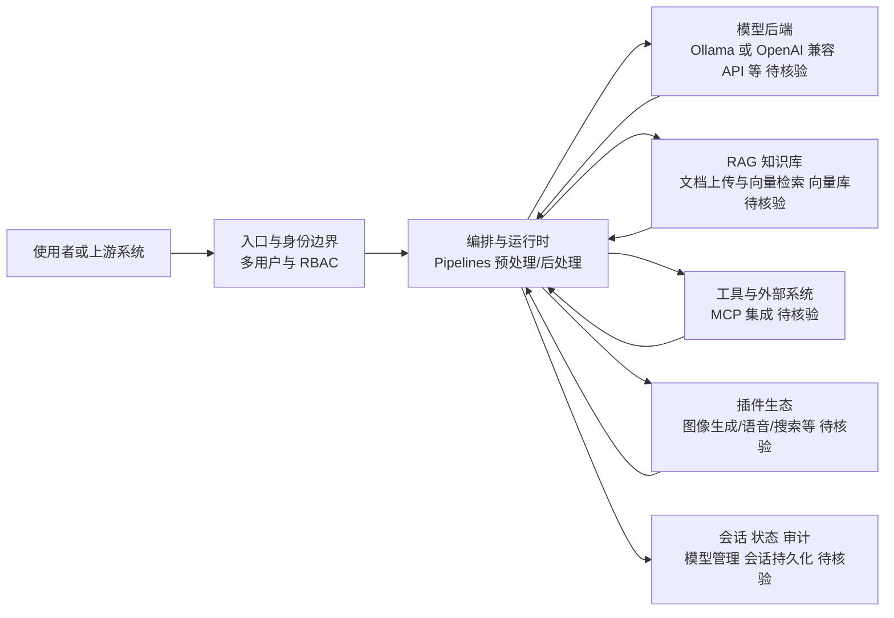

# open-webui/open-webui

## 一句话定位
功能丰富、可自部署的 LLM Web 界面，支持 Ollama、OpenAI API 等多种后端，让用户在自己的服务器上运行一个"私有版 ChatGPT"——含多用户、RAG、模型管理、MCP 工具调用等完整能力。

## 它解决的问题
ChatGPT 虽好，但存在数据隐私（对话上传到 OpenAI）、模型选择受限、无法本地运行开源模型等问题。对于企业、研究机构、隐私敏感用户，需要一个"自部署的 AI 对话平台"。Open WebUI 填补了这个空白：一键 Docker 部署，连接本地 Ollama 或远程 API，提供媲美 ChatGPT 的 Web 体验，但所有数据和模型都在自己控制下。

## 为什么值得关注
- **Stars:** 148,122（截至 2026-08-07），自部署 AI 界面绝对第一
- **Forks:** 21,555，社区贡献极活跃
- **Watchers:** 650，企业关注度极高
- **活跃度:** pushed_at 2026-08-07（当日更新），极度活跃
- **License:** NOASSERTION（自定义）
- **创建时间:** 2023-10-06，不到 3 年达到 14.8 万 stars
- **功能完整度:** 多用户/RAG/MCP/模型管理/插件/Pipelines 全栈

## 热度来源判断
Open WebUI 的热度是**企业 AI 私有化部署刚需 + 开源 LLM 浪潮 + 产品体验优秀**三重驱动。2023-2024 年 Llama、Mistral 等开源模型爆发，但"如何用"是门槛——命令行不友好、缺乏多用户管理。Open WebUI 把"私有 AI"门槛降到 Docker 一行命令。它的热度是真实生产需求，非泡沫——大量企业在内部部署。

## 关键技术亮点亮点
1. **多后端支持:** Ollama、OpenAI 兼容 API、Anthropic、Groq、本地模型，统一接口
2. **RAG 内置:** 文档上传 + 向量检索 + 对话引用，开箱即用的知识库
3. **多用户 RBAC:** 完整的用户/角色/权限管理，适合企业部署
4. **Pipelines:** 类似 LangChain 的可编程流程，支持自定义预处理/后处理
5. **MCP 集成:** 支持 Model Context Protocol，连接外部工具和数据源
6. **模型管理:** 可从 Ollama/HuggingFace 一键拉取模型，管理多模型版本
7. **插件生态:** 社区插件扩展功能（图像生成、语音、Web 搜索）

## 架构师速览

| 决策问题 | 研究判断 | 证据边界 |
|---|---|---|
| 系统边界 | 入口渠道、模型供应商、工具/数据源之间的编排层，基于标签 ai/llm/llm-webui/ollama/openai/mcp/rag 与内置多用户、RBAC 描述抽象 | 公开资料未明确语言、协议与部署形态，须以源码/文档核验 |
| 主路径 | 请求 → 编排与运行时 → 模型与工具调用 → 会话或状态回写，含 RAG 文档检索、MCP 工具调用、Pipelines 预处理/后处理 | Pipelines 协议细节、MCP 传输方式、向量库选型未在档案中证实 |
| 核心权衡 | 扩展速度（多后端/插件/Pipelines）与权限、审计、合规耦合之间的平衡；License 为自定义（NOASSERTION），企业法务审查为必要项 | 资源消耗、性能基准未给出；商业版差异化不清 |
| 最小 PoC | 单 Docker 实例，接入 Ollama 或一个 OpenAI 兼容端点，开启 RAG 与最小 MCP 工具权限，验证身份、审计日志与回退路径 | 具体镜像、端口、向量库、SSO 等企业特性须读官方文档 |

## 架构启发
Open WebUI 的核心启发是 **"LLM 应用的核心价值在 UI/UX/管理，而非模型本身"**。模型是可替换的（Ollama/OpenAI/任意 API），但"好的对话界面 + RAG + 多用户 + 工具调用"这套组合才是用户真正需要的。它将"模型后端"与"应用前端"彻底解耦，证明了 AI 时代的"应用层"机会——模型是 commodity，体验是 differentiator。

## 架构图（MMD）

> 证据边界：此图只采用本档案已有可核验描述；“待核验”节点不应视为项目实现事实。

## 定位判断
**平台型头部项目。** Open WebUI 已成为"自部署 AI 对话平台"的事实标准。它不只是 UI，而是包含 RAG、用户管理、模型管理、工具调用的完整平台。对于任何想部署"私有 ChatGPT"的组织，它是默认首选。

## 风险/局限/泡沫点
- **License 争议:** 自定义许可证（非标准 OSI 许可）限制商业使用，需法务审查
- **重量级:** 功能膨胀导致部署资源需求增长，轻量场景可能用更简单方案
- **商业化不明:** 开源版功能已极完整，商业版差异化不清
- **竞争加剧:** LibreChat、LobeChat、Dify 等替代方案崛起
- **模型依赖:** 体验质量部分取决于后端模型能力
- **安全责任:** 自部署意味着安全更新由用户承担

## 与同类项目的关系
- **vs LibreChat:** LibreChat 更轻量、更早期；Open WebUI 功能更全、社区更大
- **vs LobeChat:** LobeChat 设计更精美，插件生态强；Open WebUI 更偏"平台"
- **vs Dify:** Dify 更偏"LLM 应用开发平台"（Workflow/Agent）；Open WebUI 更偏"对话界面"
- **vs ChatGPT (OpenAI):** ChatGPT 是 SaaS；Open WebUI 是自部署替代
- **vs Ollama:** Ollama 是模型运行时；Open WebUI 是其前端界面，两者互补
- **vs AnythingLLM:** AnythingLLM 更偏 RAG/知识库；Open WebUI 更通用

## 是否值得持续跟踪
**必须跟踪。** Open WebUI 是"AI 私有化部署"赛道的代表，反映企业 AI 采用的真实趋势。它的功能演进直接影响"私有 ChatGPT"的能力边界。建议关注其 Pipelines/Agent 能力深化、企业版商业化。

## 后续观察点
- 是否推出官方企业版（商业化路径）
- Agent/Workflow 能力是否深化（与 Dify/LangFlow 竞争）
- 安全合规能力（SSO、审计日志、数据加密）是否满足企业要求
- 与 Ollama/vLLM 等推理引擎的深度集成
- License 是否回归标准 OSI 许可（消除企业顾虑）

---
> 数据来源: GitHub API (2026-08-07) | Stars: 148,122 | Forks: 21,555 | License: 自定义
