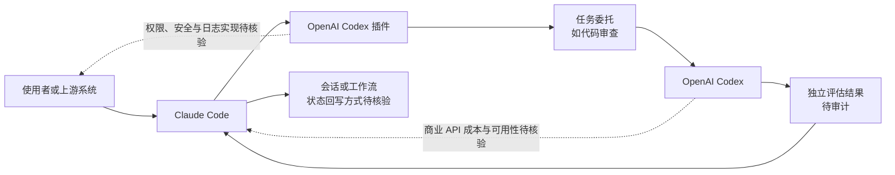

# OpenAI Codex Plugin for Claude Code

## 一句话定位
OpenAI 官方插件——让 Claude Code 调用 OpenAI Codex 进行代码审查或委托任务，实现跨厂商 Agent 互操作。

## 它解决的问题
Agent 锁定位：开发者使用 Claude Code 但也想利用 Codex 的能力（或反向），通常需要切换上下文。这个插件让两个 Agent 在同一工作流中协作。

## 为什么值得关注（2026-07-02）
22.4K⭐，Trending 多日。OpenAI 官方发布为 Claude Code 写的插件本身就很反直觉——说明了 Agent 互操作性的真实需求正在超越厂商边界。

## 热度来源判断
1. OpenAI 官方背书但面向竞品（Claude Code）——话题性极强
2. 实际需求——很多团队同时使用 Claude 和 Codex，需要桥接
3. 象征意义——Agent 生态从"厂商锁定"走向"互操作"

## 关键技术亮点亮点
1. **Claude Code Plugin 格式**——遵循 Claude Code 的插件规范，安装即用
2. **任务委托模式**——Claude Code 可将特定任务（如代码审查）委托给 Codex
3. **双模型交叉验证**——两个不同厂商的模型对同一代码给出独立评估

## 架构师速览

| 决策问题 | 研究判断 | 证据边界 |
|---|---|---|
| 系统边界 | OpenAI Codex Plugin for Claude Code 是连接 Claude Code 与 Codex 的插件级桥接层：Claude Code 可将代码审查等任务委托给 Codex，并获得两个厂商模型的交叉评估。 | 档案未明确入口、身份、工具与数据源实现，也未证实具体调用协议；边界判断基于插件定位、标签及所引公开资料。 |
| 主路径 | Claude Code 接收任务后，通过插件编排调用 Codex；Codex 完成任务并将结果回传 Claude Code，由调用侧继续工作流。 | 档案未给出内部命令、会话状态、错误处理或结果回写实现；可确认的主路径仅为“Claude Code 委托任务给 Codex”。 |
| 关键权衡 | 采用价值在于减少 Agent 上下文切换并形成双模型交叉验证；代价包括两个商业 API 的成本叠加、串行调用增加的延迟、权限与可观测性负担，以及深度协作能力有限。 | 档案未提供定价、实际延迟、安全模型、日志、SLO 或双向调用证据；不能据此认定生产可靠性。 |
| 最小 PoC | 在 Claude Code 中以最小权限运行插件，选择一个明确代码审查任务，验证 Codex 能否完成委托并返回可审计结果；验收项应包含调用链日志、结果相关性、成本、延迟、失败处理和退出方式。 | 具体安装步骤、认证方式、权限清单、调用协议、成本与性能数据待核验；不得扩展到未证实工具或部署方式。 |

## 架构启发
Agent 互操作性正在从"理论可能"变为"官方支持"。当 OpenAI 主动为 Claude Code 写插件时，说明厂商意识到：锁定位不如互操作更能扩大市场。这与早期 Web 浏览器从"厂商私有"到"标准兼容"的历史类似。

## 架构图（MMD）

> 证据边界：此图只采用本档案已有可核验描述；“待核验”节点不应视为项目实现事实。

## 定位判断
工具型。是 Agent 互操作的早期实践，但本身功能较简单（插件级别的桥接）。

## 风险 / 局限 / 泡沫点
1. **依赖两个商业 API**——使用成本叠加
2. **功能简单**——目前只是"在 Claude Code 中调用 Codex"，深度协作有限
3. **可能被官方集成替代**——如果 Claude 或 Codex 原生支持外部 Agent，插件价值下降
4. **延迟叠加**——两个 Agent 串行交互增加响应时间

## 与同类项目的关系
- **Agent Skills 规范** — Skills 解决跨平台能力复用，codex-plugin-cc 解决跨平台 Agent 调用
- **MCP（Model Context Protocol）** — MCP 标准化工具连接，但不是 Agent-to-Agent 桥接
- **OmniRoute** — LLM 路由层聚合，但不涉及 Agent 级别的协作

## 是否值得持续跟踪
是。作为 Agent 互操作的早期信号值得跟踪，关注是否出现更深度协作模式。

## 后续观察点
1. 是否出现双向桥接（Codex 调用 Claude Code）
2. 是否支持更复杂的 Agent-to-Agent 协议（如 A2A）
3. 是否有第三方 Agent 也加入互操作网络
4. 使用率和社区反馈

---
*首次记录：2026-07-02*
