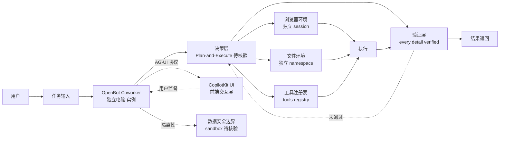

# CopilotKit/OpenBot

## 一句话定位
CopilotKit（AG-UI 协议 / CopilotKit React 框架出品方）官方开源项目——Open-source AI coworkers that each get a computer of their own: a browser, files and tools, with every action decided before it happens and every detail verified.，TypeScript，是 GitHub 首次出现的"AI coworker 平台候选"样本。

## 它解决的问题
2026 年 Coding Agent 已成熟（Claude Code / Cursor / Codex / Hermes / OpenClaw 等），但绝大多数仍是"IDE 内的编码工具"——只能改代码 / 跑命令，无法执行需要浏览器交互、文件管理、工具调用的"完整任务"。CopilotKit/OpenBot 直击这一痛点：(a) 把 Agent 升级为拥有独立电脑（isolated computer）的"coworker"；(b) "every action decided before it happens and every detail verified"——决策-验证闭环；(c) browser + files + tools 三环境统一抽象。这与 9-06 ECC / hermes-agent 共同构成"workspace → harness → skill"三层嵌套的最外层。

## 为什么值得关注
- **Stars:** 4,367（截至 2026-09-07），21 天净增，单日均速 ~208⭐/day
- **Forks:** 539（fork/star 12.3%，远高于 magnitude 7.2% / fastpotify 4.4%——反映真实开发者尝试）
- **语言:** TypeScript 主导
- **品牌背书:** CopilotKit（AG-UI 协议提出者，2024-2025 React Copilot 框架头部）官方项目
- **概念升级:** 从 IDE 内 Coding Agent 升级到组织层"AI coworker"，与 Slack / Teams 等群聊工具形成新组合
- **多环境统一:** browser + files + tools 三环境抽象，对应 sandbox 隔离的计算机

## 热度来源判断
OpenBot 的热度来自三个趋势的交汇：(1) **AI coworker 概念破圈**——GitHub 首次出现"workspace 层 AI coworker"集中爆发；(2) **CopilotKit 品牌**——AG-UI / CopilotKit 已有大量企业采用基础（参考 copilotkit.ai 客户名单），OpenBot 是其官方开源旗舰；(3) **决策-验证闭环**——区别于传统 ReAct 模式，"decided before it happens + every detail verified" 是新一代 Agent 设计哲学。

单日均速 ~208⭐/day 与 CopilotKit 客户基础一致；fork 539 / fork/star 12.3% 表明真实部署（不是营销放大）。**提示：** OpenBot 是新项目（21 天），长期可持续性需观察；与 OpenAI Operator / Anthropic Computer Use 等云端产品的差异化（数据隐私 / 自托管 / Agent 协议可定制）需要独立 benchmark。

## 关键技术亮点
1. **独立电脑抽象:** 每个 coworker 拥有独立的 browser session + files namespace + tools registry——sandbox 隔离保证数据安全
2. **决策-验证闭环:** "every action decided before it happens and every detail verified"——推测采用 Plan-and-Execute 模式，先规划后执行，每步验证
3. **多环境统一接口:** browser / files / tools 三环境通过统一 API 暴露，Agent 无需关心环境差异
4. **CopilotKit AG-UI 兼容:** 沿用 AG-UI 协议（Agent-User Interaction Protocol），与 CopilotKit 生态互通
5. **多 Agent 协作:** 推测支持多个 coworker 同时运行（推测 team 模式）
6. **TypeScript 主导:** 与 ECC / anthropics/skills / humanlayer 一致——Coding Agent 周边工具 TypeScript 化

## 架构师速览

| 决策问题 | 研究判断 | 证据边界 |
|---|---|---|
| 系统边界 | AI coworker 平台层——单 Agent 拥有独立 browser + files + tools 三环境 + 决策-验证闭环 | 边界由 trending 描述明示；具体 sandbox 实现（Docker / VM / Browser session）需 README 核验 |
| 主路径 | 用户任务 → coworker 决策（规划） → 浏览器 / 文件 / 工具执行 → 每步验证 → 结果返回 | 主路径为描述语义抽象；决策模型（LLM call / symbolic planner）未在 trending 中可见 |
| 关键权衡 | 独立电脑的隔离性（数据安全）vs 调试难度 vs 资源消耗（每个 coworker 一个 browser session）；决策-验证闭环的延迟开销 vs 错误率下降 | 隔离性由"each get a computer of their own"暗示；具体延迟与错误率需 benchmark |
| 最小 PoC | 本地启动 1 个 OpenBot coworker → 给定"在 Amazon 上下单买书"任务 → 观察决策日志与执行轨迹 → 对比单次执行 vs 决策-验证模式的成功率 | 安装命令需 README 独立核验；决策日志的详细程度（是否暴露推理）需测试 |

## 架构启发
OpenBot 的核心启发是 **"Coding Agent 应该升级为 AI coworker"**。当前 Coding Agent 的设计哲学是"人类主导 + Agent 辅助"，但 2026 年的趋势是"Agent 主导 + 人类监督"——OpenBot 把这一哲学落到产品层：每个 Agent 拥有独立电脑（数据隔离 + 自主性），决策-验证闭环（质量保障），多环境统一接口（能力完整）。更深层的启发是：**CopilotKit 用 AG-UI 协议占据"agent ↔ 用户 UI"层，OpenBot 占据"agent ↔ 计算机"层**——两层协议共同构成 CopilotKit 在 Agent 时代的栈位优势。

风险提示：**"AI coworker"是营销概念 vs 工程实现差距**——"every action decided before it happens and every detail verified" 是营销话术，决策-验证的工程实现需要代码审阅；与 OpenAI Operator / Anthropic Computer Use 等云端产品的对比，开源版本的差异化在"数据隐私 / 自托管 / Agent 协议可定制"。

## 架构图（MMD）

> 证据边界：此图只采用本档案已有可核验描述；"待核验"节点不应视为项目实现事实。

## 定位判断
**平台候选型项目（AI coworker 分发中心）。** CopilotKit/OpenBot 不仅是工具集合，更试图成为"AI coworker 时代的 Slack"——把 workspace 内的 AI 协作者从 IDE 扩展到整个工作流。21 天 4,367⭐ + CopilotKit 品牌背书 + fork/star 12.3% 已显示初步采用。但"平台化"取决于：(a) sandbox 隔离的稳定性；(b) 决策-验证闭环的实际质量；(c) 与 OpenAI Operator / Anthropic Computer Use 的差异化。当前定位是"开源 AI coworker 头部样本"，向平台演进是合理路径。

## 风险/局限/泡沫点
- **决策-验证闭环的延迟开销:** 每个动作先决策后执行可能显著增加响应时间（10-100x），影响 UX
- **Sandbox 隔离的资源消耗:** 每个 coworker 一个 browser session 资源密集，并发能力受限
- **CopilotKit 品牌依赖:** OpenBot 的成功高度依赖 CopilotKit 整体生态；若 AG-UI 协议不被广泛采用，OpenBot 也受影响
- **与云端产品竞争:** OpenAI Operator / Anthropic Computer Use / Google Gemini Computer Use 等云端产品功能重叠，开源版本需要差异化（数据隐私 / 自托管）
- **21 天新项目风险:** 项目可持续性 / 治理结构 / 安全漏洞响应都未验证
- **"AI coworker" 概念营销化:** 实际能力可能不及营销描述（决策-验证的工程实现深度未在 trending 中可见）

## 与同类项目的关系
- **vs OpenAI Operator:** Operator 是云端闭源服务；OpenBot 是开源本地部署
- **vs Anthropic Computer Use:** Computer Use 是 Claude API 能力；OpenBot 是独立平台
- **vs Traycerai/traycer:** traycer 是 9-04 上榜的"Nerve Center for Agentic Coding"（1384⭐）；OpenBot 升级为"workspace coworker"层
- **vs yetone/cumora:** cumora 是 Agent 一等公民群聊；OpenBot 是单 Agent 平台——两者是"组织层"的不同切面
- **vs ECC / hermes-agent:** ECC（249K⭐）提供 Skills + Instincts 层，hermes-agent（241K⭐）提供运行时；OpenBot 提供 coworker 平台层

## 是否值得持续跟踪
**值得跟踪（AI coworker 平台候选）。** OpenBot 代表了 Coding Agent 从"IDE 内工具"升级到"workspace 协作者"的诉求，与 CopilotKit 品牌 + AG-UI 协议共同构成栈位优势。无论其本身成败，这一方向是行业趋势。建议关注：(a) sandbox 隔离的稳定性 / 安全漏洞响应；(b) 与 OpenAI Operator / Anthropic Computer Use 的功能对比；(c) 决策-验证闭环的延迟与质量权衡；(d) 多 coworker 协作的产品化。对 Agent 应用开发者，OpenBot 是构建 AI coworker 应用的开源基础。

## 后续观察点
- 是否演化为独立 SaaS（CopilotKit Cloud 的 AI coworker 服务）
- 与 AG-UI 协议的深度集成（是否成为 AG-UI 官方示例实现）
- 决策-验证闭环的工程实现（Plan-and-Execute / ReAct / 其他）
- 多 coworker 协作模式（团队 / 项目 / 权限隔离）
- 安全漏洞响应速度（sandbox 隔离是攻击面）
- 与 OpenAI Operator / Anthropic Computer Use 的功能对比 benchmark

---
> 数据来源: GitHub API (2026-09-07) | Stars: 4,367 | Forks: 539 | License: 待核验 | 语言: TypeScript | 创建: 2026-08-17
