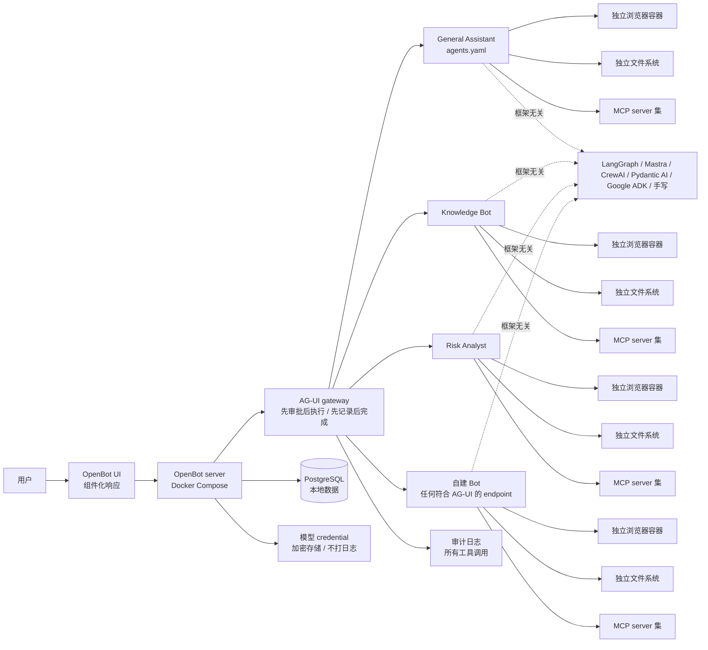

# CopilotKit/OpenBot

## 一句话定位
CopilotKit 官方开源的"AI 同事"自托管平台——每位 Bot 拥有独立的浏览器、文件系统、限定工具集，所有 action "先决定后执行、先记录后完成"；基于 AG-UI 协议，兼容 LangGraph / Mastra / CrewAI / Pydantic AI / Google ADK / 手写 endpoint。

## 它解决的问题
当企业试图把 agent 投入真实生产时，面临三重卡点：① **资源隔离**——多个 agent 不能共享同一浏览器/文件系统（登录态、cookie、cookies 互窜）；② **治理可见性**——agent 调用了哪些工具、产生了哪些副作用，必须可审计；③ **厂商绑定**——每家 agent 框架（LangGraph / CrewAI / ADK）都有自己的 runtime，企业被锁死。OpenBot 用三招回答：① 每 agent 独立容器化部署；② AG-UI 协议层内建"先审批后执行 + 全审计"语义；③ 任何符合 AG-UI 的 endpoint 都能成为 Bot，框架无关。

## 为什么值得关注（2026-08-23）
- **6 天 2,308⭐**（GitHub API 可核验）：增速极快，处于 agent governance 赛道头部
- **Alpha 状态明示**：README 顶部即声明"early, expect rough edges"，说明透明度而非营销包装
- **完整文档体系**：README + docs/architecture.md + docs/configuration.md + docs/coworkers.md + docs/deployment.md + docs/development.md + docs/plugins/，文档完备度在同类项目中罕见
- **CI + security_zizmor**：CI 流水线可见，且明确跑 zizmor（GitHub Actions 安全扫描器）
- **AG-UI 协议**（ag-ui-protocol）：把治理语义做进协议层，而非各家 SDK 各自实现

## 热度来源判断
**"agent governance × 协议化 × 自托管"三重驱动。** CopilotKit 在 CopilotKit 开源体系中是头部公司（已有 copilotkit 主项目与多个子项目），OpenBot 是其在"agent 平台"赛道的关键产品。**品牌 + 治理焦虑**双因素推升热度——2026 年企业部署 agent 时最常被问到的不是"模型准不准"，而是"出了事谁来负责"。OpenBot 把"审批 + 审计"做到协议层，符合企业的最小可信需求。**CopilotKit 的官方背书**带来大量早期 star，长期真实需求仍需观察产品稳定性与 docs 之外的实战表现。

## 关键技术亮点
1. **AG-UI 协议层治理：** Bot 所有工具调用都通过 AG-UI gateway，先审批后执行，先记录后完成——治理语义在协议层而非应用层
2. **每 agent 独立计算机：** 浏览器、文件系统、工具集均独立；登录态不共享
3. **模型无关：** 不绑定任何模型，credential 由管理员配置、加密存储、不打日志
4. **Docker Compose 一键部署：** 整套服务（含 PostgreSQL）通过 docker-compose 拉起
5. **三位示例 coworker：** General Assistant / Knowledge / Risk Analyst 通过 agents.yaml 配置，可直接复制改造
6. **generative UI：** Bot 的回答可以是"组件而非纯文本"，提升交互密度

## 架构师速览

| 决策问题 | 研究判断 | 证据边界 |
|---|---|---|
| 系统边界 | OpenBot 是自托管 agent 平台，承担"agent 资源隔离 + 工具调用治理 + 模型无关适配"；基于 AG-UI 协议实现治理语义 | 架构图与 docs/ 已公开；AG-UI 协议细节、各 framework 兼容深度、单 agent 浏览器隔离实现均待代码核验 |
| 主路径 | 用户 → OpenBot server → AG-UI gateway → Bot endpoint（任何符合 AG-UI 的 agent）→ 工具/MCP 调用 → 全审计 → 返回组件化响应 | 主路径为 README 描述；具体 AG-UI 消息格式、gateway 拦截策略、UI 组件契约均待协议规范核验 |
| 关键权衡 | "治理可见性"vs"agent 执行延迟"（每次工具调用都审批的额外开销）；"框架无关"vs"主流 framework 集成深度差异"；"本地部署"vs"运维成本" | 均为推断；gateway 拦截延迟、framework 兼容性矩阵、企业部署运维成本均待实测核验 |
| 最小 PoC | `docker compose up` 启动整套服务，配置一个 Claude / OpenAI credential，跑 Risk Analyst 示例 Bot 在隔离浏览器中执行"读取一个 URL 并写报告"任务，开启审计日志验证每一次工具调用都被记录 | PoC 范围与退出路径由"本地优先、单 Bot、可审计"原则推导；具体 docker-compose 命令、版本兼容、审计日志格式待核验 |

## 架构启发
OpenBot 的核心启发是 **"治理语义应在协议层而非应用层"**——传统做法是各家 SDK 各自实现"工具审批"，结果碎片化且难以审计；OpenBot 用 AG-UI 把治理做进协议层，所有符合 AG-UI 的 agent 自动获得治理能力，类似 LSP（Language Server Protocol）让任何编辑器都能用任何语言服务器。这降低了"agent 进入企业"的合规门槛。另一启发：**"Alpha 状态明示"是建立信任的开始而非缺陷**——README 顶部即声明早期阶段，比营销包装更让企业架构师信任，因为它降低了"踩坑预期错配"的风险。

## 架构图（MMD）

> 证据边界：此图只采用本档案已有可核验描述；"待核验"节点不应视为项目实现事实。

## 定位判断
**平台候选型项目（agent governance 赛道的协议层样本）。** OpenBot 不是又一个 agent 框架，而是"agent 平台的合规底座"——它的护城河是 AG-UI 协议而非某项 SDK 能力。短期看，Alpha 状态意味着生产成熟度不足；中期看，若 AG-UI 被更多 framework 接纳，OpenBot 可能成为 agent 进入企业的"事实治理标准"。对企业的判断关键：① 治理语义在协议层是否真能让审计通过；② AG-UI 协议规范的稳定性与扩展空间。

## 风险 / 局限 / 泡沫点
- **Alpha 早期风险：** 明确声明早期阶段，bug 与 breaking change 是常态，不建议当前用于生产
- **AG-UI 协议的成熟度：** ag-ui-protocol 仍在演进，协议层变更可能让 OpenBot 同步升级
- **单 user 模式默认开启：** `.env.example` 默认 `OPENBOT_SINGLE_USER=true`，任何人都以管理员身份接入；多用户部署必须显式配置 OAuth，否则安全风险极高
- **每 agent 一台独立浏览器的资源消耗：** 浏览器是重量级容器，3-5 个 Bot 可能需要数 GB 内存
- **CopilotKit 商业化路径不明：** OpenBot 本身 MIT，但 CopilotKit 可能有云版 / 企业版对标，开源版的功能边界需长期观察
- **governance gateway 的拦截粒度：** 每次工具调用都审批会带来延迟，对延迟敏感场景（实时对话）不友好

## 与同类项目的关系
- **vs LangChain / LangGraph：** 那些是 SDK；OpenBot 是平台 + 协议层
- **vs AutoGen / CrewAI：** 那些聚焦"多 agent 协作编排"；OpenBot 聚焦"agent 治理与隔离"
- **vs yetone/cumora：** 都属"agent 团队化"——cumora 走"团队聊天为先"，OpenBot 走"独立计算机 + AG-UI 治理"
- **vs cloudflare/computer：** 都提供"agent 独立计算机"，但 cloudflare/computer 是云端沙箱，OpenBot 是本地 Docker Compose
- **vs Snyk / Veracode（安全治理）：** 那些面向 SAST / 应用安全；OpenBot 面向 agent 行为治理——两者可互补

## 是否值得持续跟踪
**值得持续跟踪（agent governance 赛道的协议层样本）。** 6 天 2.3k⭐的增速说明赛道真实且强烈。建议关注：① AG-UI 协议规范的稳定性与主流 framework 接纳速度；② Alpha → Beta → GA 的版本节奏与生产可用性；③ CopilotKit 商业化路径（云版 SKU 是否稀释开源版）。对企业架构师，OpenBot 值得作为"agent 治理基线"对照参考；对独立开发者，AG-UI 协议层是值得关注的"治理语义标准化"窗口。

## 后续观察点
- AG-UI 协议规范的演进（特别是工具审批 / 审计日志的标准化程度）
- Alpha → Beta → GA 的版本节奏与每次的 breaking change 范围
- 主流 framework（LangGraph / CrewAI / ADK）官方是否明确推荐 AG-UI 作为标准治理层
- CopilotKit 商业版（云 SaaS）的功能边界与开源版差异
- 每 agent 独立浏览器的资源优化（headless 浏览器复用、容器复用等）

---
> 数据来源: GitHub API (2026-08-23) | Stars: 2,308 | Forks: 265 | License: MIT | 语言: TypeScript | 创建: 2026-08-17 | 推送到 main: 2026-08-22
