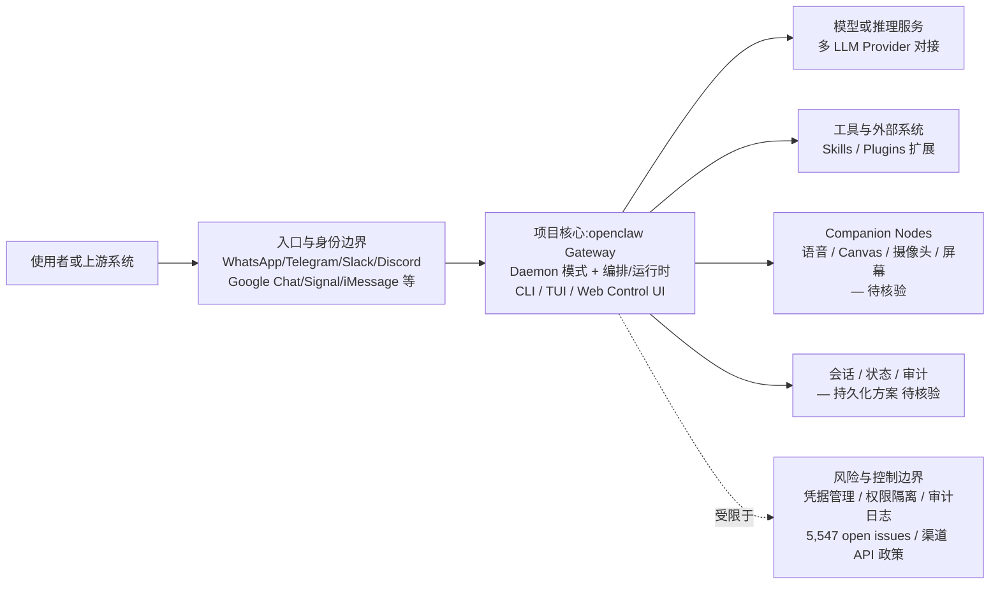

# openclaw/openclaw

## 一句话定位
运行在你自己设备上的个人 AI 助手平台——通过一个 Gateway 连接模型、工具、消息渠道和配套应用，让 AI 助手出现在你已有的聊天渠道中（WhatsApp、Telegram、Slack、Discord 等）。

## 它解决的问题
AI 助手碎片化问题：用户在不同平台使用不同的 AI（ChatGPT 网页版、Claude 桌面端、Gemini 手机端），数据分散、体验割裂。OpenClaw 的方案是：一个自托管的 Gateway 作为控制面，连接你选择的所有 LLM 模型和所有消息渠道，实现"一个助手，无处不在，数据自有"。

## 为什么值得关注
- **385,445 stars**，GitHub 上 star 数最高的个人 AI 助手项目
- **全渠道覆盖**：WhatsApp、Telegram、Slack、Discord、Google Chat、Signal、iMessage 等主流消息平台
- **Gateway 架构**：本地控制面管理会话、工具、事件和渠道连接
- **多入口**：CLI、TUI、Web Control UI、Companion Apps 多种交互方式
- **跨平台安装**：macOS、Linux、Windows 原生支持，一行命令安装

## 热度来源判断
热度来自"Own Your Data"（数据自主权）理念与个人 AI 助手需求的交汇。在 ChatGPT/Claude 等商业产品引发隐私担忧的背景下，自托管个人 AI 助手的概念获得了巨大关注。TypeScript 生态和 npm 分发降低了部署门槛。star 数的爆发式增长（2025-11 创建，8 个月达到 385k）表明市场对这一方向的高度认可。

## 关键技术亮点亮点
- **Gateway 架构**：单一本地控制面，管理所有模型连接、工具调用、事件路由和渠道适配
- **Channel 适配层**：统一抽象了不同消息平台的 API 差异（发送/接收/富文本/媒体）
- **Companion Nodes**：可扩展的节点系统，支持语音、Canvas、摄像头、屏幕等设备能力
- **Daemon 模式**：后台常驻 Gateway，随时响应消息渠道的事件
- **Plugin/Skill 生态**：支持通过 Skills 和 Plugins 扩展能力

## 架构师速览

| 决策问题 | 研究判断 | 证据边界 |
|---|---|---|
| 系统边界 | OpenClaw 是部署在自有设备上的 Gateway 控制面，作为消息渠道、模型 Provider、工具/数据源之间的编排层，不替代 LLM 也不替代消息平台 | 仅基于档案中"Gateway 架构""Channel 适配层""Companion Nodes""Plugin/Skill 生态"表述；具体协议、IPC 与持久化未披露 |
| 主路径 | 使用者经 WhatsApp/Telegram/Slack/Discord 等渠道入口进入本地 Gateway，Gateway 编排调用选定 LLM 与 Skills/Plugins，回写会话与状态，并可能联动 Companion Nodes（语音/Canvas/摄像头/屏幕） | 渠道列表、Companion Nodes 能力、Daaemon 模式明确；模型调用协议、工具调用协议与会话存储格式均待核验 |
| 关键权衡 | 渠道广度（9+ 平台覆盖）与单渠道深度 / 供应商耦合之间的取舍；扩展速度 vs 凭据管理、权限隔离、可观测性 | 渠道列表与"渠道 API 政策变化可能影响核心功能"为档案明示；安全模型成熟度被列为后续观察点，本档案未给出实现证据 |
| 最小 PoC | 单设备单渠道（如 Telegram），关闭其他入口，最小工具权限 + 可审计日志，跑通 Gateway Daemon + 单一 LLM Provider + 1 个 Skill，验证延迟、成本与凭据隔离后再扩面 | 档案仅给出"先在单一渠道、最小工具权限和可审计日志下验证"的采用建议；安装命令原文、性能基线、SLO 指标待核验 |

## 架构启发
OpenClaw 的核心启发在于"Gateway as Control Plane"——不试图替代 LLM 模型，而是成为模型能力的"路由器"和"编排器"。这种定位让它可以同时利用所有主流模型的优势，而不受限于单一供应商。消息渠道的统一抽象也是重要设计——将 AI 助手带入用户已有的沟通场景，而非要求用户迁移到新平台。

## 架构图（MMD）

> 证据边界：此图只采用本档案已有可核验描述；“待核验”节点不应视为项目实现事实。

## 定位判断
**个人 AI 助手基础设施平台**，定位为"自托管版 ChatGPT + Zapier + IFTTT"。是当前最完整的开源个人 AI 助手方案。

## 风险 / 局限 / 泡沫点
- **运维门槛**：自托管 Gateway 需要一定的技术能力，普通用户难以使用
- **star 泡沫质疑**：385k stars 在 8 个月内达成，增速异常，可能存在营销驱动或机器人 star
- **5,547 个 open issues**：项目快速增长带来的维护压力已显现
- **渠道 API 依赖**：WhatsApp/iMessage 等平台 API 政策变化可能影响核心功能
- **安全风险**：自托管 AI 助手拥有消息渠道访问权，一旦被入侵影响面极大

## 与同类项目的关系
- **概念先驱**：受 Goose（Block）、Jan 等本地 AI 助手项目启发，但渠道覆盖更广
- **竞品**：Jan（本地模型优先）、Ollama（推理引擎层）、Mycroft/OpenVoiceOS（语音优先）
- **生态关系**：上游依赖各 LLM Provider API，下游连接消息渠道

## 是否值得持续跟踪
**高度值得跟踪**。作为个人 AI 助手领域 star 数最高的项目，其 Gateway 架构和渠道适配设计代表了这一赛道的技术方向。无论其 star 数是否有泡沫，项目本身的架构设计值得深入研究。

## 后续观察点
- 385k stars 的活跃度（fork、issue、PR 的质量 vs 数量）
- Gateway 架构能否支撑企业级多人协作场景
- 渠道覆盖的广度 vs 深度权衡（每个渠道的功能完整度）
- 安全模型的成熟度（凭据管理、权限隔离、审计日志）

---
> 数据来源: GitHub API (2026-08-07) | Stars: 385,445 | Forks: 81,024 | 语言: TypeScript | License: 自定义 | 首次发现: 2026-06-17
