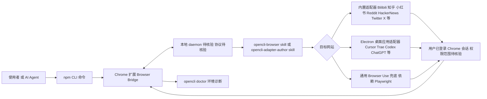

# OpenCLI

## 一句话定位
将任意网站变成 CLI——通过 Browser Bridge 扩展连接已登录的 Chrome 浏览器，为人类和 AI Agent 提供确定性的网站交互接口。

## 它解决的问题
AI Agent 需要操作网站（填表单、点按钮、提取数据、导航），但：
- 每个网站的 DOM 结构不同，交互逻辑不同
- 很多网站需要登录态，API 方式无法复用用户会话
- Browser Use 虽然灵活但不确定性高，不适合重复性操作

OpenCLI 的解法：把网站交互抽象为 CLI 命令，确定性执行，复用用户已登录的浏览器会话。

## 为什么值得关注（2026-07-12）
26K+ star，212 open issues，持续活跃。它覆盖了三层自动化：
1. **内置适配器** — Bilibili、知乎、小红书、Reddit、HackerNews、Twitter/X 等
2. **AI Agent 操作任意网站** — `opencli-browser` skill 让 Agent 通过 primitives 导航、点击、输入、提取
3. **适配器开发工具链** — `opencli-adapter-author` skill 指导从侦察到代码的端到端开发

## 热度来源判断
- **Browser Use 赛道上升** — Agent 操作浏览器是 2026 年的核心方向之一
- **中国市场适配** — 内置 Bilibili/知乎/小红书 等中文平台适配器
- **Agent Skill 集成** — 可直接被 Claude Code/Cursor 等 Agent 使用
- **多入口分发** — npm CLI + Chrome 扩展 + 桌面 App（OpenCLIApp）

## 关键技术亮点亮点
1. **Browser Bridge 架构** — Chrome 扩展 + 本地 daemon，Agent 通过 CLI 命令操作浏览器
2. **三层抽象** — 内置适配器（确定性）/ Agent Browser Use（灵活性）/ 适配器开发（可扩展）
3. **已登录浏览器复用** — 不需要传递 credentials，直接用用户的浏览器 session
4. **适配器生态** — 覆盖社交媒体、内容平台、桌面 App（Cursor/Trae/Codex/ChatGPT 等 Electron 应用）
5. **`opencli doctor` 诊断** — 环境检查工具，降低配置摩擦

## 架构师速览

| 决策问题 | 研究判断 | 证据边界 |
|---|---|---|
| 系统边界 | OpenCLI 由 npm CLI + Chrome 扩展 + 本地 daemon + 桌面 App 组成，对外暴露 CLI 与 `opencli-browser`/`opencli-adapter-author` 两个 Agent Skill，作用面是"已登录 Chrome 中被打开的网站"。 | 档案明确列出三类入口与两个 skill；daemon 与扩展之间的协议未描述，标为待核验。 |
| 主路径 | Agent/人类下发 CLI 命令 → 扩展在已登录 Chrome 中定位目标网站 → 由 Bilibili/知乎/小红书/Reddit/HackerNews/Twitter-X 等内置适配器或 `opencli-browser` 原语执行导航/点击/输入/提取 → 结果回写，可经 `opencli doctor` 排错。 | 路径与适配器名单来自档案；具体编排、回传协议与状态存储未描述，标为待核验。 |
| 关键权衡 | 复用登录态换取零 credential 管理 vs. 拿到用户在该站的全量会话权限；确定性内置适配器 vs. 浏览器改版后的脆弱性；Playwright 底层能力上限 vs. 跨站覆盖速度。 | 权衡基于档案"风险/局限"段；扩展↔daemon 安全模型、隐私隔离细节未在档案中给出，标为待核验。 |
| 最小 PoC | 在一台装有 Chrome + Node 的机器上安装扩展与 CLI，跑一条针对单一内置适配器（如 HackerNews）的只读命令，再用 `opencli doctor` 校验环境；验证登录态复用与改版对抗两条线后再引入 Agent Skill。 | 验收项来自档案"doctor""已登录浏览器复用""网站改版对抗"三条断言；具体命令、版本与依赖未在档案给出，标为待核验。 |

## 架构启发
- **"把网站变成 CLI"** — 这是一个重要的抽象层次。不是做通用 Browser Use（不确定性高），而是为每个网站定义确定性接口，再用 Browser Use 做兜底
- **确定性 + 灵活性分层** — 内置适配器提供确定性（已知网站），Browser Use 提供灵活性（未知网站），适配器开发工具链提供可扩展性（新网站）
- **本地浏览器作为 Agent 的执行环境** — 复用用户登录态避免了 credential 管理问题，但也引入了安全考量

## 架构图（MMD）

> 证据边界：此图只采用本档案已有可核验描述；“待核验”节点不应视为项目实现事实。

## 定位判断
工具型（有平台候选潜力）。当前是 Agent 浏览器交互层的实用工具，但 adapter 生态有平台化空间——如果能成为 Agent 操作网站的标准接口层，将升维为平台候选。

## 风险 / 局限 / 泡沫点
1. **登录态安全风险** — 使用已登录浏览器意味着 Agent 拥有用户的全部会话权限
2. **网站改版对抗** — 与 Knockoff 类似，适配器依赖页面结构
3. **维护成本** — 每个网站适配器需要持续维护，覆盖面与维护成本的 trade-off
4. **Playwright 依赖** — 底层依赖 Playwright，受限于其能力和性能特征

## 与同类项目的关系
- **Agent-Reach（54K⭐）** — 偏数据获取（读），OpenCLI 偏交互（读+写）
- **Firecrawl（149K⭐）** — 大规模 Web 数据抓取，非交互
- **Browser Use** — 通用浏览器自动化，OpenCLI 在其上提供结构化封装
- **Playwright MCP** — 更底层的浏览器自动化 MCP，OpenCLI 提供更高层抽象

## 是否值得持续跟踪
是。Browser Use 赛道正在上升，OpenCLI 的"网站→CLI"抽象有独特价值。

## 后续观察点
1. 适配器生态的增长速度——是否能形成社区驱动的适配器市场
2. 企业场景适用性——登录态管理在 enterprise 环境中如何解决
3. 与 MCP 协议的关系——是否会提供 MCP server 接口
4. 与 Browser Use 框架的竞合演化

---
*首次记录：2026-07-12*
