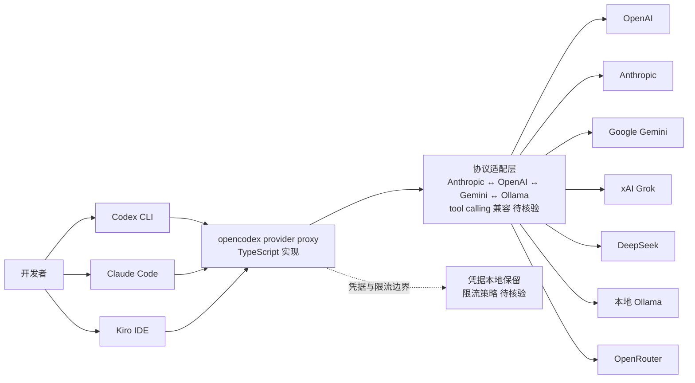

# lidge-jun/opencodex

## 一句话定位
通用 provider proxy，让 OpenAI Codex CLI 与 Claude Code 同时接入任意 LLM（Claude、Gemini、Grok、DeepSeek、Ollama、OpenRouter 等）——把"harness 锁定单一厂商"的问题转化为"harness 与模型解耦"。

## 它解决的问题
2026 年的 coding agent harness 普遍"绑死在自家模型"——OpenAI Codex CLI 默认用 OpenAI、Claude Code 默认用 Anthropic、Kiro 默认用 AWS Bedrock。用户想换模型（如用 DeepSeek 跑便宜、用本地 Ollama 跑隐私）就得换 harness，工具链碎片化严重。opencodex 在 harness 与模型之间架一层 provider proxy：① 复用现有 harness（Codex CLI、Claude Code）；② 通过兼容层接入任意 LLM；③ 20+ 模型 tags 表明覆盖主流供应商。解决的是 **"harness 锁定 vs 模型可替换"的二元矛盾**——是 harness 时代的"中间件"。

## 为什么值得关注（2026-08-22）
- **增长真实**：65 天 11,667⭐（GitHub API 可核验），TypeScript 实现。
- **覆盖广度**：官方 topics 列出 20 个相关标签，包括 `ai-gateway`、`llm-proxy`、`anthropic`、`openai`、`deepseek`、`ollama`、`openrouter` 等——是已知 harness proxy 中覆盖最广之一。
- **跨 harness 兼容**：同时支持 Codex CLI 与 Claude Code 两种主流 harness，比单一 harness proxy（只能服务 Codex 或只能服务 Claude）有更广用户基础。
- **Kiro 兼容**：topics 含 `kiro`——意味着也可服务 AWS 的 IDE，进一步证明"代理层"价值。

## 热度来源判断
**模型焦虑 × 厂商锁定反感 × 工具链复用需求三重驱动。** 自 2025 下半年起，AI 圈对"厂商绑定"的反思持续加深（OpenAI 涨价、Anthropic 限速、模型迭代频繁），"用同一个 harness 跑任意模型"是工程师的核心痛点。opencodex 65 天 1.1 万星，证明中间层有真实需求。但需警惕：**模型代理层的"覆盖广度"容易让用户误以为无成本**——实际 token 计费差异、上下文窗口差异、tool calling 协议差异都需逐项适配。

## 关键技术亮点
1. **20+ 标签覆盖**：topics 同时含 OpenAI / Anthropic / Google Gemini / xAI Grok / DeepSeek / Ollama / OpenRouter / Kiro——是已知中间层中覆盖面最广之一。
2. **跨 harness 兼容**：同时支持 Codex CLI 与 Claude Code，意味着同一 provider proxy 可服务两个不同工作流。
3. **TypeScript 实现**：与 Node 生态无缝集成，对前端 / 全栈开发者友好。
4. **AI Gateway 定位**：topics 含 `ai-gateway`、`llm-proxy`、`proxy`——定位清晰，是协议适配而非模型路由。
5. **OpenRouter 集成**：可作为上层（OpenRouter 已聚合多家厂商），但用户选 opencodex 多是"不想经过 OpenRouter 中转"或"想统一管理 credentials"。

## 架构师速览

| 决策问题 | 研究判断 | 证据边界 |
|---|---|---|
| 系统边界 | Codex CLI / Claude Code 与 LLM Provider 之间的协议适配层，承担请求转换、模型路由、token 兼容性调整；不替代 harness 也不替代模型 API | 仅基于档案描述的 20+ topics 与 cross-harness 兼容；具体协议转换矩阵（Anthropic ↔ OpenAI ↔ Gemini 字段映射）、tool calling schema 兼容性未在档案中给出 |
| 主路径 | 用户调用 Codex CLI 或 Claude Code → opencodex 拦截 → 协议适配（Anthropic ↔ OpenAI ↔ Gemini ↔ Ollama...）→ 选定 LLM API → 响应回写 → harness 收到兼容格式响应 | 主路径为档案语义抽象；具体拦截方式（CLI wrapper / 透明代理 / 配置注入）、计费归一化、错误回退策略均待核验 |
| 关键权衡 | 覆盖广度（20+ 标签）vs 单模型深度（不同模型 tool calling、流式响应、上下文窗口差异显著）；跨 harness 兼容（Codex + Claude）vs 单 harness 专注时的易用性；本地代理（凭据本地保留）vs 云端代理（部署简易） | 覆盖广度与跨 harness 兼容由 topics 直接证明；凭据管理、错误回退、限流策略等深度问题均待核验 |
| 最小 PoC | 选一个真实小项目，固定 harness（如 Claude Code），跑三个对比：① 直接 Anthropic；② opencodex 转 OpenAI；③ opencodex 转本地 Ollama。对比 tool calling 准确率、token 计费、延迟，验证"代理透明性"后再扩展到第二 harness | PoC 范围由档案"先验证代理透明、再扩面"原则推导；具体命令、兼容字段表、SLO 指标待核验 |

## 架构启发
opencodex 的核心启发是 **"在 AI 工具栈中重演 HTTP 代理"**——1990s 浏览器需要代理才能上网，2026s coding agent 需要代理才能换模型。更深层的启发是 **"中间层永远有商业价值"**：当上层应用（harness）与底层资源（model）都开始碎片化时，"协议 + 兼容层"就能赢得用户。opencodex 的话题热度证明：在 GenAI 时代，**用户不希望被绑死**，即使是 OpenAI / Anthropic 这样的巨头也无法阻止中间件生态。对照 OpenRouter（云端聚合）、litellm（Python 库）、Portkey（网关），opencodex 是"TypeScript 优先 + cross-harness"的差异化定位。

## 架构图（MMD）

> 证据边界：此图只采用本档案已有可核验描述；"待核验"节点不应视为项目实现事实。

## 定位判断
**harness 中间层 / Provider Proxy**。opencodex 是"harness 时代中间件"赛道的代表项目，差异化在于：① TypeScript 优先（与 Node 生态吻合）；② 同时支持多个 harness（不止 Codex 或不止 Claude）；③ 覆盖广度 20+ 标签（含本地 Ollama）。11k 星在 65 天达成，证明中间层有真实需求——尤其当用户从"单一厂商"扩展到"多模型 A/B 测试"或"按成本切换"时。但**生产化前需验证**：① 各模型 tool calling 兼容度；② 长上下文窗口截断风险；③ 凭据管理与审计合规。

## 风险 / 局限 / 泡沫点
- **覆盖广度的代价**：每支持一个新模型，都要适配其 tool calling、流式响应、错误码、限流策略；版本升级极易破坏兼容。
- **协议不对称的盲区**：Anthropic 的"thinking blocks"、OpenAI 的"reasoning tokens"、Gemini 的"system instructions"等差异化字段，代理层可能丢失或误转换。
- **依赖多个上游**：opencodex 的可靠性 = 最弱上游（DeepSeek / Ollama / OpenRouter 任一宕机都影响用户）。
- **社区项目的可持续性**：个人维护（lidge-jun）一旦精力分散，更新频率会下降；模型迭代速度快，中间层常需追版本。
- **可能的厂商反制**：OpenAI / Anthropic 若收紧 API 条款（要求直连、限制代理转发），opencodex 的可用性会受影响。
- **指标失真**：65 天 1.1 万星是真实增长，但需与类似项目（OpenRouter、litellm、Portkey）对比，关注是否可持续。

## 与同类项目的关系
- **vs OpenRouter**：云端 SaaS 聚合，按 token 抽成；opencodex 是本地代理，无中转成本。
- **vs litellm**：Python 库为主，服务 Python 应用；opencodex 是 TypeScript 服务 Node / harness。
- **vs Portkey**：企业级 AI 网关，含可观测性 / 审计；opencodex 是开发者自部署。
- **vs Anthropic prompt caching 兼容层**：仅优化单家；opencodex 跨厂商。
- **vs OpenAI 兼容协议标准化**：若出现"统一 LLM 协议标准"（如 MCP 类扩展），opencodex 的适配层价值可能被吸收。

## 是否值得持续跟踪
**值得跟踪（harness 中间层赛道风向标）**。opencodex 体现了用户对"模型可替换性"的真实需求。建议关注：① 是否扩展到更多 harness（Cursor、Aider、Cline）；② 是否引入 token 成本优化（如自动路由到最便宜的等价模型）；③ 是否被厂商正式承认或反制（OpenAI、Anthropic 的政策）。对开发者：可直接采用——尤其当需要"在 Claude Code 中用本地 Ollama"或"在 Codex CLI 中用 DeepSeek"时。对 harness 厂商：应警惕被绕过——opencodex 类项目意味着"用户用我的 harness 但不用我的模型"成为可能。

## 后续观察点
- 是否扩展到 Cursor / Aider / Cline 等 harness
- 是否引入"按成本自动路由"或"延迟自动路由"等智能能力
- 与 OpenRouter / litellm / Portkey 的差异化是否持续
- 厂商政策变化（OpenAI / Anthropic 是否限制代理转发）
- token 计费与限流的兼容层成熟度

---
> 数据来源: GitHub API (2026-08-22) | Stars: 11,667 | Language: TypeScript | 创建: 2026-06-18 | 官方 topics: 20 个相关标签，含 ai-gateway、llm-proxy、anthropic、openai、deepseek、ollama、openrouter、kiro