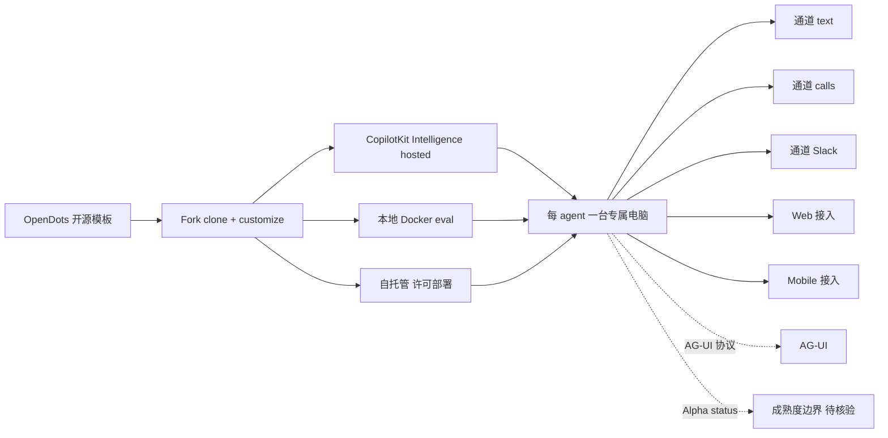

# CopilotKit/OpenDots

## 一句话定位
持续 AI 同事开源模板——每 agent 一台专属电脑，跨 text/calls/Slack 三通道，CopilotKit Intelligence 三档（hosted / 本地 Docker eval / 自托管）+ AG-UI 协议 + Web/Mobile + MIT 商用清晰。

## 它解决的问题
2026 年 AI agent 多为"聊天框 + 工具调用"形态，难以承担"24/7 持续 AI 同事"角色。OpenDots 提供"每 agent 一台专属电脑"的开源模板，把持续运行 agent 从"演示 demo"推向"production template"。同时通过 CopilotKit Intelligence 三档（hosted / 本地 Docker eval / 自托管）让用户根据数据敏感度选择部署方式。目标用户是希望部署 24/7 AI 同事的企业（Slack 集成 + calls）+ 独立开发者（自托管）+ 移动端需求（Web/Mobile）。

## 为什么值得关注
- **Stars:** 4,167（截至 2026-10-08），9 天突破 4100
- **Forks:** 575
- **License:** MIT
- **语言:** TypeScript
- **规模:** 19,351 KB
- **覆盖:** Always-on AI coworkers + text/calls/Slack 三通道 + 每 agent 一台专属电脑 + CopilotKit Intelligence 三档 + AG-UI + Web/Mobile + Alpha
- **趋势:** Trendshift #2 TypeScript Repository Of The Day
- **组织:** CopilotKit（AG-UI 协议维护者）

## 热度来源判断
OpenDots 的热度是 **"持续 AI 同事刚需 × 每 agent 专属电脑差异化 × CopilotKit Intelligence 三档部署 × AG-UI 协议 × Trendshift #2 TypeScript 趋势"** 的强劲组合。传统 agent 框架（LangChain、CrewAI、AutoGen）多为多 agent 编排，不解决"持续运行 + 专属电脑隔离"。OpenDots 通过"每 agent 一台电脑"提供差异化能力，且作为 CopilotKit 官方模板享有 AG-UI 协议红利。575 个 forks 反映企业用户对其模板化能力的期待。热度**真实且具模板化潜力**——但需警惕：（1）每 agent 一台电脑的资源开销大；（2）CopilotKit Intelligence 三档功能等价性未验证；（3）Alpha status 与 Beta 工具的差距；（4）持续运行成本与商用授权边界。

## 关键技术亮点
1. **每 agent 一台专属电脑：** 隔离机制确保 24/7 持续运行
2. **三通道：** text + calls + Slack 跨平台通讯
3. **CopilotKit Intelligence 三档：** hosted / 本地 Docker eval / 自托管
4. **AG-UI 协议：** 标准化 agent UI 通信
5. **Web + Mobile 双端：** 跨平台覆盖
6. **开源模板：** Clone + customize 路径
8. **CI 自动化：** CI workflow 严肃工程化承诺
9. **Slack 集成：** 企业协作通道
10. **MIT 商用清晰：** 可商用

## 架构师速览

| 决策问题 | 研究判断 | 证据边界 |
|---|---|---|
| 系统边界 | 持续 AI 同事开源模板——Always-on AI coworkers that move between text, calls, and Slack + 每 agent 一台专属电脑 + 跨 Web/Mobile + CopilotKit Intelligence（hosted / 本地 Docker eval / 自托管）+ AG-UI + Alpha + Trendshift #2 TypeScript + MIT | 仅基于 README 描述的 OpenDots 模板 + CopilotKit Intelligence + AG-UI + Web/Mobile + Trendshift；具体每 agent 一台专属电脑隔离机制 / AG-UI 协议完整度 / 自托管严肃工程化承诺未在档案中明示 |
| 主路径 | 模板 fork → 自托管（hosted / 本地 Docker eval / 自托管）→ 配置 CopilotKit Intelligence → 每 agent 一台专属电脑 → 跨 text/calls/Slack 三通道 → Web/Mobile 接入 | 主路径为档案语义抽象；具体每 agent 电脑隔离机制 / AG-UI 协议严谨度 / 自托管严肃工程化承诺未在档案中讨论 |
| 关键权衡 | 每 agent 一台专属电脑 vs 共享 runtime + 跨 text/calls/Slack 三通道 vs 单通道 + CopilotKit Intelligence 三档（hosted / 本地 Docker eval / 自托管）vs 单档 + Web/Mobile 跨平台 vs 单平台 + Alpha status vs Beta + MIT 商用清晰 vs SaaS | 档案明示每 agent 一台专属电脑 + 三通道 + CopilotKit Intelligence 三档 + Web/Mobile + Alpha + MIT；具体每 agent 电脑隔离机制 / AG-UI 协议严谨度 / 自托管严肃工程化承诺未在档案中讨论 |
| 最小 PoC | git clone CopilotKit/OpenDots → 自托管（hosted 或 本地 Docker eval 或 自托管）→ 配置 CopilotKit Intelligence → 验证每 agent 一台专属电脑 → 验证 text/calls/Slack 三通道 → 验证 Web/Mobile 接入 → 跟踪 CI | PoC 范围由档案「每 agent 一台专属电脑 + text/calls/Slack + CopilotKit Intelligence + AG-UI + Web/Mobile + Alpha」建议推导；具体每 agent 电脑隔离机制 / AG-UI 协议严谨度 / 自托管严肃工程化承诺未在档案中讨论 |

## 架构启发
OpenDots 的核心启发是 **"持续 AI 同事需要每 agent 一台专属电脑 + 多档部署选项"**。当前 agent 框架多关注"多 agent 编排"，OpenDots 则把"持续运行 + 隔离"作为差异化——每 agent 一台电脑避免相互影响，类似 Slack 经典多 channel 设计。CopilotKit Intelligence 三档（hosted / 本地 Docker eval / 自托管）覆盖从 SaaS 到完全自托管的完整路径，特别适合数据敏感型企业。更深层的启发是：**AG-UI 协议作为 agent UI 标准化层，可与 MCP 协议形成"agent 通信 + agent UI"双协议栈**。决定其能否成为"持续 AI 同事标准模板"的是每 agent 一台电脑的隔离机制严肃工程化承诺 + AG-UI 协议完整度 + Alpha → Beta 升级路径。

## 架构图（MMD）

> 证据边界：此图只采用本档案已有可核验描述；"待核验"节点不应视为项目实现事实。

## 定位判断
**工具型项目（持续 AI 同事模板）。** OpenDots 是 CopilotKit 推出的"持续 AI 同事"开源模板，把"每 agent 一台专属电脑"作为核心差异化（区别于传统聊天框 + 工具调用）。CopilotKit Intelligence 三档（hosted / 本地 Docker eval / 自托管）+ AG-UI + Web/Mobile 跨平台 + Alpha status 是其商业化路径。9 天 4167⭐ ⑂575 fork/star 13.8% + Trendshift #2 TypeScript Repository Of The Day 说明社区关注度。决定其长期价值的是每 agent 一台专属电脑隔离机制 + AG-UI 协议严谨度 + 自托管严肃工程化承诺 + Alpha 升级到 Beta/GAPoC 路径。

## 风险/局限/泡沫点
- **每 agent 一台专属电脑隔离成本：** 资源开销大，单 VPS 可能跑不起多个 agent
- **AG-UI 协议成熟度：** 协议完整度与生态广度未充分验证
- **CopilotKit Intelligence 锁定：** 三档都依赖 CopilotKit 基础设施
- **Alpha status 严肃工程化承诺：** 与 Beta 工具的功能/稳定性差距
- **自托管严肃工程化承诺：** 与 hosted/Docker eval 的功能等价性
- **Web/Mobile 跨平台 UX 一致性：** 移动端 UX 简化是否影响核心价值
- **三通道（text/calls/Slack）覆盖率：** Slack 集成深度 vs text/calls
- **持续运行成本：** 24/7 agent 资源消耗与商用授权
- **CI 严肃工程化承诺：** CI 配置完整度与覆盖率
- **Trendshift 排名波动：** 热度排名短期波动大

## 与同类项目的关系
- **vs Lindy AI：** 商用持续 AI 同事，OpenDots 开源模板差异化
- **vs CrewAI：** 多 agent 编排框架，OpenDots 持续 agent 模板差异化
- **vs AutoGen：** 多 agent 编排框架，OpenDots 持续 agent + 三通道差异化
- **vs Letta（MemGPT）：** 长期记忆 agent，OpenDots 持续 agent + 跨通道差异化
- **vs Zapier AI：** 工作流自动化，OpenDots 持续 AI 同事模板差异化

## 是否值得持续跟踪
**值得跟踪（持续 AI 同事模板）。** OpenDots 是 CopilotKit 推出"持续 AI 同事"开源模板的代表作，9 天 4167⭐ ⑂575 fork/star 13.8% + Trendshift #2 TypeScript 说明社区关注。建议关注：（1）每 agent 一台专属电脑隔离机制的工程严肃工程化承诺；（2）AG-UI 协议完整度；（3）CopilotKit Intelligence 三档功能等价性；（4）Alpha → Beta 升级路径；（5）三通道（text/calls/Slack）集成深度。

## 后续观察点
- 每 agent 一台专属电脑的隔离机制严肃工程化承诺
- AG-UI 协议完整度与生态广度
- CopilotKit Intelligence 三档功能等价性
- Alpha → Beta 升级路径
- 三通道（text/calls/Slack）集成深度
- Web/Mobile 跨平台 UX 一致性

---
> 数据来源: GitHub API (2026-10-08) | Stars: 4,167 | Forks: 575 | License: MIT | 语言: TypeScript | 创建: 2026-09-29 | Size: 19,351 KB