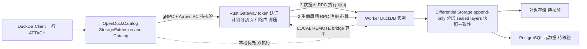

# openduck — 开源分布式 DuckDB

## 一句话定位

开源分布式 DuckDB 实现，DuckDB 扩展 + Rust gateway/worker，通过开放 gRPC + Arrow IPC 协议实现差分存储（differential storage）和混合双执行（dual execution），让 DuckDB 像 MotherDuck 一样工作但完全自托管。

## 它解决的问题

DuckDB 已成为分析领域的「SQLite」—— 单进程、零配置、高性能 OLAP。但它不支持分布式查询。MotherDuck 提供了商业云方案但不开源。openduck 用开源协议和开放后端重新实现 MotherDuck 的核心能力（差分存储 + 双执行 + `ATTACH` 方案），一行 `ATTACH 'openduck:mydb'` 即可透明挂载远程数据库。

## 为什么值得关注

- **565 stars / 27 forks**，MIT 许可证，C++ + Rust 实现
- **差分存储 + 双执行**：复刻 MotherDuck 的核心架构（MotherDuck 博客引用），但完全开源
- **开放协议**：gRPC + Arrow IPC，任何能返回 Arrow 的服务都可作为后端
- **DuckDB 原生集成**：实现 DuckDB 的 `StorageExtension` 和 `Catalog` 接口，远程表是一等公民
- **一行 attach**：`ATTACH 'openduck:mydb?endpoint=http://localhost:7878&token=xxx' AS cloud`

## 热度来源判断

- **DuckDB 生态位空白驱动。** 单机分析有 DuckDB，分布式分析缺一个轻量开源方案
- 565 stars 不高但方向正确，在 DuckDB 热度持续攀升的背景下有天然吸引力
- MotherDuck 商业成功的验证了差分存储 + 双执行方向

## 关键技术亮点亮点

1. **差分存储（Differential Storage）**：append-only 分层 + PostgreSQL 元数据，不可变 sealed layers + 对象存储，快照提供一致性读取
2. **混合双执行（Dual Execution）**：单条查询可在本地和远程 worker 间拆分，gateway 分割计划、标注 LOCAL/REMOTE 算子、插入 bridge 算子
3. **开放协议**：两个数据面 RPC（执行查询 + 取消）+ 两个生命周期 RPC（注册 + 心跳），任何 gRPC + Arrow 服务可作后端
4. **DuckDB 原生 Catalog**：远程表参与 JOIN、CTE、优化器，如同本地表
5. **Rust gateway**：token 认证、worker 注册、亲和路由、计划分割、背压

## 架构师速览

| 决策问题 | 研究判断 | 证据边界 |
|---|---|---|
| 系统边界 | 客户端 DuckDB 进程 → OpenDuckCatalog（StorageExtension/Catalog 抽象）→ [gRPC + Arrow IPC] → Rust Gateway → Worker（DuckDB 实例）+ Differential Storage（append-only 分层 + PostgreSQL 元数据 + 对象存储 sealed layers） | 边界描述基于档案引用的公开资料，4 个 RPC（2 数据面 + 2 生命周期）、worker 亲和路由、背压等具体机制需源码核验 |
| 主路径 | 一行 `ATTACH 'openduck:mydb?endpoint=http://localhost:7878&token=xxx'` → Catalog 暴露远程表 → Gateway 分割计划、标注 LOCAL/REMOTE 算子、插入 bridge → Worker 执行 → 快照一致性读取返回 Arrow | 计划分割算法的正确性、性能、双执行拆分边界在档案中未给出基准 |
| 关键权衡 | 开放协议可替换后端（任何 Arrow 返回服务）vs 早期阶段功能完整度未知；DuckDB 原生 Catalog 一等公民体验 vs 双执行引擎计划分割的优化复杂度；MIT 自托管 vs 社区规模小、DuckDB Labs 可能推出竞争方案 | 性能、稳定性、查询优化正确性档案中均未提供基准或案例 |
| 最小 PoC | 单机部署 Gateway + 一个 Worker，挂载 PostgreSQL 元数据 + 本地对象存储，跑 JOIN/CTE 验证远程表参与本地优化器的能力；验收项含 token 认证链路、取消 RPC、快照一致性、失败恢复、SLO 退出路径 | 生产部署形态、HA 配置、多 worker 亲和策略细节档案未述，需源码/文档核验 |

## 架构启发

```
DuckDB Client → OpenDuckCatalog → [gRPC + Arrow IPC] → Gateway (Rust) → Workers (DuckDB)
                                                                              ↓
                                                                    Differential Storage
                                                                    (append-only layers)
```

**核心启发：分析数据库的「本地优先 → 按需分布式」演进路径**，与 SQLite → LiteFS 的思路类似。开放协议设计（4 个 RPC）让后端可替换，是数据基础设施的好实践。差分存储的 append-only + snapshot 模式与 lakehouse 架构（Iceberg/Delta）思路一致。

## 架构图（MMD）

> 证据边界：此图只采用本档案已有可核验描述；“待核验”节点不应视为项目实现事实。



## 定位判断

**工具型，有基础设施候选潜力。** 如果成熟，可以成为轻量级分析管道的核心组件 — DuckDB 版的 "LiteFS for analytics"。

## 风险 / 局限 / 泡沫点

1. **非常早期（565 stars）**，功能完整度未知
2. **DuckDB Labs 官方可能有自己的分布式方案规划** — 被官方吞并的风险
3. **双执行引擎的查询优化复杂性高** — plan splitting 的正确性和性能
4. **社区规模小**，非知名团队
5. 最后 push 2026-05-06，需关注是否持续维护

## 与同类项目的关系

- **MotherDuck**：商业闭源，openduck 是其核心能力的开源复刻
- **DuckDB**：底层引擎，openduck 是其分布式扩展
- **LiteFS（SQLite 分布式）**：架构思路类似（本地优先 + 按需分布式）
- **Apache Iceberg / Delta Lake**：差分存储思路类似，但 openduck 更轻量

## 是否值得持续跟踪

**是。** DuckDB 分布式化是刚需，此项目方向正确且实现了 MotherDuck 级别的核心能力（差分存储 + 双执行 + 开放协议）。

## 后续观察点

1. 性能基准测试是否发布（对比单机 DuckDB 和 MotherDuck）
2. DuckDB Labs 官方是否推出竞争方案
3. 生产场景验证和企业采用
4. 开放协议的生态（第三方后端实现）
5. 项目维护活跃度（2026-05 后是否继续更新）
